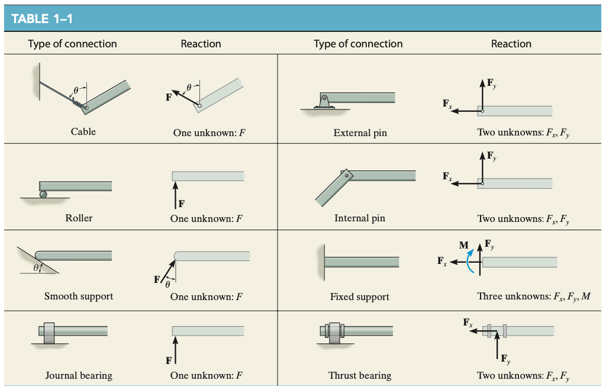

# Chapter 1. Stress

## 1.1<SPACE /> Introduction
- **mechanics of materials**. the branch of mechanics that studies the internal effects of stress and strain in a solid body
- notables
  - Saint-Venant
  - Poisson
  - Lamé
  - Navier

## 1.2<SPACE />Equilibrium of a deformable body

### Loads
- **surface loads**. can be **concentrated forces** or **distributed loadings**
  - **distributed loads**, if coplanar, act through the centroid of the area, with $F_R = F \times A$
    - $A$. area of distributed load
- **body force**. force on another body without direct physical contact, e.g. gravity
  - represented as single force acting on the body

### Support reactions

