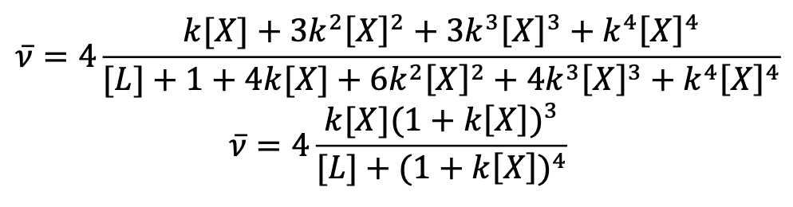
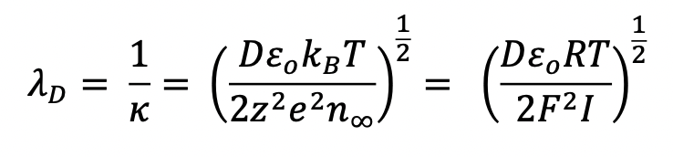
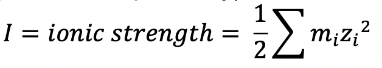
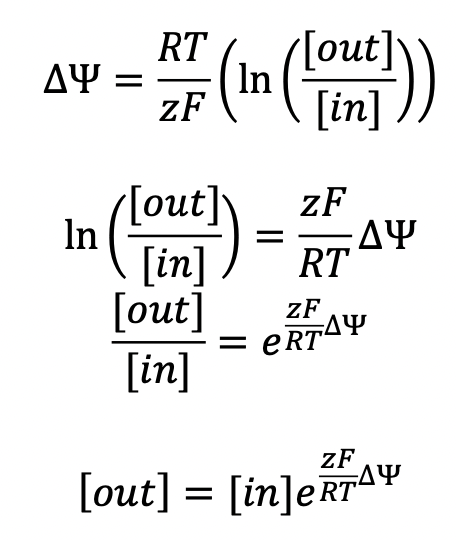

# 20.110 Review

## Questions
- UL26, chemical potential derivation for osmotic pressure

## Constants

<table>
  <tr>
    <td>Boltzmann's constant</td>
    <td style="text-align: center;"><C chem="k_B" /></td>
    <td>
      <C chem="\pu{1.3807e−23 J/K}" />
    </td>
  </tr>
  <tr>
    <td>Coulomb's constant</td>
    <td style="text-align: center;"><C chem="k" /></td>
    <td>
      <C chem="\pu{8.9876e9 Nm^2/C}" />
    </td>
  </tr>
  <tr>
    <td>
      charge of proton, electron, fundamental charge</td>
    <td style="text-align: center;"><C chem="e" /></td>
    <td>
      <C chem="\pu{1.6e-19 C}" />
    </td>
  </tr>
  <tr>
    <td>
      Faraday's constant (Avogadro's number multiplied by the unit charge of an electron)
    </td>
    <td style="text-align: center;"><C chem="F" /></td>
    <td>
      <C chem="\pu{96485 C/mol}" />
    </td>
  </tr>
  <tr>
    <td>
      permittivity of free space
    </td>
    <td style="text-align: center;"><C chem="\varepsilon_0" /></td>
    <td>
      <C chem="\pu{8.85e-12 C^2/N mol}" />
    </td>
  </tr>
</table>

## Variables

<table>
  <tr>
    <th>Symbol</th>
    <th>Meaning</th>
    <th>Definition</th>
  </tr>

  <tr>
    <td style="text-align: center">
      <C chem="\gamma" />
    </td>
    <td>
      interfacial tension <T tag="L25" /> <T tag="dill, 15" />
    </td>
    <td>the free energy cost of increasing the interfacial area between phases A and B</td>
  </tr>

  <tr>
    <td style="text-align: center">
      <C chem="\mathcal{A}" />
    </td>
    <td>
      total surface area in lattice units <T tag="L25" /> <T tag="dill, 15" />
    </td>
    <td></td>
  </tr>

  <tr>
    <td style="text-align: center">
      <C chem="a" />
    </td>
    <td>
      area per molecule
    </td>
    <td></td>
  </tr>

  <tr>
    <td style="text-align: center">
      <C chem="\mu" />
    </td>
    <td>
      chemical potential
    </td>
    <td></td>
  </tr>

  <tr>
    <td style="text-align: center">
      <C chem="l_p" />
    </td>
    <td>
      persistence length
    </td>
    <td></td>
  </tr>

  <tr>
    <td style="text-align: center">
      <C chem="b_k" />
    </td>
    <td>
      Kuhn length
    </td>
    <td></td>
  </tr>

  <tr>
    <td style="text-align: center">
      <C chem="R_g" />
    </td>
    <td>
      radius of gyration
    </td>
    <td></td>
  </tr>

  <tr>
    <td style="text-align: center">
      <C chem="b" />
    </td>
    <td>
      length of monomer
    </td>
    <td></td>
  </tr>

  <tr>
    <td style="text-align: center">
      <C chem="z" />
    </td>
    <td>
      lattice number
    </td>
    <td></td>
  </tr>

  <tr>
    <td style="text-align: center">
      <C chem="L_c" />
    </td>
    <td>
      contour length
    </td>
    <td></td>
  </tr>

  <tr>
    <td style="text-align: center">
      <C chem="\phi_A" />
    </td>
    <td>
      volume fraction of <C chem="A" />
    </td>
    <td><C chem="\phi_A = \dfrac{N_A n_A}{M}" /></td>
  </tr>

  <tr>
    <td style="text-align: center">
      <C chem="M" />
    </td>
    <td>
      number of lattice sites
    </td>
    <td><C chem="M = N_A n_A + N_B n_B" />; if small molecule solution, then <C chem="M = n_A + n_B" />.</td>
  </tr>

  <tr>
    <td style="text-align: center">
      <C chem="N_A" />
    </td>
    <td>
      number of monomers per molecule of <C chem="A" />
    </td>
    <td></td>
  </tr>

  <tr>
    <td style="text-align: center">
      <C chem="n_A" />
    </td>
    <td>
      number of molecules of <C chem="A" />
    </td>
    <td></td>
  </tr>
</table>

## Topics

<Box>

#### Ligand binding (Langmuir model)

$$
p_{\text{bound}} = \Phi_b \text{ (fraction bound)} = \frac{[L]}{[L] + K_D}
$$

- **Keq.** $K_{eq} = 1 / K_D$ (dissociation constant)
- **slope of bound/free vs. bound concentration (Scatchard plot)**. $-1/K_D$
- $$\Delta G = -RT \ln K_{\text{eq}}$$

</Box>

<Box>

#### Cooperativity

</Box>

<!-- -->

<Box>

#### Debye length <T tag="l27" />

- When calculating ionic strength, use concentration of ions in **solution** (not within a cell, etc.).

</Box>

<Box>

#### Nernst equation <T tag="L27" /> <T tag="dill, 22" />

$$
\Delta \Psi = \Psi_i - \Psi_o = \frac{RT}{zF}\ln \frac{[X]_o}{[X]_i}
$$

- when calculating membrane potentials, the convention is $\Psi_{\text{membrane}} = \Psi_{\text{inside}} - \Psi_{\text{outside}}$.

- **coulomb potential energy.** $U = \frac{q_1q_2}{4\pi\varepsilon_0 r}$
- **coulomb potential.** $V = \frac{q}{4\pi\varepsilon_0 r}$

</Box>

<!-- -->

<Box>

#### Apparent <PKA /> <T tag="L28" />

$$
k_{\text{acid,app}} = k_{\text{acid}} e^{\frac{e\Phi}{k_B T}}
$$

$$
\mathrm{p}K_{\text{a,app}} = \mathrm{p}{K_a} - 0.4343\frac{e\Phi}{k_B T}
$$

- $\Phi$ is electric potential
- negative electric potential <RA /> apparent pKa is higher than Ka (weaker acid, stronger base)
  - negative charge can better accomodate positive charge (proton)
- positive electric potential <RA /> apparent pKa is lower than the Ka (stronger acid, weaker base)
  - positive charge can better accomodate negative charge (deprotonation)

</Box>

<!-- -->

<Box>

#### Pure liquids
- **free energy of pure liquid.** $$\frac{Nz}{2}w_{AA}$$
- **entropy**. 0

</Box>

<Box>

#### Solutions of small molecules

</Box>

<Box>

#### Colligative properties

- **Boiling point elevation, freezing point depression.** $\Delta T = K_B m_A$
  - $m_A$ is the molal (mols/kg solution) concentration of A
- **Osmotic pressure**. $$\pi = \frac{k_B T x_A}{v_B} = C_ART$$
  - $x_A$ is mole fraction of A

</Box>

<Box>

#### Micellization and self-assembly <T tag="L30" /> <T tag="dill, 28; 570" />

- micelles _form a set size and shape_, and not a distribution
- effectively a hill equation

$$
\Delta \mu^\circ_n = \Delta \mu^\circ(a) = \gamma a + \frac{c}{a}
$$
- minimized at $a^* = \sqrt{c/\gamma}$
- substitute $c$ back into first equation
  - $$K = \exp \frac{-(2\gamma a^* + \frac{\gamma}{a}(a - a^*)^2)}{k_B T}$$, a Gaussian distribution

</Box>

<Box>

#### Polymers

##### Counting microstates <T tag="L31" />

##### Free energy of mixing <T tag="L31" />

- if negative, mixes spontaneously
- $$\dfrac{\Delta F_{\text{mix}}}{M k_B T} = \dfrac{\phi_A}{N_A}\ln {\phi_A} + \dfrac{\phi_B}{N_B} \ln {\phi_B}$$
  - By convention in this class, $N_A$ is solute, while $N_B$ is the solvent.

##### (Helmholtz) free energy of a polymer solution <T tag="L31" />

##### Freely jointed chain, a.k.a. random walk model or random flight model <T tag="L32" />
- random walk refers to two dimensions, while random flight refers to three <T tag="dill, 33" />
- $N$ monomers
- length $b$ between monomers is constant
- angle $\theta$ between monomers is random
- **contour length ($L_c$)**. the largest possible length for the polymer.
  - $L_c = Nb$
- **average (RMS) end-to-end distance.** $\langle r^2 \rangle = b \sqrt{N}$
- **radius of gyration ($R_g$).** length of polymer's end from its center of mass.
  - $R_g = \dfrac{b\sqrt{N}}{\sqrt{6}}$
- real polymers are **stiffer** than freely jointed chains
  - ${\langle r^2 \rangle}_{\mathrm{nonideal}} = C_NNb^2$
  - $C_N$ is the **characteristic ratio**, typically greater than 1.
- **important takeaway:** end-to-end distance grows proportionally to the **square root of the chain length**

##### Kuhn length ($b_k$) <T tag="L32" />
- The **Kuhn length** $b_k$ is the length needed to be able to consider our polymer as a freely jointed chain.
- $C_N N b^2 = N_k b_k^2 = \dfrac{Nb}{b_k} b_k^2 \implies \boxed{b_k = C_N b}$.

##### Persistence length ($l_p$) <T tag="L32" />
- The **persistence length** ($l_p$) is the length scale in which a polymer remains roughly straight.
  - $l_p = b_k / 2$

##### Energy of bending (e.g. DNA compaction) <T tag="L33" />

##### Solvent effects on folding <T tag="L33" />

- &ldquo;good&rdquo; solvent ($\chi_{AB} < 0.5$) $\implies$ $\sqrt{\langle r^2 \rangle} \propto N^{0.6}$
- theta ($\theta$) solvent ($\chi_{AB} = 0.5$) $\implies$ $\sqrt{\langle r^2 \rangle} \propto N^{0.5}$
- &ldquo;bad&rdquo; ($\chi_{AB} > 0.5$) solvent $\implies$ polymers preferentially interact with themselves; $\sqrt{\langle r^2 \rangle} \propto N^{0.3}$

</Box>