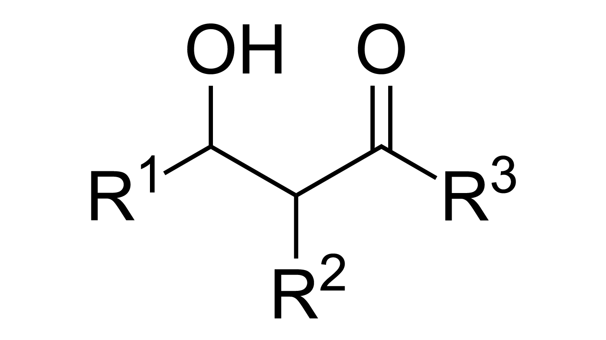

# unit 2: enzymes and catalysis

- standard conditions
    - <C chem="\pu{298 K}" />
    - partial pressure of each gas <C chem="\pu{1 atm}" /> (<C chem="\pu{101.325 kPa}" />)
    - concentration of each solute <C chem="\pu{1 M}" />

## lec 12
- case studies
    - ADAR inhibitors
    - Anti-HIV reverse transcriptase inhibitors
    - SARS-CoV-2 inhibitors
- general stages of drug development
    - Identify gene target
    - Develop inhibitors
    - Drug delivery
    - Clinical trial

## lec 13: membrane transport

## lec 14: sugars
- [the net effect of protonation is that the C=O pi bond is weakened (the carbon becomes even more electron deficient)](http://www.masterorganicchemistry.com/2010/04/21/the-power-of-acid-catalysis/)

## lec 15: biochemical transformations: C-C bond

- three ways to make C-C bonds
    1. **aldol reaction.** aldehyde condenses with aldehyde or ketone; reversible reaction
    2. **claisen condensation.** CoA ester condenses with aldehyde or ketone
    3. **prenyl transfer.**

## functional groups

- **enol**. alkene with a hydroxyl group attached to one end of the alkene double bond

- **aldol.**

