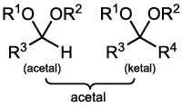

# glossary of terms

## a
- **acetylide.** chemical compounds with the chemical formula <C chem="\ce{MC#CM}" /> or <C chem="\ce{MC#CH}" />, where <C chem="\ce{M}" /> is a metal
- **acetal.**

## g
- **geminal.** denoting substituent atoms or groups attached to the same atom in a molecule

## v
- **vicinal.**
    - see the [Wikipedia page](https://archive.md/WEmTN) for a good illustration of geminal and vicinal.