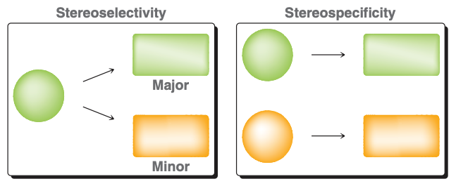

# 5.12 Review Sheet

## TODO
- What makes a good nucleophile?
- What makes a good base?
    - Lots of negative charge
    - Not sterically hindered
- Memorize strong/weak nucleophile, strong/weak base chart.
- pKas to know
- Lectures
    - 51A 21, 22, 23, 24 (SN1, SN2)
    - 51B
    - 51C

## pKas to memorize

|name|structure|pKa|
|:---|:--------|:--|
|sulfuric acid|<C chem="\ce{H2SO4}" />|-9|
|phenol||10|
|protonated carboxylic acid||-6|

- Alkanes: 45 to 50
- Amines: 35 to 40
- Alcohols: 15 to 18
- Carboxylic acids: 5
- Hydrogen halides: -10 to 3

## Terminology
- alkyl halide, allylic halide, benzylic halide, vinylic halide, aryl halide, alkynyl halide

- phenol, enol

- mesyl chloride (MsCl)

- tosyl chloride (TsCl)

- **stereoselective.** the product favors one stereoisomer over another
- **stereospecific.** the product depends on the stereochemistry of the reactant

## Steric strain in alkenes

## Solvent effects of SN1 and SN2
- SN1 favors **polar protic solvents**
    - reason: carbocation intermediate is stabilized, lowering $E_a$
- SN2 favors **polar aprotic solvents**
    - reason: aprotic solvents raise the energy of the nucleophile, which also lowers $E_a$

## What makes a good leaving group?
- Main idea: ability to **stabilize a lone pair**
    - Able to stabilize a -ve charge
        - **Polarizability (size)**
        - **Resonance**
    - **Able to lose a +ve charge to become _neutral_**
    - **Strong thermodynamic driving force**

## What makes a good nucleophile?
- Main idea: ability to **donate a lone pair**
    1. less electronegative
    2. polarizability
    3. able to lose a -ve charge and become neutral
    4. lack of steric hindrance
        - tert-butoxide (<C chem="\ce{tBuO-}" />) is a bad nucleophile because its tert-butyl group prevents it from attacking carbons.

## What makes a good base?

## Carboxylic acids

### Preparation of carboxylic acids
- Ozonolysis of alkynes with [1] ozone, [2] <C chem="\ce{H2O}" />
- Oxidation of alcohols primary alcohols with <C chem="\ce{Cr^6+}" /> oxidants (Smith§12.12)

## Inductive effects
- A positive formal charge acts to stablize negative charge as it pulls electron density towards it through $\sigma$ bonds.

## SN1, SN2, E1, E2
- Strong base, weak nucleophile: **E2**
- Strong base, strong nucleophile
  - **SN2** if substrate unhindered (1º, 2º)
    - **Does not happen** if 3 substituents at alpha or beta carbon
  - **E2** otherwise (2º, 3º)
- Weak base, strong nucleophile
  - **SN2** if 1º or 2º substrate
  - **SN1** if 3º substrate
- Weak base, weak nucleophile
    - **SN1 and E1** if 3º substrate
    - _if we don't use a WBWN, then SN2 and E2 will outcompete SN1 and E1_

### SN2 Regiochemistry and Stereochemistry
- **Regiochemistry**
  - n/a
- **Stereochemistry**
  - **Stereoselectivity**
    - n/a
  - **Stereospecificity**
    - SN2 occurs via **back-side attack**, and thus **inversion of stereochemistry** is observed

### E2 Regiochemistry and Stereochemistry
- **Regiochemistry**
  - If the base is _not sterically hindered_
    - major product = more substituted alkene (Zaitsev product)
  - Otherwise
    - major product = less substituted alkene (Hofmann product)
- **Stereochemistry**
  - **Stereoselectivity** (if both _cis_ and _trans_ products can be formed)
    - Major product is **trans product**
  - **Stereospecificity**
    - If only one $\beta$ carbon exists, then the isomer formed via **anti-periplanar** arrangement is the one formed

## E1 Regiochemistry and Stereochemistry
- **Regiochemistry**
    - Zaitsev product favored over Hofmann, and no way to control (unlike E2 using a sterically hindered base)
- **Stereochemistry**
    - Product with less steric strain is the major product

## Alcohol reactions
- Alcohol reactions as SN1/SN2/E1/E2
    - Under strongly acidic conditions, the -OH group is protonated and becomes a good leaving group.
        - 1º alcohols then proceed via SN2
        - 3º alcohols proceed via SN1

## Strength (pKa) of alcohols
1. **Resonance.**
2. **Inductive effects.**
3. **Solvation effects.** The _less sterically hindered_, the stronger the acid.
    - reason: solvent can stabilize the conjugate base better when the alcohol is not bulky.
    - this is reversed in gas phase, where the extra R groups are electron-donating.
4. Longer chain = weaker acid (base is less stable)

---

## Unit 4. Carbonyl chemistry

### Main ideas
- The substituents attached to the carbonyl carbon determines the fate of the **tetrahedral intermediate**, which results in _substitution_ or _addition_
    - _good leaving group_ attached to the carbonyl carbon $\rightarrow$ _substitution_
    - otherwise, _addition_
    - **alkoxides (OR) cannot act as leaving groups in SN2 reactions, but they can act as leaving groups in addition/elimination reactions of carbonyl chemistry.**

### Hydrides
- LiAlH4
    - Cannot use in the presence of water or alcohols; will catch on fire
        - LiAlH4 is a base, will deprotonate alcohol, and destroy LiAlH4
    - Used to reduce ketones and aldehydes
    - Not for SN2 reactions.
    - Can reduce esters to alcohols; cleaves the acyl C-O bond (i.e. OR group leaves)
- NaBH4
    - Can be run in MeOH; reacts fast enough with ketones and aldehydes to avoid workup step
    - To be safe, run as two steps

### DIBAL-H: substitution of OR groups with hydride groups
- Reduces esters to aldehydes
- **Does not work on carboxylic acids.**

### Stereochemistry
- Addition to carbonyls always creates a **racemic mixture**.

### How to make carbonyls

#### Main method: PCC Oxidation
- Generates ketones and aldehydes from alcohols

#### Other <C chem="\ce{Cr^6+}" /> oxidants

## Miscellaneous facts
- The more electronegative the atom, the shorter (and stronger) its bond to carbon.
- **Ketones are more reactive than esters**
- Aldehydes are more reactive than ketones (steric hindrance).
- Heat pushes reactions toward **elimination rather than substitution** because elimination is entropically favored (3 products vs 2 products)
  - 3 products: major product + protonated base + leaving group

## Synthesis of aldehydes
- PCC Oxidation of alcohols (12.12B)
- DIBAL-H on ethers (20.7A)
- hydroboration-oxidation of alkynes (11.10)
- Ozonolysis of alkenes (12.10)

## Synthesis of ketones
- PCC oxidation of secondary alcohols
- Friedel-Craftz
- Ozonolysis
- Cuprates to acyl chlorides (not used)

---

## Questions
- Stronger nucleophile
    - Does resonance not contribute to polarizability?
- If a neutral molecule is more stable than a charged molecule, why do atoms try to fill their octet?`
- Why does the oxygen of a ketone become protonated when the pKa of hydronium is only -1.79?
    - e.g. https://www.coursehero.com/sg/organic-chemistry/oxygen-nucleophiles/
- Why are bonds to negatively charged atoms nucleophilic and basic?