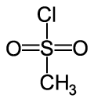

## pKas to memorize

|name|structure|pKa|
|:---|:--------|:--|
|sulfuric acid|<C chem="\ce{H2SO4}" />|-9|
|phenol||10|
|protonated carboxylic acid||-6|

## Steric strain in alkenes

## Tosylates
- Mesyl chloride (MsCl)

- Tosyl chloride (TsCl)

## Solvent effects of SN1 and SN2
- SN1 favors **polar protic solvents**
    - reason: carbocation intermediate is stabilized, lowering $E_a$
- SN2 favors **polar aprotic solvents**
    - reason: aprotic solvents raise the energy of the nucleophile, which also lowers $E_a$

## E1 Regiochemistry and Stereochemistry
- Regiochemistry
    - Zaitsev product favored over Hofmann, and no way to control (unlike E2 using a sterically hindered base)
- Stereochemistry
    - Product with less steric strain is the major product

## Alcohol reactions
- Alcohol reactions as SN1/SN2/E1/E2
    - Under strongly acidic conditions, the -OH group is protonated and becomes a good leaving group.
        - 1º alcohols then proceed via SN2
        - 3º alcohols proceed via SN1

## Strength (pKa) of alcohols
1. **Resonance.**
2. **Inductive effects.**
3. **Solvation effects.** The _less sterically hindered_, the stronger the acid.
    - reason: solvent can stabilize the conjugate base better when the alcohol is not bulky.
    - this is reversed in gas phase, where the extra R groups are electron-donating.
4. Longer chain = weaker acid (base is less stable)

## Good leaving group
- Main idea: ability to **stabilize a lone pair**
    - Able to stabilize a -ve charge
        - **Polarizability (size)**
        - **Resonance**
    - **Able to lose a +ve charge to become _neutral_**
    - **Strong thermodynamic driving force**

## Good nucleophile
- Main idea: ability to **donate a lone pair**
    1. less electronegative
    2. polarizability
    3. able to lose a -ve charge and become neutral
    4. lack of steric hindrance

## Carboxylic acids

### Preparation of carboxylic acids
- Ozonolysis of alkynes with [1] ozone, [2] <C chem="\ce{H2O}" />
- Oxidation of alcohols primary alcohols with <C chem="\ce{Cr^6+}" /> oxidants (Smith§12.12)

## Inductive effects
- A positive formal charge acts to stablize negative charge as it pulls electron density towards it through $\sigma$ bonds.

---

## Questions
- Stronger nucleophile
    - Does resonance not contribute to polarizability?
- If a neutral molecule is more stable than a charged molecule, why do atoms try to fill their octet?`

## Miscellaneous facts
- The more electronegative the atom, the shorter (and stronger) its bond to carbon.
