# Full List of Reactions

## TODO
- organize by type of nucleophile
- base-catalyzed tautomerization mechanism
- Gilman reagents (cuprates)

## Notes on conventions
- In `Klein`, brackets around reagents (e.g. <C chem="\ce{[H+]}" />) indicate **catalytic amounts**
- [What does <C chem="\ce{H3O+}" /> really mean in a reaction?](https://www.masterorganicchemistry.com/2011/08/22/instructors-kludges-of-organic-chemistry/)
- Van Vranken
  - roman numerals: no purification between steps

## Lectures
- [Spreadsheet of lectures](https://docs.google.com/spreadsheets/d/1VcTZjrExC1peAVu_-uCuUR-UJIYW2eo_7z-w6JTAAR8/edit#gid=0)

## Questions
- Why do we need to reduce alkenes before using organolithium reagents? (`sp18 exam 4`)

<Collapse title="Bases and nucleophiles chart">

</Collapse>

<Collapse title="Table of pKa values">

- [source: pKa values for organic and inorganic Bronsted acids](https://owl.oit.umass.edu/departments/OrganicChemistry/appendix/pKaTable.html)

<table>
  <tr>
    <th>compound</th>
    <th><PKA /></th>
    <th>notes</th>
  </tr>

  <tr>
    <td>carboxamide</td>
    <td>30</td>
    <td>nitrogen is strong EDG competing with deprotonation of alpha-hydrogen</td>
  </tr>
  <tr>
    <td>nitrile</td>
    <td>25</td>
    <td>just memorize</td>
  </tr>
  <tr>
    <td>ester</td>
    <td>25</td>
    <td>oxygen donates electrons, which competes with deprotonation of alpha-hydrogen</td>
  </tr>
  <tr>
    <td>ketone</td>
    <td>20</td>
    <td>alkyl groups are weaking EDG</td>
  </tr>
  <tr>
    <td>aldehydes</td>
    <td>17</td>
    <td>hydrogens don't donate; aldehydes almost too easy to deprotonate</td>
  </tr>
  <tr>
    <td>1,3-diesters</td>
    <td>13</td>
    <td>two resonance structures for conjugate base, but slightly blocked due to existing resonance in ester</td>
  </tr>
  <tr>
    <td>1,3-dicarbonyls</td>
    <td>9</td>
    <td>two resonance structures for conjugate base</td>
  </tr>
  <tr>
    <td>alcohols</td>
    <td>15-18</td>
    <td><PKA /> increases as carbon chain grows; reasons: EDG and bulkiness.</td>
  </tr>
  <tr>
    <td><C chem="\ce{NaH}" /></td>
    <td>35</td>
    <td></td>
  </tr>
  <tr>
    <td><C chem="\ce{NaNH2}" /></td>
    <td>25</td>
    <td></td>
  </tr>
  <tr>
    <td>phenol</td>
    <td>10</td>
    <td></td>
  </tr>
  <tr>
    <td>acetic acid</td>
    <td>5</td>
    <td></td>
  </tr>
  <tr>
    <td>pyridine</td>
    <td>5-6</td>
    <td></td>
  </tr>
  <tr>
    <td><C chem="\ce{HCl}" /></td>
    <td>-7</td>
    <td></td>
  </tr>
  <tr>
    <td><C chem="\ce{H2SO4}" /></td>
    <td>-10</td>
    <td></td>
  </tr>
  <tr>
    <td>hydrazine (<C chem="\ce{H2N-NH2}" />)</td>
    <td>8.10</td>
    <td>forms hydrazines; can act as acid</td>
  </tr>
</table>

</Collapse>

<Collapse title="List of types of compounds">

- Alkenes
- Aldehydes
- Ketones
- Acetals
    - Gem-diol
    - Hemiacetal
    - Acetal
- Carboxylic acid derivatives
    - Carboxylic acids
    - Acyl chlorides
    - Acid anhydrides
    - Ester
- Nitrogen containing compounds
    - Nitriles
    - Amides
    - Imines
    - Enamines
- Sulfur containing compounds
    - ??

</Collapse>

<Collapse title="Reaction maps">

</Collapse>

<Collapse title="Reactivity trends">

1. acyl chloride (most reactive)
2. acid anhydride
3. aldehyde
4. ketone
5. thioester
6. ester
7. amide (least reactive)

</Collapse>

## To alkynes

<Box>

#### Elimination of geminal halides or vicinal halides (`klein, 9`)

</Box>

## From alkynes

<Box>

#### Hydrohalogenation (1 eq)

</Box>

<Box>

#### Hydrohalogenation (2 eq)

</Box>

<Box>

#### Acid catalyzed hydration

</Box>

## Radical reactions

<Box>

#### Allylic bromination with NBS (`klein, 10.7`) <T tag="NBS" />

- **NBS** helps avoid competition with alkene bromination
  - concentrations of <C chem="HBr" /> and <C chem="Br2" /> are kept to a minimum

</Box>

<Box>

#### Benzylic bromination with NBS <T tag="NBS" /> (`L33,3`)

- **_reagents_**
  - bromine source: <C chem="\ce{NBS}" />
  - benzoyl peroxide, radical initator <C chem="\ce{(PhCO2)2}" />

</Box>

## To alkenes

<Box>

#### Dehydration with <C chem="\ce{POCl3}" /> and pyridine (`smith5e, 9.10`/`L24`) <T tag="from alcohol to alkene" />

- Used because **some organic compounds decompose in the prescence of strong acid** (see _alcohol dehydration_)

</Box>

## From alkenes

<Box>

#### Oxymercuration-demercuration (mknv) (`klein, 8.6`) <T tag="from alkene to alcohol" /> <Nmxn />

- **reagents**
  - step 1
    - <C chem="\ce{Hg(OAc)2}" />
    - solvent (water)
  - step 2
    - <C chem="\ce{NaBH4}" />

</Box>

<Box>

#### Hydroboration-oxidation (anti-mknv) (`klein, 8.7`) <T tag="anti-mknv" /> <T tag="from alkene to alcohol" />

- **reagents**
  - step 1: hydroboration
    - <C chem="\ce{BH3}" />
    - solvent (water)
  - step 2: oxidation
    - <C chem="\ce{H2O2}" />
    - <C chem="\ce{NaOH}" />

</Box>

<Box>

#### _Syn_-dihydroxylation (`klein, 8.9`) <T tag="from alkene to alcohol" />

- **reagents**
  - step 1
    - <C chem="\ce{OsO4}" />
  - step 2
    - <C chem="\ce{NaHSO3}" />
    - <C chem="\ce{H2O}" />

</Box>

<Box>

#### _Anti_-dihydroxylation (`klein, 8.10`) <T tag="from alkene to alcohol" />

</Box>

## To ethers

### Alcohols <RA /> ethers

<Box>

#### Williamson ether synthesis (`klein, 13.5`) <T tag="from alcohol to ether" />

</Box>

## From ethers

 

## To aldehydes/ketones

### Alkyne <RA /> ketone

<Box>

#### Hydration of alkynes with strong acid (<C chem="\ce{H2SO4}" />) and <C chem="\ce{HgSO4}" /> (`smith5e, 11.9`) to form _ketones_

- **reagents**
  - <C chem="\ce{H2SO4}" />
  - <C chem="\ce{HgSO4}" /> (only needed for aldehydes)

</Box>

<Box>

#### Hydroboration of terminal alkyne (`L24`)
- **reagents**

</Box>

## From aldehydes/ketones

<Box>

#### Wolff-Kishner reaction: reduce ald/ket to alkane (`L27`/`klein, 19.6`) <T tag="hydrazone" /> <T tag="from ald to alkane" /> <T tag="from ket to alkane" />

- basic conditions
  - use for acid-sensitive (i.e. will undergo other reactions in acidic conditions) functional groups
    - e.g. alkenes
- not for **esters** or **amides**
- **_reagents_**
  - <C chem="\ce{H2NNH2}" />
  - strong base: <C chem="\ce{NaOH}" />, <C chem="\ce{KOH}" />
  - heat

<Collapse title="Wolff-Kishner reaction mechanism">

</Collapse>

</Box>

<Box>

#### Clemmensen reduction: counterpart of Wolff-Kishner <T tag="from ald to alkane" /> (`smith5e,18.15B`, `klein, 18.6`, `51c,l4,23:43`)

- **_reagents_**
  - zinc-mercury amalgam: <C chem="\ce{Zn(Hg)}" />
  - <C chem="\ce{HCl}" />
  - heat
- acidic conditions
  - use for base-sensitive functional groups
    - e.g. E2 reactions
  - generally, more functional groups are acid-sensitive than base-sensitive
- not for **esters** or **amides**

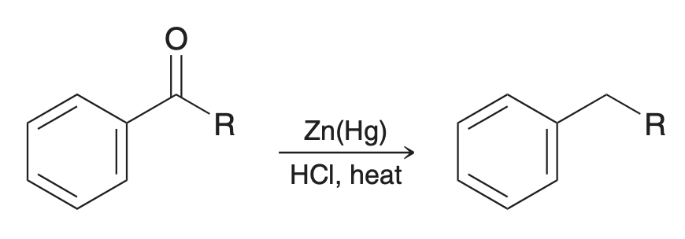

</Box>

<!-- -->

<Box>

#### Protection/deprotection of ald/ket via thioacetals (`L27,2`) <T tag="protection" /> <T tag="sulfur" /> <T tag="from ald to alkane" /> <T tag="from ket to alkane" />

- **_reagents_**
  - **protection**
    - <C chem="\ce{HS(CH2)3SH}" />
    - (solvent) <C chem="\ce{BF3 \cdot Et2O}" />
  - **deprotection**
    - <C chem="\ce{HgCl2}" />
- mechanism is analogous to **acetal formation**

</Box>

<!-- -->

<Box>

#### Reduction to alkane with Raney nickel (`L27,2`) <T tag="sulfur" /> <T tag="from ald to alkane" /> <T tag="from ket to alkane" />
- Instead of deprotecting, we can also reduce the **dithioacetal** into an alkane.
- **_reagents_**
  - Raney nickel (<C chem="\ce{Ni/Al}" />)

</Box>

### Ald/ket <RA /> alkene

<Box>

#### Wittig reaction (Wittig reagent: <C chem="\ce{Ph3P^+-C^-R^1R^2}" />) (`L25`)

<Collapse title="Making Wittig regents">

</Collapse>

</Box>

### Ald/ket <RA /> alcohols

<Box>

#### Catalytic hydrogenation (`smith5e, 20.4C`)
- **notes**
  - carbon/carbon (<C chem="\ce{C=C}" /> double bonds are hydrogenated much more quickly than <C chem="\ce{C=O}" /> bonds.
    - this enables different products between **xs** and **1 equiv** of <C chem="\ce{H2}" />.

</Box>

<Box>

#### Grignard addition (<C chem="\ce{C-C}" /> forming at the carbonyl carbon)

- **reagents**
  - step 1: Grignard reagent (<C chem="\ce{RMgX}" />)
  - step 2: water or acid workup

</Box>

<Box>

#### Addition with Gilman reagents (cuprates)

</Box>

## To epoxides

 

## From epoxides

 

## To acetals

### Ald/ket <RA /> acetal

<Box>

#### Protection: Acetal formation with alcohol and acid catalysis (`L26`)

- **reagents**
  - **2 equiv** of alcohol
  - catalytic <C chem="\ce{H2SO4}" /> or <C chem="\ce{p-TsOH}" />
- **notes**
  - reaction is driven forward by **removing water** with _drying agents_ or a _Dean-Stark trap_.
  - formation of **cyclic acetals** is **entropically favored**
- **applications**
  - used as **protecting groups** for **aldehydes and ketones**.

<Collapse title="Acetal formation mechanism">

</Collapse>

<Collapse title="Acetal formation and hydrolysis as protecting groups">

</Collapse>

</Box>

## From acetals

### Acetal <RA /> ald/ket

<Box>

#### Hydrolysis of acetals (`L26,2`)
- **_reagents_**
  - water
- **_notes_**
  - reverse of acetal formation

</Box>

 
## To alcohols

<Box>

#### <Rxn /> Carbonyl reduction with hydride reducing agents <T tag="from aldehyde to alcohol" /> <T tag="from ketone to alcohol" />

- **reagents**
  - step 1: hydride nucleophile (<C chem="\ce{LiAl4}" /> or <C chem="\ce{NaBH4}" />)
  - step 2: water or acid workup

<Collapse title="About LiAlH4">

- Lithium aluminium hydride (<C chem="\ce{LiAl4}" />) **also reacts with carboxylic acid derivatives**; avoid if **ester is also present**
- Avoid water and alcohols; <C chem="\ce{LiAl4}" /> is also a strong base.

</Collapse>

<Collapse title="About NaBH4">

- Sodium borohydride is too weak to reduce esters, but strong enough to reduce **aldehydes and ketones**.

</Collapse>

</Box>

<!-- -->

<Box>

#### <Rxn /> Ester reduction (`klein, 20.11`) <T tag="from ester to alcohol" />

<Collapse title="Mechanism for ester reduction to 1º alcohol"> 

</Collapse>

</Box>

<!-- -->

<Box>

#### Ester reduction (`klein, 20.11`) with Grignard reagents <T tag="from ester to alcohol" />
- requires **workup**

</Box>

<!-- -->

<Box>

#### Addition of water (hydration) <T tag="from aldehyde to alcohol" /> <T tag="from ketone to alcohol" />

- **only aldehydes favored to form gem-diols**; acid/base catalyst only speeds up the reaction; doesn't affect the equilibrium.

</Box>

## From alcohols

### Formation of better LGs

<Box>

#### With <C chem="\ce{H-X}" /> (<SN1 />, _3º alcohol only_) (`L23`) <T tag="from alcohol to alkyl halide" />

</Box>

<!-- -->

<Box>

#### With phosphorous tribromide (<C chem="\ce{PBr3}" />) (`L23`) <T tag="from alcohol to alkyl halide" />

</Box>

<!-- -->

<Box>

#### With thionyl chloride (<C chem="\ce{SOCl2}" />), pyridine (`L23`) <T tag="from alcohol to alkyl halide" />

</Box>

<Box>

#### With tosyl chloride (<C chem="\ce{TsCl}" />) (`L23`) <T tag="from alcohol to alkyl halide" />

</Box>

### Alcohol <RA /> ald/ket

<Box>

#### PCC oxidation (`L24`)

</Box>

### Alcohol <RA /> alkenes

<Box>

#### 1º alcohol dehyration (E2)

- **reagents**
  - strong acid, like <C chem="\ce{H2SO4}" />

<Collapse title="Reaction details">

- **notes**
  - clean E1 because no good nucleophile is present to compete as <SN1 />.

</Collapse>

</Box>

<!-- -->

<Box>

#### 2º and 3º alcohol dehyration (E1)

- **reagents**
  - strong acid, like <C chem="\ce{H2SO4}" />

</Box>

## _Oxidation_ reactions

<Box>

#### Oxidation of 1º alcohol <T tag="from alcohol to carboxylic acid" />

- **_reagents_**
  - chromium trioxide (<C chem="\ce{CrO3}" />)
  - strong acid (<C chem="\ce{H3O+}" />)

</Box>

<Box>

#### Oxidation of 2º alcohol <T tag="from alcohol to ketone" />

- **_reagents_**
  - chromium trioxide (<C chem="\ce{CrO3}" />)
  - strong acid (<C chem="\ce{H3O+}" />)

</Box>

<!-- -->

<Box>

#### Oxidation of aldehyde <T tag="from aldehyde to carboxylic acid" />

- **_reagents_**
  - chromium trioxide (<C chem="\ce{CrO3}" />)
  - strong acid (<C chem="\ce{H3O+}" />)

<Collapse title="Mechanism for oxidation">

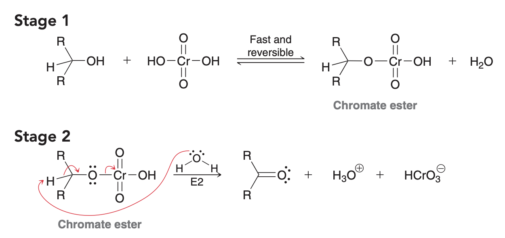

</Collapse>

</Box>

<!-- -->

<Box>

#### Oxidation to carboxylic acid in the presence of benzylic hydrogen (`L27`) <T tag="to carboxylic acid" />

</Box>

## To carboxylic acids

<Box>

#### Carboxylation: Grignard reagent with <C chem="\ce{CO2}" /> <T tag="to carboxylic acid" />

<Collapse title="Grignard carboxylation mechanism">

</Collapse>

</Box>

### _Hydrolysis_ reactions from carboxylic acid derivatives (CADs) (`L27,5`)

<Box>

#### Acyl chloride <RA /> carboxylic acid (`klein, 20.8`/`L28`) <T tag="hydrolysis" />

<Collapse title="Mechanism for acyl chloride hydrolysis to carboxylic acid">

</Collapse>

</Box>

<!-- -->

<Box>

#### Nitrile <RA /> carboxylic acid (`klein, 20.4`) <T tag="hydrolysis" />

- **_reagents_**
  - strong acid (<C chem="\ce{H2SO4}" />)
  - heat ($\mathrm{100\ ^\circ C}$)
- **_applications_**
  - alkyl bromide <RA /> nitrile (via <SN2 />) <RA /> carboxylic acid (hydrolysis)

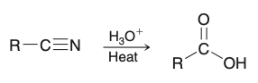

<Collapse title="Mechanism for nitrile hydrolysis">

</Collapse>

</Box>

<!-- -->

<Box>

#### Amide <RA /> carboxylic acid

</Box>

<!-- -->

<Box>

#### Ester <RA /> carboxylic acid: Ester hydrolysis in aqueous acid (`smith5e, 22.11A`)

<Collapse title="Mechanism for acid-catalyzed hydrolysis of ester to carboxylic acid">

</Collapse>

</Box>

<!-- -->

<Box>

#### Base-_promoted_ (not catalyzed) ester hydrolysis a.k.a _saponification_ (`smith5e, 22.11B`) <T tag="ester to carboxylic acid" />

- use a **strong acid** at the end to protonate the **carboxylate anion**.

<Collapse title="Mechanism for base-promoted hydrolysis of ester to carboxylic acid">

</Collapse>

</Box>

## From carboxylic acids

<Box>

#### Via DCC (dicyclohexylcarbodiimide) (`L29`) <T tag="from carboxylic acid to amide" />

</Box>

<!-- -->

<Box>

### Reduction of carboxylic acids to 1º alcohols with hydrido reagents <T tag="from carboxylic acid to alcohol" />

</Box>

## To esters

<Box>

#### Fischer esterification (`klein, 20.10`/`L28,6`) <T tag="from carboxylic acid to ester" />

</Box>

<Box>

#### Esters from acid chlorides (`klein, 20.8`) <T tag="from acid chloride to ester" />

- **_reagents_**
  - <C chem="\ce{ROH}" />
  - (solvent) pyridine

</Box>

## From esters

### Ester <RA /> ald/ket

<Box>

#### Ester reduction with DIBAL-H (_aldehyde only_) (`kakioka, WS_11_16`) <Nmxn /> <T tag="from ester to aldehyde" />

</Box>

### Ester <RA /> carboxylic acid

<Box>

#### Reverse of Fischer esterification (acat hydrolysis) (`klein, 20.11`/`L28,6`)

<Collapse title="Mechanism for acat hydrolysis of esters">

</Collapse>

<Collapse title="Spontaneously decarboxylating beta-keto esters and beta-diacids">

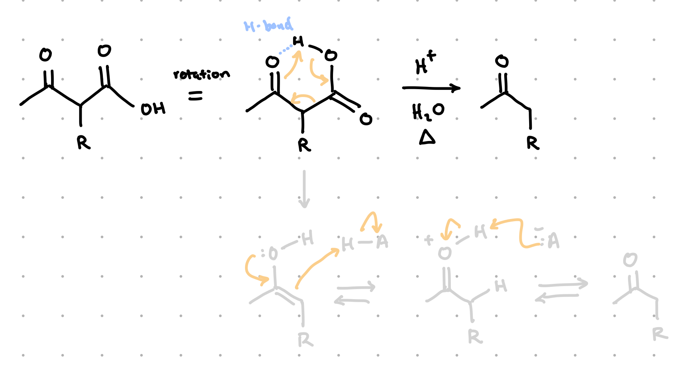

- **conditions**
  - acid, water, heat

</Collapse>

</Box>

<!-- -->

<Box>

#### Malonic ester synthesis (carboxylic acid from diester) (`smith5e, 23.9`/`kakioka, WS_11_30`)

</Box>

## To acyl chlorides

<Box>

#### Via thionyl chloride (<C chem="\ce{SOCl2}" />) (`klein, 20.8`/`L28`) <T tag="from carboxylic acid to acyl chloride" />

- formation of <C chem="\ce{SO2}" /> gas drives reaction to completion

</Box>

## From acyl chlorides

<Box>

#### Hydrolysis with water and pyridine (`klein, 20.8`) <T tag="from acyl chloride to carboxylic acid" />
- **pyridine** neutralizes the <C chem="\ce{HCl}" /> formed that can often produce undesired reactions with other functional groups present in the compound.

</Box>

<!-- -->

<Box>

#### Alcoholysis with <C chem="\ce{ROH}" /> and pyridine (`klein, 20.8`) <T tag="from acyl chloride to ester" />
- **pyridine** neutralizes the <C chem="\ce{HCl}" /> formed that can often produce undesired reactions with other functional groups present in the compound.

</Box>

<!-- -->

<Box>

#### Aminolysis (`klein, 20.8`) <T tag="from acyl chloride to amide" />
- two equivalents of <C chem="\ce{R^1R^2NH}" /> are used.
  - the second equivalent neutralizes the <C chem="\ce{HCl}" /> formed
  - or just use **pyridine**

</Box>

<!-- -->

<Box>

#### Reduction of acid chlorides with <C chem="\ce{LiAlH4}" /> (`klein, 20.8`) <T tag="from acyl chloride to alcohol" />

- solvent: <C chem="\ce{THF}" />

</Box>

<!-- -->

<Box>

#### Reduction of acid chlorides with Grignard reagents (`klein, 20.8`) <T tag="from acyl chloride to alcohol" />

- solvent: <C chem="\ce{Et2O}" />

</Box>

<Box>

#### <Rxn /> Reduction of acid chlorides with Gilman reagent (<C chem="\ce{R2CuLi}" />) (`klein, 20.8`) <T tag="from acyl chloride to aldehyde" />

- solvent: <C chem="\ce{Et2O}" />

- **a water/acid workup step is required**

<Collapse title="Making Gilman reagents">

- use <C chem="\ce{2 Li}" /> and <C chem="\ce{CuBr}" />

</Collapse>

</Box>

## To amides

 

## From amides

 

## To amines

 

### Nitro <RA /> amines

<Box>

#### Reduction of nitro groups to amines via hydrogenation (`51c,l2,16:27`) <T tag="from nitro to amine" /> <T tag="reduction" />

- **_reagents_**
  - <C chem="\ce{H2}" />
  - catalytic <C chem="\ce{Pd/C}" />
- works for nitrobenzene to aniline
- works for aliphatic nitro compounds
- **limitations**
  - **aryl bromines** will be removed
  - **alkenes** will be reduced

</Box>

<Box>

#### Reduction of nitro groups to amines with tin (<C chem="\ce{Sn}" />) (`51c,l4,34:06`) <T tag="from nitro to amine" /> <T tag="reduction" />

- **_reagents_**
  - i) <C chem="\ce{Sn, HCl}" />
  - ii) workup with <C chem="\ce{NaOH}" />

</Box>

### Amides <RA /> amines

<Box>

#### Reduction of amides to amines (`smith5e, 20.7B`/`L29.3`) <T tag="from amide to amine" /> <T tag="reduction" />

</Box>

### Nitriles <RA /> amines

<Box>

#### Reduction of nitriles to amines <T tag="from nitrile to amine" /> <T tag="reduction" />

- **_reagents_**
  - <C chem="\ce{LiAl4}" />
  - (solvent) THF
  - cold ($\mathrm{-78\ ^\circ C}$)

<Collapse title="Mechanism for reduction of nitriles to amines">

</Collapse>

</Box>

<!-- -->

<Box>

#### Hydrogenation of enamine

</Box>

## From amines

 

## To imines/enamines/oximes/hydrazones

### Ald/ket <RA /> imines/enamines

- A **pH of 4.6** in the reaction conditions indicates imine/enamine formation.
  - **mildly acidic**; catalytic <C chem="\ce{AcOH}" /> is fine
- Reactions are **reversible**; **add water for hydrolysis**
  - requires **reflux** or **removal of water**

<Box>

#### Addition of _1º amines_ (<C chem="\ce{RNH2}" />) to form _imines_ (`L26`)

</Box>

<!-- -->

<Box>

#### Addition of _2º amines_ (<C chem="\ce{R^1R^2NH}" />) (`L26`)
- **notes**
  - deprotonation happens at the **$\alpha$-carbon**.

<Collapse title="Imine/enamine formation mechanism">

</Collapse>

</Box>

### Ald/ket <RA /> oximes/hydrazones
- **different substituents** (i.e. other than **R**) can be used
  - if <C chem="\ce{OH}" /> <RA /> **oxime**
  - if <C chem="\ce{NH2}" /> <RA /> **hydrazone**

## To nitriles

### Alkyl halide <RA /> nitrile

<Box>

#### <Rxn /> via <SN2 /> (1º and 2º alkyl halide) (`L28,2r`)
- **_reagents_**
  - <C chem="\ce{NaCN}" />
  - solvent: THF
- **notes**
  - **inversion of stereochemistry**

</Box>

### Ald/ket <RA /> cyanohydrin

<Box>

#### Cyanohydrin formation (addition of _cyanide_ nucleophile)

</Box>

### Amides <RA /> nitriles

<Box>

#### Dehydration of amides
- **_reagents_**
  - <C chem="\ce{SOCl2}" />
  - (solvent) benzene
  - heat

<Collapse title="Mechanism for amide dehydration">

</Collapse>

</Box>

## From nitriles

<Box>

#### Reduction of nitriles with DIBAL (`L25`) <Nmxn /> <T tag="from nitrile to aldehyde" />

</Box>

<Box>

#### Reduction of nitriles with <C chem="\ce{LiAlH4}" /> (`L28`) <T tag="from nitrile to amine" />

</Box>

## To acid anhydrides

 

## From acid anhydrides

### Acid anhydride <RA /> esters

<Box>

#### Alcohols with acetic anhydride (`L29,2`/`klein, 20.9`)

</Box>

### Acid anhydride <RA /> amides

<Box>

#### Amines with acetic anhydride (`L29,2`/`klein, 20.9`)

</Box>

## Nucleophilic acyl substitution (NAS) (`L28`)

<Collapse title="The three kinds of mechanism: neutral, base-cat, acid-cat">

</Collapse>

## To enols/enolates

### Ketones <RA /> enols

<Box>

#### Acid catalyzed tautomerization

- we use _acid_ to favor **enol** over **keto** form

</Box>

### Ketones <RA /> enolates

<Box>

#### Powerful bases deprotonate ald/ket to form enolates

- **notes**
  - alkoxide bases generate small amounts of the **more-substituted alkene**

<Collapse title="About LDA">

- $\alpha$-carbon <PKA /> is around **20** (<PKB /> is **-6**).
- The <PKB /> of amide anions is $14 - 35.7 =$ **-21.7**.
- amide anions are used to get 100% formation of enolates.
  - note the difference between [amide anion](https://en.wikipedia.org/wiki/Azanide) and an [amide (carboxamides)](https://en.wikipedia.org/wiki/Amide).

- LDA is **highly hindered** (weak nucleophile).
  - **the less hindered proton will be removed** <RA /> the **less stable enolate** is the **kinetic product** under the following conditions:
    - solvent: <C chem="\ce{THF}" />
    - temperature: <C chem="\pu{-78 ^\circ C}" />
      - low temperature prevents thermodynamic product with higher $E_a$ from proceeding

</Collapse>

</Box>

## From enols/enolates

### Enolate <RA /> ketones (forming <C chem="\ce{C-C}" /> bonds)

<Box>

#### Alkylation using alkyl halides (`smith5e, 23.8`/`kakioka, WS_11_30`)

- **_applications_**
  - forms <C chem="\ce{C-C}" /> bonds!
  - can be used on carboxamides, as long as there is no hydrogen more acidic than the $\alpha$-hydrogen.
- **_reagents_**
  - step 1: formation of enolate
    - LDA
    - (solvent) THF
    - $\mathrm{-78\ ^\circ C}$
  - step 2: <SN2 />
    - alkyl halide (should have good LG and not sterically hindered)
    - if the alkyl halide doesn't have any beta hydrogens, you get clean <SN2 /> (no E2).

<Collapse title="Reaction details">

- _stereochemistry_
  - **racemic** (no control over adding to top or bottom of enolate)
- _regiochemistry_
  - adds to **less sterically hindered side**
- notes
  - the same $\alpha$-carbon can be alkylated multiple times.

</Collapse>

</Box>

### Enolate <RA /> $\alpha$-halo carbonyl compounds

<Box>

#### $\alpha$-halogenation with <C chem="\ce{Br2}" /> in acidic conditions (`smith5e, 23.7C`/`kakioka, WS_11_23`)

- **_applications_**
  - often followed by an <SN2 /> reaction
- **_reagents_**
  - bromide <C chem="\ce{Br2}" />
  - (solvent) often acetic acid (<C chem="\ce{AcOH}" />)

<Collapse title="Reaction details">

- _stereochemistry_
  - **racemic** (no control over adding to top or bottom of enolate)
- _regiochemistry_
  - adds to **less sterically hindered side**

</Collapse>

</Box>

### $\alpha$-halo ketones <RA /> enone

<Box>

#### Secret conditions for eliminating $\alpha$-halo ketones to enones <Nmxn />

- **_reagents_**
  - lithium carbonate: <C chem="\ce{Li2CO3}" />
  - lithium bromide: <C chem="\ce{LiBr}" />
- **_solvent_**
  - dimethylformamide: DMF

</Box>

### Enolates <RA /> carboxylic acid

<Box>

#### Haloform reaction (`smith5e, 23.7B`/`kakioka, WS_11_23`)

<Collapse title="Reaction details">

- notes
  - overhalogenation occurs because the added halogen makes the $\alpha$-hydrogens even more acidic and likely to be deprotonated by the base.
- _stereochemistry_
  - **racemic** (no control over adding to top or bottom of enolate)
- _regiochemistry_
  - adds to **less sterically hindered side**

</Collapse>

</Box>

## Electrophilic Aromatic Substitution (EAS)

- **general EAS (two step mechanism)**
  - two steps
    1. formation of resonance-stabilized arenium ion
    2. loss of proton to regain aromaticity
  - acids are formed as the reactions progress (byproduct is <C chem="\ce{H-A}" /> (`51cL1.40:00`)
- reagents used
  - stronger lewis acid: <C chem="\ce{AlCl3}" />
  - slightly weaker lewis acid: <C chem="\ce{FeBr3/FeCl3}" />
- only difference is identity of **electrophile**

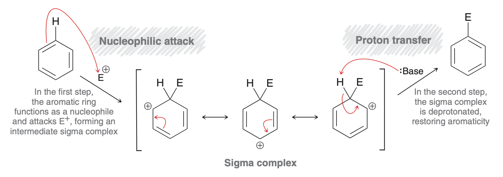

<Box>

#### Bromination and chlorination (replace H with Br, Cl)

- **_reagents_**
  - <C chem="\ce{Br2}" />
  - catalytic <C chem="\ce{FeBr3}" />
- the <C chem="\ce{Br2.FeBr3}" /> complex makes <C chem="\ce{Br2}" /> act like <C chem="\ce{Br+}" />, making it the **super electrophile**
  - super electrophile needed to react with relatively stable benzene nucleophile
- **limitations**
  - phenols over-halogenate _unless_ you leave out <C chem="\ce{FeX3}" /> catalyst
  - anilines always over-halogenate

<Collapse title="Bromination mechanism">

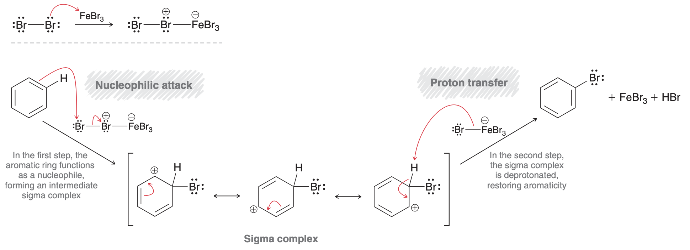

</Collapse>

</Box>

<!-- -->

<Box>

#### Nitration (replace H with <C chem="\ce{NO2}" />) (`51c,l2,17:00`)

- **_reagents_**
  - <C chem="\ce{HNO3}" />
  - <C chem="\ce{H2SO4}" />
- nitro groups are reduced to amino groups
- **nitronium ion** as the _super electrophile_

<Collapse title="Nitration mechanism">

</Collapse>

</Box>

<Box>

#### Sulfonation (form carbon-sulfur bond) <T tag="less useful" /> (`51c,l2.22:00`,`smith5e, 18.4`)

- **_reagents_**
  - <C chem="\ce{SO3}" />
  - <C chem="\ce{H2SO4}" />
- **limitations**
  - cannot be done on **anything meta directed**
    - too **deactivated**
  - cannot be done with <C chem="\ce{-NR2}" /> activators
    - lone pairs react with Lewis acid
- sulfuric acid protonates **sulfur trioxide, making it a powerful electrophile**
  - makes the _sulfur_ more electrophilic

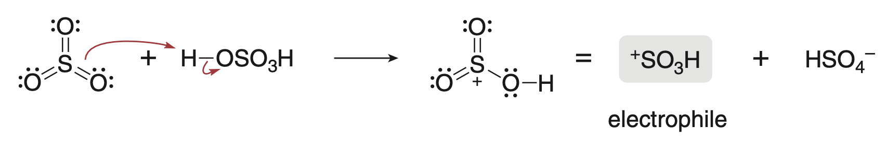
- used to prepare <C chem="\ce{p-TsOH}" />

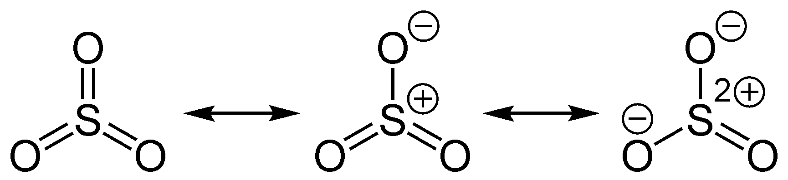

</Box>

<Box>

#### Friedel-Crafts acylation <T tag="carbon-carbon" /> (`51c,l2,23:31`)

- **_reagents_**
  - acyl chloride
  - <C chem="\ce{AlCl3}" />
- **limitations**
  - cannot be done on **anything meta directed**
    - too **deactivated**
  - cannot be done with <C chem="\ce{-NR2}" /> activators
    - lone pairs react with Lewis acid
- electrophile: acylium ion; formed when <C chem="\ce{AlCl4}" /> leaves

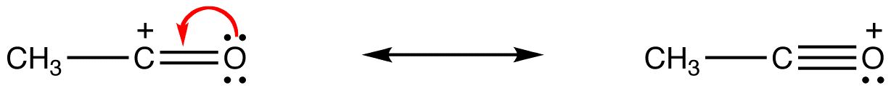

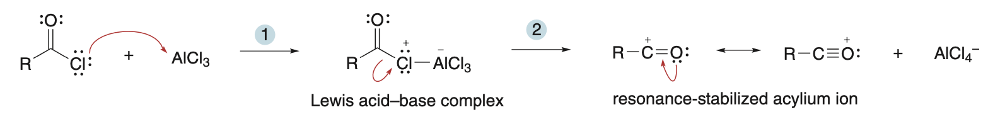

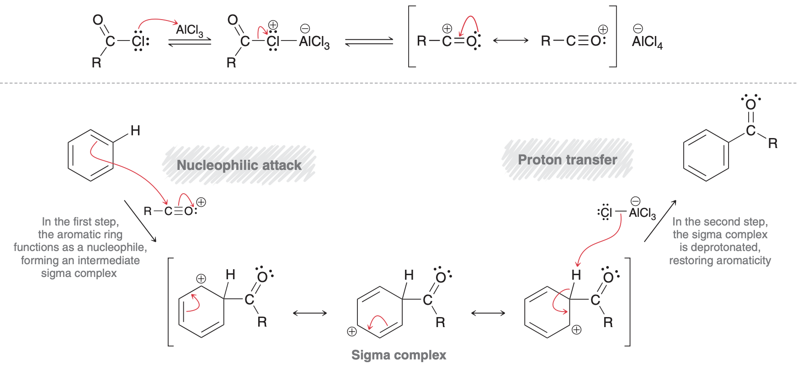

</Box>

<Box>

#### Friedel-Crafts alkylation <T tag="less useful" /> <T tag="carbon-carbon" /> (`51c,l2,32:29`, `smith5e, 18.5`)
- **_reagents_**
  - **xs** benzene (solvent)
  - <C chem="\ce{R-X}" />
  - <C chem="\ce{AlCl3}" />
- electrophile
  - **carbocation** (for 2º and 3º alkyl halides)
  - **lewis acid-base complex** for 1º alkyl halides
- **limitations**
  - alkyl groups activate, leading to **polyalkylation

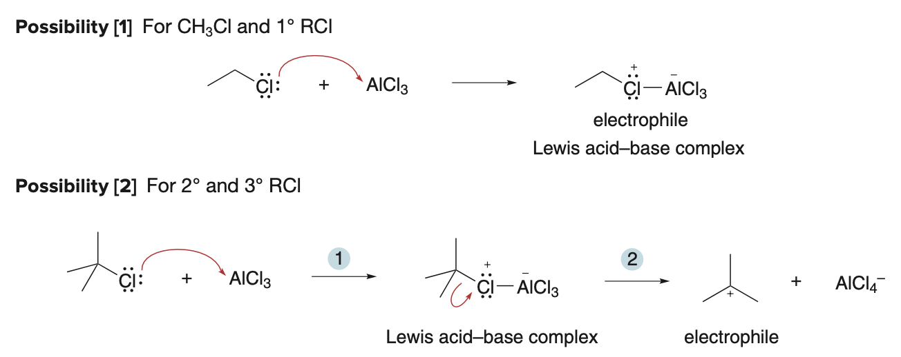

- can also be performed without <C chem="\ce{AlCl3}" /> (`51c,l2,40:28`)
  - protonate alkene to form carbocation

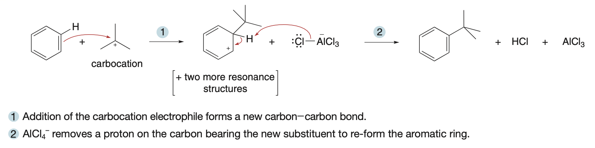

</Box>

## EAS: _activation_ (rate) and _direction_ (regiochemistry)
- _ipso_, _ortho_, _meta_, _para_

<table>

<tr>
  <th>substitutent</th>
  <th>direction</th>
  <th>EWG/EDG</th>
  <th>activation</th>
</tr>

<tr>
  <td>methoxy</td>
  <td>ortho, para</td>
  <td>EDG</td>
  <td>activating</td>
</tr>

<tr>
  <td>methyl</td>
  <td>ortho, para</td>
  <td>EDG</td>
  <td>activating</td>
</tr>

<tr>
  <td>halogen</td>
  <td>ortho, para; lone pairs resonance stabilize, but inductive effect deactivates</td>
  <td>EWG</td>
  <td>deactivating</td>
</tr>

<tr>
  <td>nitro</td>
  <td>meta</td>
  <td>EWG</td>
  <td>deactivating</td>
</tr>

<tr>
  <td>carbonyl</td>
  <td>meta</td>
  <td>EWG</td>
  <td>deactivating</td>
</tr>

</table>

- notice: **any kind of donating** <RA /> **ortho, para directing**; stabilized via resonance
  - donation _via resonance_ beats withdrawal via inductive effect
- notice: **only withdrawing** <RA /> **meta directing**; unstable withdrawing of electrons in _ortho_ and _para_ positions
- **strongest activating group** controls direction

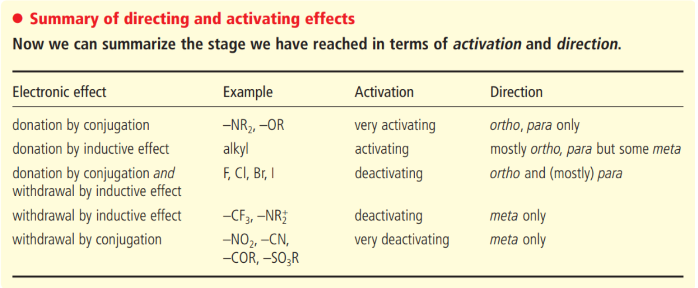

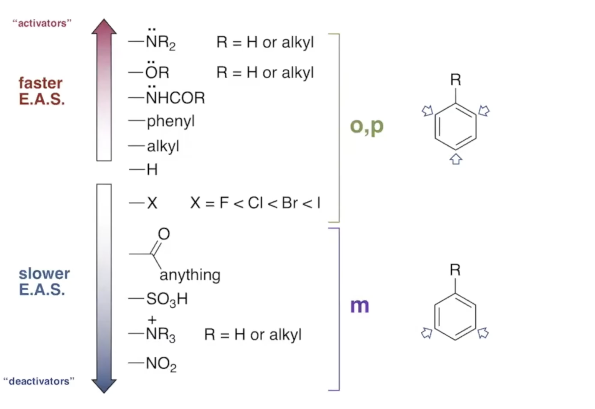

- mixtures of ortho/para can often be separated efficiently with **silica-gel chromatography** (`51c,l4,39:20`)

### Disubstituted benzenes
- no substitution **between meta substituents** (sterics)

## About carbonyls
- **Thermodynamic driving force** for carbonyl reactions is the formation of the <C chem="\ce{C-Nu}" /> $\sigma$-bond which is stronger than the lost $\pi$-bond.

## Nucleophile classes
- 5 classes
  1. hydride
  2. carbon
  3. oxygen (reversible)
  4. sulfur (reversible)
  5. nitrogen (reversible)

## About carboxylic acids and nitriles (`L27`)

### Similarities between carboxylic acids and nitriles
- electrophilic carbons (see: resonance structures)
- carbon atom contains 3 bonds to electronegative atoms
- $\pi$-bonds

### Activating and deactivating groups (`L27,4`)
- **Activating groups** donate electron density (strengthening nucleophile)
  - This decreases acidity
- **Deactivating groups** withdraw electron density (weakening nucleophile)
  - This increases acidity

<Collapse title="Activating and deactivating groups">

</Collapse>

## About enols/enolates
- **enolates** are good for **<SN2 /> reactions!**
- **enols** are much more nucleophlic than regular <C chem="\ce{C=C}" /> double bonds; see the resonance structure.

- acidic vs. basic conditions
    - **enols**; important in acidic conditions (but not basic ones)
    - **enolates**; important in basic conditions (but not acidic ones)
- the **keto** form is favored over the **enol** form
    - except for
        - _phenols_. reason: aromaticity
        - _1,3-diketones_ (_1,3-dicarbonyls_). reason: **hydrogen bond** between -OH and carbonyl oxygen and **resonance**
            - _2,4-pentadione_ exists as 1:3 keto:enol ratio.

### Enolates should avoid water and alcohols
- once you make an enolate, **water and alcohols** have low enough <PKA /> that they will protonate your enolate, **destroying it**.

### Racemization/epimerization
- deprotonation and reprotonation at the $\alpha$-carbon (a hydrogen must be present) will **racemize a stereogenic center**
- if there are other stereogenic centers, the term **epimerization** is used

## Geometry and hybridization

- [“Geometry Determines Hybridization, Not The Other Way Around” (Master Organic Chemistry)](https://www.masterorganicchemistry.com/2018/01/16/a-hybridization-shortcut/#seven)

---

## FAQ

### [Why are more substituted alkenes more stable?](https://www.masterorganicchemistry.com/2020/04/30/alkene-stability/#appendixone)
- orbital mixing of <C chem="\ce{C-H}" /> sigma bonds in methyl group with the $\pi^*$ orbitals of the alkene double bond

### To form thermodynamic product, why do we add LDA into ketone?
- Once kinetic product forms, it is an **enolate** that can react with **ketones**.

### Which reactions are reversible?
- oxygen, sulfur, and nitrogen are **reversible** when attacking carbonyls (condensation and hydrolysis) (`L27,2`)
  - **hydrates, acetals, imines, enamines, oximes, hydrazones**

### Why is anhydride more reactive (electrophilic) than aldehyde? Withdrawing group?
- Oxygen is electron withdrawing through **inductive effects**.
- Resonance also causes the central oxygen to have a **positive charge**, which pulls heavily on the neighboring carbon's electrons, making that carbon very **electrophilic.**

### What makes a good leaving group?
- Main idea: ability to **stabilize a lone pair**
    - Able to stabilize a -ve charge
        - **Polarizability (size)**
        - **Resonance**
    - **Able to lose a +ve charge to become _neutral_**
    - **Strong thermodynamic driving force**

### What makes a good nucleophile?
- Main idea: ability to **donate a lone pair**
    1. less electronegative
    2. polarizability
    3. able to lose a -ve charge and become neutral
    4. lack of steric hindrance
        - tert-butoxide (<C chem="\ce{tBuO-}" />) is a bad nucleophile because its tert-butyl group prevents it from attacking carbons.

### What makes a good base?
