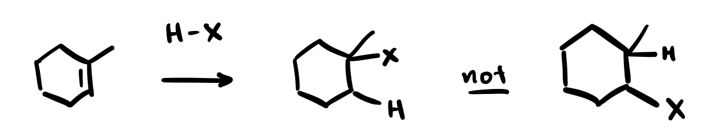
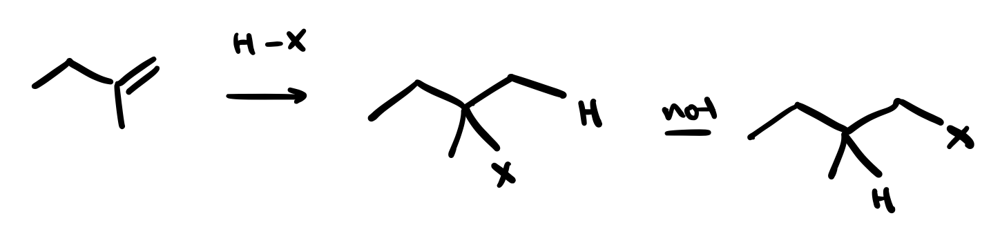
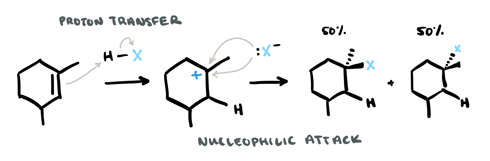

# unit 2: chemistry of alkenes and alkynes

## lecture 11

### basicity vs. nucleophilicity
- basicity: _thermodynamics_ ($\Delta G$)
- nucleophilicity: _kinetics_ ($\Delta G^\ddagger$)

## lecture 12
- difference between energy diagram and RCD
    - **energy diagram.** energy vs. conformation
    - **reaction coordinate diagram (RCD).** energy diagrams (energy vs. reaction stage) for reactions
- the **rate determining step** is the one with the higher $\Delta G^\ddagger$
- **reactive intermediate**. an intermediate that is highly reactive (_concentration never builds up in a reaction_)
    - four types
        - carbocations
        - carbanions
        - radicals
        - carbenes (<C chem="\ce{R-(C^{(2.)})-R'}" /> or <C chem="\ce{R=C^{(2.)}}" />)

### which carbocation is the most stable?
- stabilizing carbocations
    - inductive effects
    - resonance
    - hybridization
        - which orbital is missing the electron?
        - e.g. $sp^2$ missing an electron is worse than a $p$ orbital missing an electron
    - hyperconjugation
- **hyperconjugation**. adjacent $\sigma$ bonds donate electron density into an electron-deficient $p$-orbital.
    - carbocations with more <C chem="\ce{R}" /> groups are more stable, **because of hyperconjugation**

### markovnikov's rule
- in electrophilic addition of <C chem="\ce{H-X}" /> to an unsymmetrical alkene, the **added <C chem="\ce{H}" /> ends up on the less substituted carbon** (and the <C chem="\ce{X}" /> ends up on the more substituted carbon)
    - this is because the carbocation intermediate with **more <C chem="\ce{R}" /> groups** will be more stable
    - this justification works because of **hammond's postulate**
        - the **intermediate/product** is more stable, so the **transition state** will also be more stable

### hammond postulate: blending kinetics and thermodynamics
- hydrohalogenation occurs under **kinetic control**

## lecture 13: electrophilic addition to alkenes (3)

---

## general concepts

### basicity vs. nucleophilicity
- basicity: _thermodynamics_ ($\Delta G$)
- nucleophilicity: _kinetics_ ($\Delta G^\ddagger$)

### kinetic vs. thermodynamic control, hammonds postulate
- **kinetic control.** the major product is the product that forms _fastest_ (i.e. lower $\Delta G^\ddagger$)
    - associated with **irreversible reactions**
- reversible reaction (i.e. equilibrium): **thermodynamic control**
- the **Hammond postulate** allows us to link thermodynamic stability with transition state stability, allowing us to use **thermodynamic stability to predict kinetics**

## problem solving

### which compound is the most nucleophilic?
- charge
- polarizability
- most negative charge aggregated in one location

### which compound is the most electrophilic?
- most positive charge aggregated in one location

## reaction mechanisms

### hydrohalogenation: addition of <C chem="\ce{H-X}" />
- **kinetic controlled**: **once carbocation forms, there is no chance the reaction goes backwards**, i.e. _no equilibrium_

### halogenation: _anti_ addition of <C chem="\ce{X2}" />