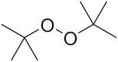

# unit 2: chemistry of alkenes and alkynes

## readings

|lecture|smith|klein|
|:------|:-------|:------|
|11|10.4-10.6, 10.8-10.9|
|12|7.13, 7.14A, 10.10-10.12|
|13|10.13-10.16, 12.1-12.3|
|14|4.14A, 10.17-10.18, 12.1-12.2, 12.7-12.10|
|15|15.1-15.2, 15.13-15.14|8.2|
|16|11.1-11.4, 11.6-11.10, 12.5|
|17|11.11, 11.12, 12.8B|
|18|none||

## lecture 11: nucleophiles, electrophiles, electrophilic addition to alkenes (1)

### basicity vs. nucleophilicity
- basicity: _thermodynamics_ ($\Delta G$)
- nucleophilicity: _kinetics_ ($\Delta G^\ddagger$)

## lecture 12: electrophilic addition to alkenes (2)
- difference between energy diagram and RCD
    - **energy diagram.** energy vs. conformation
    - **reaction coordinate diagram (RCD).** energy diagrams (energy vs. reaction stage) for reactions
- the **rate determining step** is the one with the higher $\Delta G^\ddagger$
- **reactive intermediate**. an intermediate that is highly reactive (_concentration never builds up in a reaction_)
    - four types
        - carbocations
        - carbanions
        - radicals
        - carbenes (<C chem="\ce{R-(C^{(2.)})-R'}" /> or <C chem="\ce{R=C^{(2.)}}" />)

### which carbocation is the most stable?
- stabilizing carbocations
    - inductive effects
    - resonance
    - hybridization
        - which orbital is missing the electron?
        - e.g. $sp^2$ missing an electron is worse than a $p$ orbital missing an electron
    - hyperconjugation
- **hyperconjugation**. adjacent $\sigma$ bonds donate electron density into an electron-deficient $p$-orbital.
    - carbocations with more <C chem="\ce{R}" /> groups are more stable, **because of hyperconjugation**

### markovnikov's rule
- in electrophilic addition of <C chem="\ce{H-X}" /> to an unsymmetrical alkene, the **added <C chem="\ce{H}" /> ends up on the less substituted carbon** (and the <C chem="\ce{X}" /> ends up on the more substituted carbon)
    - this is because the carbocation intermediate with **more <C chem="\ce{R}" /> groups** will be more stable
    - this justification works because of **hammond's postulate**
        - the **intermediate/product** is more stable, so the **transition state** will also be more stable

### hammond postulate: blending kinetics and thermodynamics
- hydrohalogenation occurs under **kinetic control**

## lecture 13: electrophilic addition to alkenes (3)

## lecture 14: intro to organic synthesis, oxidation and reduction
## lecture 15: oxidation of alkenes and intro to radical chemistry
## lecture 16: radical reactions and alkyne chemistry
## lecture 17: the chemistry of alkynes
## lecture 18: alkynes and organic synthesis

---

## general concepts

### basicity vs. nucleophilicity
- basicity: _thermodynamics_ ($\Delta G$)
- nucleophilicity: _kinetics_ ($\Delta G^\ddagger$)

### kinetic vs. thermodynamic control, hammonds postulate
- **kinetic control.** the major product is the product that forms _fastest_ (i.e. lower $\Delta G^\ddagger$)
    - associated with **irreversible reactions**
- reversible reaction (i.e. equilibrium): **thermodynamic control**
- the **Hammond postulate** allows us to link thermodynamic stability with transition state stability, allowing us to use **thermodynamic stability to predict kinetics**

### markovnikov
- non-hydrogen substituent ends up on the _more substituted carbon_ (think: **m**arkovnikov is **m**ore substituted)

## problem solving

### which compound is the most nucleophilic?
- most negative charge aggregated in one location
- more electronegative $\implies$ worse nucleophile
    - electronegative atoms like holding onto their negative charge
- polarizability
- steric effects
- references
    - [ucalgary](https://www.chem.ucalgary.ca/courses/351/Carey5th/Ch08/ch8-5.html)
    - [socratic](https://socratic.org/questions/what-determines-the-nucleophile-s-strength)

### which compound is the most electrophilic?
- most positive charge aggregated in one location
    - full positive charge stronger than partial
- positive charge on more electronegative atom $\implies$ better electrophile
- least sterically hindered
- [C=O double bond is more electronegative than C-O bond](https://archive.md/SKsEn)
    - resonance structure <C chem="\ce{C^+-O-}" /> implies greater charge separation

## numbers
- <C chem="\pu{1.36 kcal/mol}" /> is 10-fold rate difference
- radical stability
    - 1º < 2º < 3º, each <C chem="\Delta \Delta G^{\circ} \approx 2 \text{-} 3 \pu{kcal/mol}" />

## reaction mechanisms

### `alkene/1`. hydrohalogenation: addition of <C chem="\ce{H-X}" /> (<C chem="\ce{X} = \ce{Cl, Br, I}" />)
- reagents
    - 1 equivalent <C chem="\ce{X2}" />
    - solvent: <C chem="\ce{CCl4}" /> or <C chem="\ce{CH2Cl2}" />

#### stereochemistry and regiochemistry
- regiochemistry: markovnikov addition
- stereochemistry: racemic mixture

#### additional notes
- **kinetic controlled**: **once carbocation forms, there is no chance the reaction goes backwards**, i.e. _no equilibrium_

### `alkene/2`. acid-catalyzed hydration

#### regiochemistry and stereochemistry
- follows _Markovnikov_ addition
- stereochemistry: forms _racemic_ mixtures

#### additional notes
- if the solvent is an alcohol rather than water (i.e. <C chem="\ce{R-OH}" />), then in the second step, an alcohol will function as the nucleophile instead of water, leading to attachment of a <C chem="\ce{-OR}" /> group.

### `alkene/3`. halogenation: _anti_ addition of <C chem="\ce{X2}" />

- reagents
    - 1 equivalent <C chem="\ce{X2}" />
    - solvent: <C chem="\ce{CCl4}" /> or <C chem="\ce{CH2Cl2}" />

#### stereochemistry and regiochemistry
- regiochemistry: irrelevant
- stereochemistry: _anti_ addition

### `alkene/4`. halohydrin formation

### `alkene/5`. hydroboration-oxidation: anti-markovnikovian _syn_-addition of water

#### stereochemistry
- only _syn_ addition is observed

### `alkene/6`. catalytic hydrogenation: addition of <C chem="\ce{H2}" />

- we need an acid catalyst because _water is not acidic enough to protonate an alkene on its own_

### `alkene/7`. epoxidation

- reagents
    - peroxyacid, e.g.
        - **<i>m</i>CPBA (meta-chloroperoxybenzoic acid).**
        - **peroxybenzoic acid** (<C chem="\ce{PhCO3H}" />).

### `alkene/8`. _anti_ dihydroxylation

- an extension of epoxidation

### `alkene/9`. _syn_ dihydroxylation

- reagents
    - catalytic (aka [Upjohn dihydroxylation](https://www.organic-chemistry.org/namedreactions/upjohn-dihydroxylation.shtm))
        - osmonium tetroxide (<C chem="\ce{OsO4}" />)
        - _N_-methyl morpholine-_N_-oxide (<C chem="\ce{NMO}" />)
        - solvent: aqueous acetone
    - stoichiometric

#### regiochemistry and stereochemistry
- regiochemistry is **irrevelant** since we are adding two of the same group
- stereochemistry is _syn_ addition
    - **steric hindrance** can prevent particular stereoisomers from forming

### `alkene/10`. ozonolysis: addition of <C chem="\ce{O3}" /> followed by cleavage; forms _ketones_ and _aldehydes_

- _stereochemistry and regiochemistry are irrelevant_

### `alkene/11`. oxymecuration-demercuration

- used because **carbocation rearrangements** can happen in acid-catalyzed hydration (`alkene/2`).

### `radical/1`. alkene hydrohalogenation: addition of <C chem="\ce{H-X}" /> via a _radical chain mechanism_

### `radical/2`. radical polymerization

### `alkyne/1`. alkyne hydrohalogenation (<C chem="\ce{X = Cl, Br, I}" />)

- reagents
    - peroxide: di-_tert_-butyl-peroxide

### `alkyne/2`. alkyne halogenation: addition of <C chem="\ce{X-X}" /> (<C chem="\ce{X = Cl, Br}" />)

- reagents
    - 1 equivalent <C chem="\ce{X2}" /> for _trans_ halide
    - 2 equivalents (or excess) <C chem="\ce{X2}" /> for tetrahalide
    - solvent: <C chem="\ce{CCl4}" /> or <C chem="\ce{CH2Cl2}" />

#### stereochemistry
- _trans_ product only

### `alkyne/3`. alkyne acid-catalyzed hydration: addition of <C chem="\ce{H-OH}" />, followed by tautomerization to _ketones_

- for terminal alkynes, a mixture of catalysts (<C chem="\ce{H2SO4, HgSO4}" />) is needed in order to activate the alkyne

#### regiochemistry and stereochemistry
- this reaction is **not regioselective**; the products are mixed
- **stereochemistry is not a consideration** because the double bond becomes a single bond after tautomerization
    - there is a slight preference because one of the enols is more stable, but the effect is minimal

### `alkyne/4`. alkyne hydroboration-oxidation: anti-mknv addition of <C chem="\ce{H-OH}" />, followed by tautomerization to _aldehydes_

### `alkyne/5`. reduction of alkyne to alkane
- reagents
    - hydrogen gas: <C chem="\ce{H2}" />
    - [palladium on carbon](https://en.wikipedia.org/wiki/Palladium_on_carbon): <C chem="\ce{Pd/C}" /> 
- double _syn_ addition of <C chem="\ce{H2}" />

### `alkyne/6`. reduction of alkyne to _cis_ alkene

- uses the **Lindlar reagent**

### `alkyne/7`. reduction of alkyne to _trans_ alkene (the _&ldquo;dissolving metal reduction&rdquo;_)

- involves **single electron transfer (SET)**

### `alkyne/8`. acetylide ion formation and <C chem="\ce{C-C}" /> bond formation
