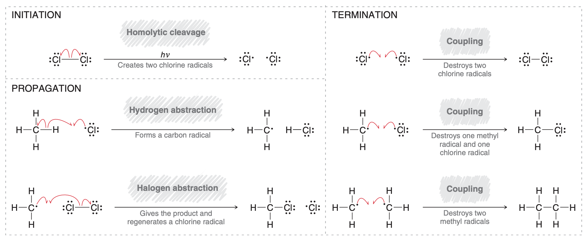

# unit 3: substitution and elimination reactions

## readings
|lecture|smith|klein|
|:------|:-------|:------|
|19|7.1-7.4, 15.3-15.8, 15.10||
|20|7.5-7.11||
|21|7.12-7.17||
|22|8.1-8.8||
|23|7.15, 8.9, 8.11||

## lecture 19: intro to $sp^3$ electrophiles

### what makes a good leaving group?
- _criterion 1_: anything that can **stabilize a negative charge**
    - nonfactors
        - electronegativity
    - factors
        - **polarizability**. how distorted the electron cloud of an atom is
            - generally larger atoms are more polarizable
            - the larger the atom, the less the nucleus can feel the negative charge (negative charge more stable) $\iff$ more polarizable
        - **resonance delocalization**
            - the more delocalized, the more stablized the negative charge
            - e.g. _&ldquo;pseudohalides&rdquo;_
                - $R$ group commonly methyl or phenyl
- _criterion 2_: able to lose a positive charge
    - charged species are higher in energy $\implies$ more reactive
    - if a group can regain a neutral charge by leaving with a lone pair, it is a good leaving group.
    - protonated hydroxyl group (<C chem="\ce{-OH2}" />) is a good leaving group (it can lose its positive charge if it leaves)
- _criterion 3_: strong thermodynamic driving force <T tag="L23" />

### what makes a strong nucleophile in substitution reactions?
- able to donate a lone pair
    - factors
        - **electronegativity**
            - the more electronegative, the _less_ nucleophilic
            - $\boxed{\chi \uparrow \implies \text{Nu} \downarrow}$
            - reason: an electronegative element doesn't want to give up its electrons
        - **polarizability**
            - the more polarizable the atom, the more nucleophilic it is
                - polarizability increases down groups
            - $\boxed{\text{polarizability} \uparrow \implies \text{Nu} \uparrow}$
            - reason: the electron cloud can easily distort and grab the electrophile
        - **able to lose a negative charge**
            - if a <C chem="\ce{Nu}" /> can lose a negative charge and become neutral by donating its lone pair, it is a better <C chem="\ce{Nu}" /> than its neutral counterpart
                - water < <C chem="\ce{OH-}" />
                - ethanol < ethoxide
            - reason: neutral is more stable; donating is thermodynamically favorable
        - **steric hindrance**
            - steric bulk around <C chem="\ce{Nu}" /> site decreases Nu for any electrophile that is _not a proton_
                - e.g. methanol vs. _t_-Butanol
                    - methanol is a stronger acid = methoxide weaker base = harder to lose a negative charge
                    - however, methoxide is a stronger nucleophile because it is less bulky
- why is mustard gas poisonous?
    - sulfur is a good nucleophile
    - chlorine is a good leaving group
    - mustard gas attacks itself, turning sulfur into a good LG
    - guanine attacks sulfur and becomes _alkylated guanine_
    - _alkylated guanine_ triggers programmed cell death

## lecture 20: substitution &mdash; $\text{S}_\text{N}2$ and $\text{S}_\text{N}1$

## lecture 21: elimination &mdash; $\text{E}1$ and $\text{E}2$

## lecture 22: battle of the mechanisms: $\text{S}_\text{N}2$ vs. $\text{S}_\text{N}1$ vs. $\text{E}1$ vs. $\text{E}2$

## lecture 23: alcohol chemistry ($\text{S}_\text{N}2$ and $\text{E}2$)

---

## topics

### hammond's postulate
- hammond's postulate only explains kinetic selectivity when the reaction is endothermic
    - endothermic reactions mean the transition state resembles the products
    - the more stable product will form faster
    - for exothermic reactions, the TS resembles the reactants, and the different _regiochemical products are irrelevant_ to kinetics

---

# reactions

## `alkane/1`. radical chlorination/bromination

### additional notes
- bromination is much more regioselective than chlorination
    - reason: bromination is endothermic, in combination with hammond's postulate
        - bonds broken: <C chem="\ce{C-H}" />
        - bonds formed: <C chem="\ce{C-Br}" />
    - reason: chlorination is exothermic
