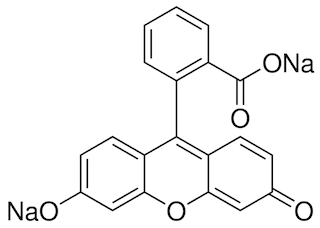

# A low-cost palmtop high-speed capillary electrophoresis bioanalyzer with laser induced fluorescence detection (Pan 2018)

- **LIF**. laser induced fluorescence
- 1.02 nM sodium fluorescein
- **PMT**. photomultiplier
- **CZE**. capillary zone electrophoresis

- used **fused silica capillaries**