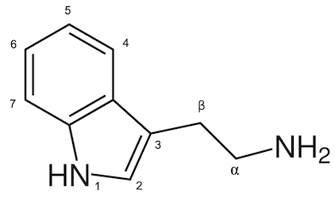

# Lecture 2. Synthetic, biodegradable lipid nanoparticles for gene therapy and gene editing

## Neurotransmitter-derived lipidoids (NT-lipidoids) for enhanced brain delivery through intravenous injection
- drugs are rapidly ejected from the CNS within hours
- temporary disruption of the BBB leads to neurotoxicity and neuropathic conditions
- NT-derived because some NTs have been shown to cross the BBB
  - e.g. **dimethyltryptamine**, other **tryptamine** derivatives
- synthesized using **Michael addition**
- payloads
  - small-molecule drug. **amphotericin B (AmB)**
  - antissense oligonucleotides. **Tau-ASO**
  - gene editing protein. **GFP-Cre**
- Ai14 has a STOP cassette preventing fluorescence, unless genetically modified

## Lipid nanoparticle-mediated codelivery of Cas9 mRNA and single-guide RNA achieves liver-specific in vivo genome editing of _Angptl3_

- **Angptl3**. Angiopoietin-like 3
  - loss-of-function mutation is associated with lower blood lipid levels
    - triglycerides (TG)
    - LDL cholesterol (LDL-C)
  - _no apparent clinical risks resulting from this loss_
  - validated in PhI trial in healthy humans
- developed a:
  - **lipid nano-particle delivery platform** 
  - carrying Cas9 messenger RNA (mRNA) and guide RNA
  - for editing of _Angptl3_ _in vivo_.
- current gold standard (FDA approved too): **MC-3 LNP**
  - for siRNA only, not CRISPR-Cas9
- more _efficient_ than MC-3 LNP
- therapeutic rationale
  - target monogenic mutations that are known to have protective effect against _polygenic/multifactorial_ diseases
  - e.g. _Pcsk9_ knockdown for treating hyperlipidemia (_Pcsk9_ loss-of-function is known to protect against hyperlipidemia)
- current CRISPR-Cas9 delivery methods
  - adenovirus or adeno-associated virus (AAV) vector
    - undesired insertion mutagenesis
    - biosafety issues
- Cas9 delivered as mRNA is particularly promising for _in vivo_ genome editing of its _transient, nonintegrating Cas9 expression_.
- **system**
  - composed of
    - a leading tail-branched bioreducible lipidoid (**306-O12B**)
    - coformulated with an optimized mixture of excipient lipid molecules
  - successfully codelivers SpCas9 (Streptococcus pyogenes Cas9) mRNA and a sgRNA targeting Angptl3 (sgAngptl3)
- **procedure**
  - injected into **C57BL/6 mice**
- **results**
  - **median editing rate of 38.5%**
  - corresponding **65.2% reduction of serum ANGPTL3** protein.
- **lipidoid**. lipid-like structures containing multiple secdonary and tertiary amine functionalities

### Related papers/readings
- Lipid Nanoparticle Systems for Enabling Gene Therapies ([pubmed](https://www.ncbi.nlm.nih.gov/pmc/articles/PMC5498813/))
- A Single Administration of CRISPR/Cas9 Lipid Nanoparticles Achieves Robust and Persistent In Vivo Genome Editing ([pubmed](https://pubmed.ncbi.nlm.nih.gov/29490262/))
  - examined the ability to modulate the _chemical structure of the Cas9 gRNA_ to influence the _Cas9 editing efficiency_ _in vivo_ to knock down the _Ttr_ gene.
- Michael addition
- female wild-type **Balb/c mice**
  - ability to produce plasma cell tumors within soft tissue is important in the production of monoclonal antibodies (mAbs)
- Cre-Lox recombination
  - FLEx switches
    - Tissue-specific expression

## In situ cancer vaccination using lipidoid nanoparticles
- **STING activation**.
  - **STING**. stimulator of interferon (IFN) genes (STING) pathway
  - **STING** is a master regulator in the cancer-immunity cycle
  - activate of STING are critical for anticancer immunity
  - **TAA**. tumor-associated antigens
  - **DOX**. doxorubicin
  - **cGAMP**. an agonist of the STING pathway
  - **OVA**. model antigen ovalbumin
- **IgG1**. subtype of IgG
- **$T_h1$ (T helper 1) cell**. subclass of CD4+ T Helper cells.
  - $T_h1$ lead to cell-mediated response
  - $T_h2$ leads to humoral immune response
- Successful LNP cancer vaccine should enhance **CD8+ T cell activation**
  - Only possible if antigen is delivered **straight into cytosol of APCs** (alerts CD8+ that cells)
    - proteosome and **MHC class 1**
  - ingested from surroundings would present on MHC class 2
- **zeta potential**. the electrical potential at the slipping plane, which is the interface which separates _mobile fluid from fluid that remains attached to the surface_
- **B16F10**. mouse melanoma
- how does **immune escape work**?
  - https://www.ncbi.nlm.nih.gov/pmc/articles/PMC6249768/

## Questions

### Lipid nanoparticle-mediated codelivery of Cas9 mRNA and single-guide RNA achieves liver-specific in vivo genome editing of _Angptl3_

- How is efficiency measured?
- How do you detect off-target mutagenesis?
- Why does the effect only last 100 days?
  - Hepatocyte lifespan ranges from 200 to 300 days.[^livercells] (does this explain everything?)
- While delivering Cas9 as DNA, mRNA, or RNP (with gRNA) formats each have potential strengths, mRNA delivery is particularly promising for in vivo genome editing applications because of its _transient, nonintegrating Cas9 expression feature_.
  - Why is it _nonintegrating_ compared to other formats (namely RNP)?
- How do the injected LNPs only target liver cells?

### Neurotransmitter-derived lipidoids (NT-lipidoids) for enhanced brain delivery through intravenous injection

### In situ cancer vaccination using lipidoid nanoparticles

[^livercells]: [Stem Cells and Liver Regeneration (Gastroenterology 2011)](https://www.ncbi.nlm.nih.gov/pmc/articles/PMC3136245/)