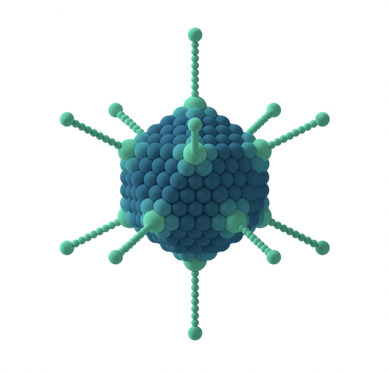

# Lecture 3. COVID-19: Developing a Vaccine During a Pandemic

## Vaccines elicit highly conserved cellular immunity to SARS-CoV-2 Omicron (Liu, 2022)
- Ad26.COV2.S or BNT162b2 vaccines demonstrated durable Spike-specific CD8+ and CD4+ T cell responses
  - showed extensive cross-reactivity against both the Delta and Omicron variants, including in central and effector memory cellular subpopulations
- i.e. lower levels of antibodies (B cell response), but still high level of cellular immune response (CD8+, CD4+ response)
- **cross-reactivity**. the ability of an observed agent to initiate reactions outside the main reaction expected. This is relevant to allergic reactions (undesired cross-reactivity) and broad immune response (desired cross-reactivity).

## Novel approaches for vaccine development
- Traditional vaccines have fallen short for
  - persistent infections
  - rapidly evolving pathogens with high sequence variability
  - complex viral antigens
  - emerging pathogens
- discuss current state of
  - RNA vaccines
  - adenovirus vector-based vaccines
  - advances from biomaterials and engineering
- mRNA benefits
  - stabilize proteins in more immunogenic form
  - multiple mRNAs
    - generate multi-protein complexes
    - multiple vaccines in one
  - mRNAs are manufacturing in a consistent way regardless of the sequence
    - simplifies scale up and quality control
- Vaccines for SARS-CoV-2
  - Moderna **mRNA-1273**
  - Pfizer/BioNTech **BNT162b2**
- design of mRNA vaccine
  - requires inverted triphosphate cap (N7-methylated guanosine) at 5' end
    - added with **anti-reverse cap analog (ARCA)** or **vaccinia capping enzyme**
  - 3'-UTR
    - modulates mRNA half life
  - 5'-UTR
    - modulates stability and translation _initiation_ efficiency
  - Codon optimiation
    - changes secondary structure content
    - changes translation elongation rate
  - Long Poly-A tail (>120 units)
    - increases protein expression
- mRNA vaccines can cause innate immune system stimulation
  - TLR3, TLR7/8 in endosomes
  - MDA5, RIG-I in cytosol
  - NLRS
- **N1-methyl-pseudouridine** circumvents TLR7/8 activation
- High antibody titers and germinal center (GC) B cell and T follicular helper (Tfh) cell responses by sustained antigen availability resulting from mRNA vaccination
- Tfh cells are critical to the development of potent and durable neutralizing antibody responses

### mRNA vaccines

#### Lipid nanoparticle mRNA delivery
- LNPs have ~100nm diameter
- LNPs are trafficked to LDL receptors (LDLR) or **scavenger receptors (SR-B1)**
- **opsonize**. to make more susceptible to phagocytosis
- four parts of LNPs
  - ionizable lipid (lipoid)
  - cholesterol
  - PEGylated lipid
  - helper lipid, e.g. distearoylphosphatidylcholine (DSPC)
- amino lipid is key to function of LNPs
  - helps lipid quickly clear from site of injection
  - LNPs are easily metabolized (broken down) and cleared

#### Self-amplifying mRNA (saRNA) vs. mRNA
- based on linear, nonsegmented, single stranded, positive-sense RNA viral genomes
  - positive sense, aka already "premade" mRNA
- much longer than pure mRNA
- **dose-sparing**. using fractional doses
- less stable than mRNA

### Adenovirus vector-based vaccines
- **gene cassette**. contains a gene and a recombination site.
- **expression cassette**. a distinct component of vector DNA consisting of a gene and regulatory sequence to be expressed by a transfected cell.
  - **transfection** for mammalian cells.
  - **transformation** for prokaryotic and non-animal eukaryotic cells.

#### Ad vectors
- dsDNA genome encased in a protein capsid
- capsid includes fibrous projects that extend from the core and bind to receptors expressed on host cells

- Ad vectors were traditionally too immunogenic (when used for gene therapy)
  - would cause adaptive immune response, preventing repeat administrations of therapy

#### Immunogenicity of Ad vector vaccines
- foreign DNA sensors (**TLR9** and **cyclic guanosine monophosphate-AMP synthase (cGAS)**) play critical role in Ad vector innate immunity
- Ads have self-adjuvanting capability
- other benefit: can use both dividing and non-dividing cells for replication

#### Ad pre-existing immunity
- preexisting exposure to Ads neutralizes Ad vaccine vectors
- **serotypes**. groups within a single species of microorganisms that share distinctive surface structures.
- 67+ serotypes of Ads
- Ad26 neutralizing Ab titers is low, even though baseline immunity is common
- can also use **nonhuman Ads** to address preexisting immunity
  - chimpanzee (ChAd)
  - gorilla (GAd)
  - rhesus monkey (RhAd)
- alt: replace epitope
  - common epitope is **hexon protein**

#### Ad vector design, production, and application
- **size: 34-43 kb dsDNA**
- delete **E1 gene** to make replication deficient
- Ads used for **Ebola vaccine**
- [Ad35 used for new TB vaccine](https://www.sciencedirect.com/science/article/pii/S0264410X16300652)

#### Ad vaccine for SARS-CoV-2
- AstraZeneca/Oxford: **ChAdOx1**
- Johnson and Johnson

### Biomaterials-based vaccines
- lipid carriers
- tether signals to surface of spherical carriers
- self-assembly of cues into complexes
- control degradation rate of carriers (controlled release)

## Questions

### Novel approaches to vaccine development
- What is germinal center (GC) B cell and T follicular helper (Tfh) cells?
- What is the difference between amino lipids and lipidoids?
- What is the strand breakage rate for mRNA? How is 1 in 10,000 less stable than 1 in 2,500?
