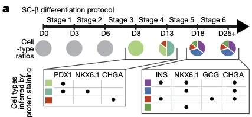
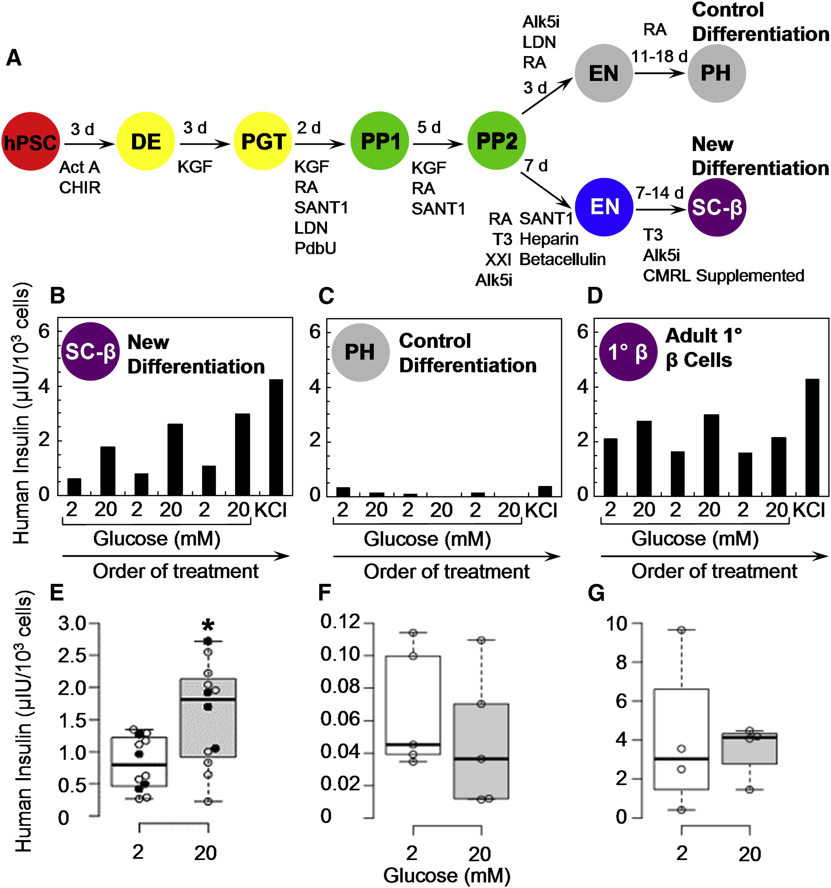

# Lecture 4. Regenerative medicine for Type 1 Diabetes

## Charting cellular identity during human in vitro β-cell differentiation

### Abstract
- transcription profiles of more than 100,000 human cells undergoing in vitro β-cell differentiation, and describe the cells that emerged
- resolved populations
  - $\beta$-cells,
  - $\alpha$-like poly-hormonal cells
  - non-endocrine cells resembling pancreatic exocrine cells
  - previously unreported population that resembles enterochromaffin cells
- endocrine cells maintain their identity in culture in the absence of exogenous growth factors
- changes in gene expression associated with in vivo β-cell maturation also happen in vitro
- develop scalable re-aggregation technique to deplete non-endocrine cells and identify **CD49a (aka ITGA1)** as a surface marker of the β-cell population
  - allows magnetic sorting to a purity of 80%
- use high-resolution sequencing time course to characterize gene-expression dynamics during the induction of human pancreatic endocrine cells $\to$ develop a **lineage model of in vitro β-cell differentiation**.
- implications
  - provides perspective on human stem-cell differentiation
  - guide future research on the differentiation of pancreatic islet cells, and applications in regenerative medicine

### Introduction
- SC-$\beta$. stem-cell-derived $\beta$ cells (from pluripotent stem cells)
  - SCβ protocol performs **stepwise differentiation** using _in vivo_ derived signal cues
    - 6 stages
    - first three, largely homogenous (90%) express master TF **PDX1**
    - after, distinct populations identified by staining for
      - **C-peptide** (a fragment of proinsulin)
      - pan-endocrine marker **CHGA**
      - β-cell transcription factor **NKX6.1**
  - imperfect; not all cells differentiate as desired
- Use high-throughput scRNAseq (HTscRNAseq) to characterize cell types
- measure **progress** and **efficiency** using **immunofluorescence microscopy** and **flow cytometry**

## Questions

---

## Lecture

### Diabetes background
- 50g can of Coke adds 100 mg/dL (considering all 50L water in body)
- why does excess blood sugar cause damage?
  - **additional protein glycation** $\to$ dysfunction of proteins themselves
  - retina, kidneys, and limbs require steady blood flow
- insulin is a dangerous drug: it can lead to **hypoglycemia**
- continuous glucose monitoring (CGM) only monitors peripheral glucose levels (not reflective of blood sugar level (BSL) experienced by organs)
- pancreas
  - two organs in one: 95% **exocrine** and 5% **endocrine**
  - **beta cells**. secrete insulin (activates when BSL high)
  - **alpha cells**. secrete glucagon (activates when BSL low)
- types of diabetes
  - type 1
    - autoimmune disease
    - we don't know why the immune system starts to attack the **beta cells**
  - type 2
    - cells don't respond to insulin
  - relatively rare
    - failure in beta cell development
    - loss of pancrease due to other disease (cystic fibrosis, pancreatitis)
- type 1 diabetes cure: **islet transplantation**
  - very tricky to isolate islets
    - preferentially digest the exocrine
    - use gradient centrifugation
  - can also transplant the whole pancreas: **substantially more difficult for the patient**
  - issues:
    - organ donation: limited supply of organs
    - islet isolation: possibility of failure
    - transplantation: immunosuppresion
- we can solve all these problems by **making islets _in vitro_**
- how to make any cell type?
  - get them from organ donor
  - stimulate endogenous precursor stem cells
  - replicate pre-existing target cells
  - reprogram neighboring cells

### 2<SPACE/> Creating cures using synthetic biology

#### Making beta cells _in vitro_
- no resident pancreatic stem cells
- direct differentiation of embryonic stem cell (ESCs)/iPSCs
- Pagliuca et al. (Cell 2014)

- beta cells don't really divide: 1/1000 beta cells are dividing

#### Key properties of SC-islets (how do you know you succeeded?)
- crystallized insulin granules
- rescue diabetes in mice
- **Vertex Pharmaceuticals (VX-880)**; SC-islets rescue diabetes in humans
- HbA1c: **damaged hemoglobin**

#### SCβ islets work: what's next
- scaling manufacturing
- complete control over cell composition
- eliminate the need for systemic immune suppression
- efficiently create patient-specific iPS-derived islets and develop a universal differentiation protocol

### 3<SPACE />Mapping cell dates during directed differentiation

#### Key questions
- How beta-like are SCβ cells?
- What are the other cell types?
- How did they arise?

#### Where are the non-beta cells?
- Model 1
  - progenitors left behind
  - follow up Q (FUQ): where did they stuck?
- Model 2
  - alternative terminal fates
  - FUQ: how diverse are these fates?

#### Previous work
- Protein assays: low dimensional view
- Gene expression: high-dimensional and comprehensive view of cell types

#### SC-islets contain 4 main cell types (weekly sampling)
- SC-beta
- SC-alpha
- SC-EC (enterochromaffin)
- non-endocrine
- cell types are maintained after they have formed

#### SC-EC cells synthesize and secrete serotonin
- SCβ-cells produce serotonin (in vivo do not)

#### Mapping endocrine induction _in vitro_ at high temporal resolution
- when did SCbeta and SC-EC cells bifurcate?

### 4<SPACE/> Measuring and predicting control of differentiation

#### How do we alter the outcome of differentiation?
1. Change the protocol
2. Change the starting cells

#### Pooled perturbations screen
- can run 10-100k single perturbations of every gene
- what about combinations, timing, context-independence?

### The road ahead
- making single kind of cells: simplest possible case
  - many useful cells, e.g.
    - blood
- making simple tissues?
- making whole organs _in vitro_?