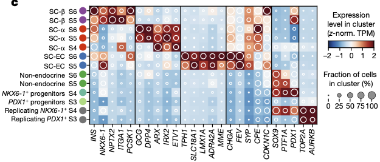

# Lecture 4. Regenerative medicine for Type 1 Diabetes

## Charting cellular identity during human in vitro β-cell differentiation

### Abstract
- transcription profiles of more than 100,000 human cells undergoing in vitro β-cell differentiation, and describe the cells that emerged
- resolved populations
  - $\beta$-cells,
  - $\alpha$-like poly-hormonal cells
  - non-endocrine cells resembling pancreatic exocrine cells
  - previously unreported population that resembles enterochromaffin cells
- endocrine cells maintain their identity in culture in the absence of exogenous growth factors
- changes in gene expression associated with in vivo β-cell maturation also happen in vitro
- develop scalable re-aggregation technique to deplete non-endocrine cells and identify **CD49a (aka ITGA1)** as a surface marker of the β-cell population
  - allows magnetic sorting to a purity of 80%
- use high-resolution sequencing time course to characterize gene-expression dynamics during the induction of human pancreatic endocrine cells $\to$ develop a **lineage model of in vitro β-cell differentiation**.
- implications
  - provides perspective on human stem-cell differentiation
  - guide future research on the differentiation of pancreatic islet cells, and applications in regenerative medicine

### Introduction
- SC-$\beta$. stem-cell-derived $\beta$ cells (from pluripotent stem cells)
  - SCβ protocol performs **stepwise differentiation** using _in vivo_ derived signal cues
    - 6 stages
    - first three, largely homogenous (90%) express master TF **PDX1**
    - after, distinct populations identified by staining for
      - **C-peptide** (a fragment of proinsulin)
      - pan-endocrine marker **CHGA**
      - β-cell transcription factor **NKX6.1**
  - imperfect; not all cells differentiate as desired
- Use high-throughput scRNAseq (HTscRNAseq) to characterize cell types
- measure **progress** and **efficiency** using **immunofluorescence microscopy** and **flow cytometry**

## Questions