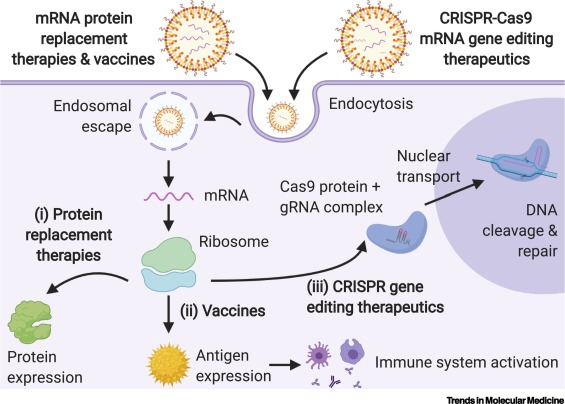
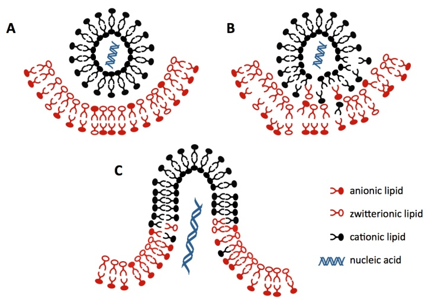

# Recitation 2. Synthetic, biodegradable lipid nanoparticles for gene therapy and gene editing

## Lipid Nanoparticles
- many different formulations
- common formulation
  1. ionizable/cationic lipid
      - drives potency
  2. cholesterol
      - stability and membrane fusion
  3. PEG-lipid
      - regulate size and transfection potency
  4. DSPC
      - believed to help stability
  

## [Endosomal escape](https://www.intechopen.com/chapters/37734)

- flip flop mechanism

