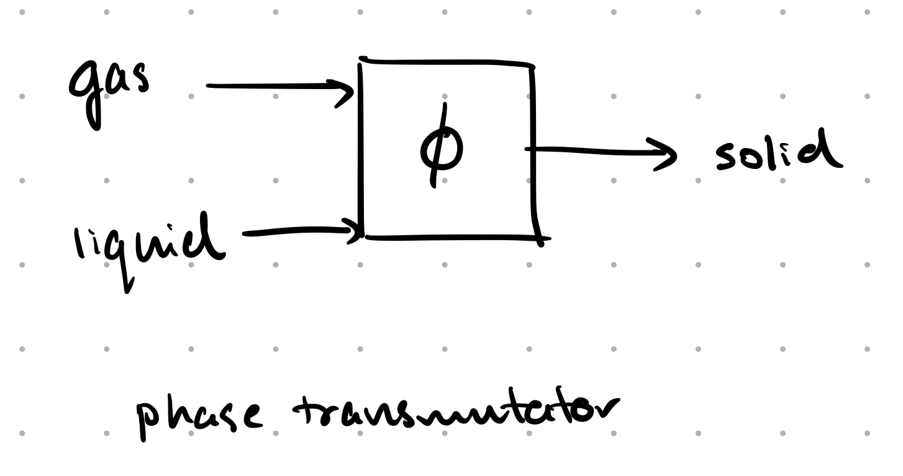
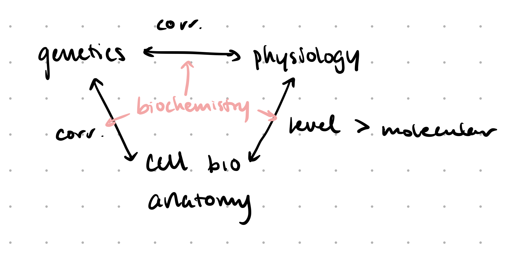

# Lecture 1. Classes of biomolecules; pH, buffers and titration curves

## Readings

_pp. 1-4, 13-17, Appendix 1 (22-23) (11 pages)_

### pp. 1-4

#### Biochemical unity underlies biological diversity
- e.g. TATA-box-binding protein (TBP)
- <Def term="metabolite" />
- life began approximately 3.5 bya
- oxygen atmosphere formed from 2 to 1.5 bya
- key metabolic processes also are common to many organisms

### pp. 13-17

#### Acid-base reactions
- $K$ vs $K_W$ (biochemistry uses $K_W = 1.0 \times 10^{-14}$)
    - $K_W$ is the **ion product** of water
    - biochemistry assumes that <C chem="\ce{[H2O]} = \pu{55.5 M}" />

#### Acid-base reactions can disrupt the double helix
- DNA dissociates at $\PH = 9$ (guanine deprotonated)
    - 9 comes from <PKA /> of guanine

#### Buffers regulate pH in organisms and in the laboratory
- buffer functions best at <PKA /> of acid component

### Appendix 1: Visualizing Molecular Structures 1: Small Molecules
- Stereochemistry
- Fischer projection
- Molecular models
    - Space filling
    - Ball and stick
- CPK coloring
    - C black
    - O red
    - H white
    - S yellow
    - N blue
    - P purple

## Lecture notes

### Why study biochemistry?
- Phase transmutator
    - 
    - It's a plant!
- Relationship between foundations of biology
    - 
    - Biochemistry enables us to determine causation (rather than just correlations).

### Types of biomolecules
1. proteins: polyamides
2. nucleic acids: polyphosphate esters
3. carbohydrates: polyalcohols
4. lipids: alkanes/alkenes with carboxylic acids

### History of biochemistry
- **yeast** has the root: **zyme**
- people wanted to understand **fermentation**
    - two schools of thought
        - vitalism: some "life force"
        - mechanistic: 
    - Pasteur: attempted to grind yeast and use extract to ferment; failed
    - changed in 1897, Edward Buchner
        - achieved fermentation without life
            - extracted the enzymes intact

### Why is life carbon based?
- only 5 elements that can make $\ge 3$ bonds (so that you can get a chain of atoms)
    - B, C, N, Si, P
    - metals primarily form ions
    - B: 3 valence electrons, electron deficient; limited stability
    - N: 5 valence electrons, electron rich; get repulsion, can only make short nitrogen chains
    - C: 4 valence electrons; very stable
    - Si: radius is too large <RA /> not enough orbital overlap to make long chains
    - P: even more unstable chains than N chains

- biochemistry often has **heteronuclear bonds**
    - e.g. C-O, C-N, C-O-C, C-O-P-O
    - because these are less stable than C-C bond

### Limitations of biochemistry
1. 1 atm pressure
2. Most reactions happen at <C chem="37 \Cel" />
3. 55 M <C chem="\ce{H2O}" />
4. enantiomer specific

### Reactions of biochemistry
1. hydrolysis (cleavage by water)
2. dehydration reaction (condensation, loss of water)
    - how do we get around Le Chatelier in 55 M water?
3. oxidation/reduction reactions: dehydrogenation reactions; convert alcohols into ketones and aldehydes
4. isomerization reactions
5. group transfer reactions (<C chem="\ce{PO4}" />, <C chem="\ce{CO2}" />)
6. formation of C-C bonds without water (**lyases**)

#### What you won't see
- alkenes <RA /> alkanes (reduction)
- Grignard
- Diels-Alder (some organisms have **Diels-Alderases**)

### Acids, bases, and pH
- **Bronsted-Lowry definition**
    - acid: proton donor
    - base: proton acceptor
- **Lewis definition**
    - Gilbert Newton Lewis
    - acid: electron pair acceptor
    - base: electron pair donor
- all acids have conjugate bases

$$
\underset{\text{acid}}{\mathrm{HA}} \leftrightharpoons \mathrm{H^+} + \underset{\text{conjugate base}}{\mathrm{A-}}
$$

- all bases have conjugate acids

- strong acids have weak conjugate bases; the equilibrium lies to the right
    - strong acids are generally **mineral acids**
    - complete dissociate
    - <C chem="\ce{HCl, HBr, HNO2, H2SO4}" />
- weak acids partially dissociate
    - <C chem="\ce{CH3COOH}" /> acetic acid
    - ammonium ion (NH4+) to ammonia and proton

#### Calculating pH of solution
- Testing the assumption
    - $\ce{[HAc] = [HAc]_0 - [H+]}$
- Henderson-Hasselbalch equation
    - $\PH = \PK{a} + 1$: 90% deprotonated
    - $\PH = \PK{a} + 2$: 99% deprotonated

#### Determining $\PK{a}$ experimentally
- **titration**
    - determine the amount of acid in a solution

---

## Questions

### Readings
- Fischer projections for long chains? What is the stereochemistry?
    - The Fischer projection is not physically accurate.
    - The Fischer projection is **defined** so that every arm branches out of the page.
- How do I make a buffer?

### Lecture
- What does testing the assumption after the fact work?