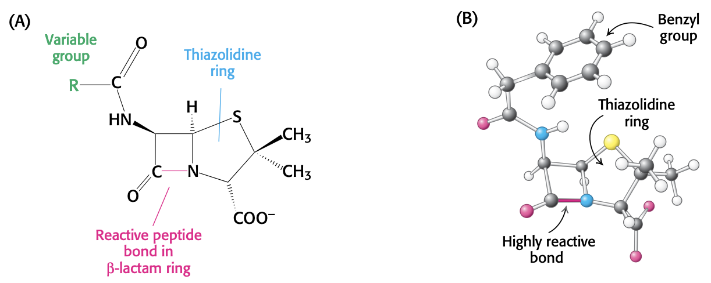

$$\gdef\kcat{k_\text{cat}}$$
$$\gdef\KM{K_M}$$
$$\gdef\Kmapp{K_M^{\text{app}}}$$
$$\gdef\Vmax{V_{\max}}$$
$$\gdef\Vamax{V_{\max}^\text{app}}$$

# Lecture 10. Enzyme Mechanisms and Kinetics

- Readings
  - pp. 234-243
    - 8.5, Enzymes can be inhibited by specific molecules
  - pp. 264-268
    - 9.2, Carbonic anhydrases make a fast reaction faster
  - pp. 455-456
    - 16.1; Mechanism: Triose phosphate isomerase salvages a three-carbon fragment

## Readings

### 8.5<SPACE/>Enzymes can be inhibited by specific molecules
- types of reversible inhibition
  - **competitive**. E can only bind I or S, but not both
    - decreases the fraction of enzyme bound to substrate
    - _can be overcome by adding more substrate_
  - **uncompetitive**. I binds to ES
    - _cannot be overcome by adding more substrate_
  - **noncompetitive**. I binds to different site, deactivating enzyme
    - works by decreasing concentration of functional enzyme
    - _cannot be overcome by adding more substrate_

#### The different kinds of reversible inhibitors are kinetically distinguishable

- dissociation constant for inhibitor: $K_i = \dfrac{\ce{[E][I]}}{\ce{[EI]}}$
  - smaller $K_i$ means stronger inhibitor
- slope of LB plot: $\dfrac{K_M}{\Vmax}$
- y intercept: $\dfrac{1}{\Vmax}$
- x intercept: $-\dfrac{1}{K_M}$

##### Competitive
- $V_{\max}$ unchanged
- $K_M$ increased
  - new value called $\Kmapp = K_M(1 + \dfrac{\ce{[I]}}{K_i}) = K_M(1 + \dfrac{\ce{[EI]}}{\ce{[E]}})$
- LB
  - Slope increased by factor of $1 + \dfrac{\ce{[I]}}{K_i}$

##### Uncompetitive
- $\Vmax$ decreases by factor of $1 + \dfrac{\ce{[I]}}{K_i}$
- $K_M$ decreases by factor of $1 + \dfrac{\ce{[I]}}{K_i}$
  - $$K_M = \dfrac{k_{-1} + k_2}{k_1}$$
  - $K_M$ decreases because I binds ES forming ESI, and by Le Chatelier's principle more E and S will bind to form ES, increasing the apparent value of $k_1$
- LB
  - slope unchanged
  - y intercept increases by factor of $1 + \dfrac{\ce{[I]}}{K_i}$
  - x intercept increases by factor of $1 + \dfrac{\ce{[I]}}{K_i}$ (but x-intercept is negative, so it becomes _more negative_)

##### Noncompetitive
- **pure noncompetitive**
  - $K_i$ is same for both
    - $\ce{E + I <=> EI}$
    - $\ce{ES + I <=> ESI}$
- $\Vmax$ decreases; $\Vamax = \dfrac{\Vmax}{1 + \frac{\ce{[I]}}{K_i}}$
- $K_M$ unchanged
  - simply reduces concentration of functional enzyme
  - EI pulls down LHS of $\ce{E + S <=> ES}$, Le Chatelier's shift towards left
  - ESI pulls down RHS of $\ce{E + S <=> ES}$, Le Chatelier's shift towards right
  - no net change on reaction rate $k_1$ or $k_{-1}$
- LB
  - x intercept unchanged
  - y intercept increases by factor of $1 + \dfrac{\ce{[I]}}{K_i}$
  - slope increases by factor of $1 + \dfrac{\ce{[I]}}{K_i}$

#### Irreversible inhibitors can be used to map the active site
- inhibitors modify functional groups, which can then be identified
- three categories of irreversible inhibitors:
  1. **group-specific reagents**
  2. **reactive substrate analogs (a.k.a. affinity labels)**
  3. **suicide inhibitors**
- **group-specific reagents**
  - react with specific side chains of amino acids
  - e.g. DIPF
    - serine protease trypsin
    - acetylcholinesterase
- **reactive substrate analogs (a.k.a. affinity labels)**
  - structurally similar to substrate and covalently bind to active-site residues
  - e.g. **tosyl-<L/>-phenylalanine chloromethyl ketone (TPCK)** for chymotrypsin
    - binds to His57
  - e.g. **3-bromoacetol phosphate** for triose phosphate isomerase
- **suicide inhibitors (mechanism-based inhibitors)**
  - modified substrates that generate reactive intermediate that inactivates enzyme through covalent modification

#### Penicillin irreversible inactivates a key enzyme in bacterial cell-wall synthesis

- glycopeptide transpeptidase catalyzes formation of cross-links in peptidoglycan
- bacterial cell walls contain <D />-amino acids
- pentaglycine amino group attacks carbonyl of <D/>-Ala-<D/>-Ala
- transpeptidase creates **acyl-enzyme intermediate** before glycine attaches

#### Transition-state analogs are potent inhibitors of enzymes
- **proline racemase**
  - **pyrrole 2-carboxylic acid** is a potent inhibitor because it resembles the transition state
- essence of catalysis: **selective binding of the transition state**

#### Catalytic antibodies (abzymes) demonstrate the importance of selective binding of the transition state to enzymatic activity
- transition state analog **_N_-methylmesoporphyrin** can be used to generate catalytic antibodies
  - only 10x slower than **ferrochelatase**

### 9.2<SPACE/>Carbonic anhydrases make a fast reaction faster

### 16.1; Mechanism: Triose phosphate isomerase salvages a three-carbon fragment

---

## Lecture 10. Enzymes as Catalysts II, Enzyme Kinetics I

### Key points
1. oxyanion hole, trans state stablization
2. Ile-16, Asp-194, 
3. MM kinetics
4. Briggs-Haldane: "Steady state approximation"
5. $\KM$ is **not** an equilbrium constant
6. $\Vmax$, fractional saturation, $K_2 = \kcat$

### Exam questions
- Buffer
- Amino acid sequence
- Protein purification
- Hemoglobin
- Enzymes

### Transition state stablization (TSS) and oxyanion hole
- For serine proteases, the TSS comes from the **oxyanion hole**

### MM kinetics
- alcohol dehydrogenase
- $\ce{EtOH <=> \underbrace{acetaldehyde}_{\text{toxic}} <=>[acetaldehyde][dehydrogenase] AcO-}$

### Determining $\Vmax$ and $\KM$ experimentally
- use different substrate concentrations to find the initial slope, which is $V_0$. for that concentration.
