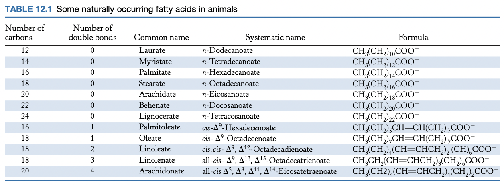

# Lecture 11. Protein Modules, Membranes, and Blood Clotting

- Readings
  - pp. 341-350
  - pp. 303-308
  - pp. 275-281
  - pp. 416-418

## Readings

### 12<SPACE/>Introduction
1. sheet-like structures, only two molecules thick
    - thickness of most membranes between 60 and 100 Å
2. mostly lipids and proteins: mass ratio between **1:4 and 4:1**
3. lipid bilayers due to hydrophobic and hydrophilic moieties
4. specific proteins mediate distinctive functions of membranes
5. membranes are noncovalent assemblies
    - noncovalent interactions act cooperatively
6. membranes are **asymmetric**; two faces differ
7. membranes are **fluid structures**
8. most cell membranes are **electrically polarized** (inside is -60 mV)

### 12.1<SPACE/>Fatty acids are key constituents of lipids

#### Fatty acid names are based on their parent hydrocarbons
- **A:B notation**. $\ce{C_A}$ fatty acid with $B$ double bonds
- position of double bond represented by $\Delta^p$, where $p$ is the carbon where the double bond starts
- alternative: $\omega$-$p$, $p$ is the carbon where the double bond starts, counting from the end
- fatty acids are **ionized at pH 7.4**

#### Fatty acids vary in chain length and degree of unsaturation
- usually **even number** of carbon atoms, between **14 and 24**
- **16 and 18**-carbon fatty acids are the most common

- **short chain length** $\to$ more fluid
- **more unsaturation** $\to$ more fluid

### 12.2<SPACE/>There are three common types of membrane lipids

- **lipids**. water-insoluble biomolecules that are highly soluble in organic solvents such as chloroform
- three major kinds of membrane lipids
  1. phospholipids
  2. glycolipids
  3. cholesterol

#### Phospholipids are the major class of membrane lipids

#### Membrane lipids can include carbohydrate moieties

#### Cholesterol is a lipid based on a steroid nucleus

#### Archael membranes are built from ether lipids with branched chains

#### A membrane lipid is an amphipathic molecule containing a hydrophilic and hydrophobic moiety

### 12.3<SPACE/>Phospholipids and glycolipids readily form bimolecular sheets in aqueous media

#### Lipid bilayers are highly impermeable to ions and most polar molecules

### Blood clotting (10.4)

#### Blood clotting is accomplished by a cascade of zymogen activations

#### Prothrombin requires a vitamin K-dependent modification for activation

#### Fibrinogen is converted by thrombin into a fibrin clot

#### Vitamin K is required for the formation of $\gamma$-carboxyglutamate

#### The clotting process must be precisely regulated

#### Hemophilia revealed an early step in clotting

### 9.4<SPACE/>Myosins harness changes in enzyme conformation to couple ATP hydrolysis to mechanical work

### 14.5<SPACE />Defects in signal-transduction pathways can lead to cancer and other diseases