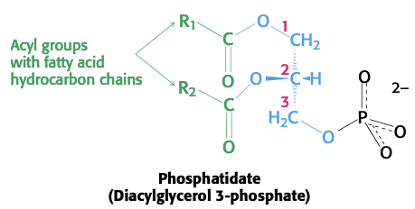
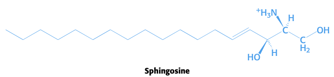
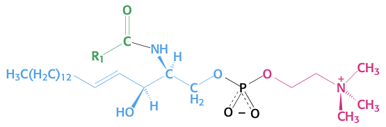
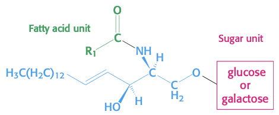
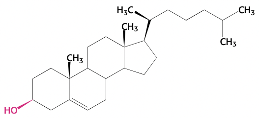

$$\gdef\kcat{k_\text{cat}}$$
$$\gdef\KM{K_M}$$
$$\gdef\Kmapp{K_M^{\text{app}}}$$
$$\gdef\Vmax{V_{\max}}$$
$$\gdef\Vamax{V_{\max}^\text{app}}$$
$$\gdef\ET{\ce{[E]}_T}$$
$$\gdef\E{\ce{[E]}}$$
$$\gdef\S{\ce{[S]}}$$
$$\gdef\ESI{\ce{[ESI]}}$$
$$\gdef\ES{\ce{[ES]}}$$
$$\gdef\EI{\ce{[EI]}}$$
$$\gdef\I{\ce{[I]}}$$

# Lecture 11. Protein Modules, Membranes, and Blood Clotting

- Readings
  - pp. 341-350
  - pp. 303-308
  - pp. 275-281
  - pp. 416-418

## Readings

### 12<SPACE/>Introduction
1. sheet-like structures, only two molecules thick
    - thickness of most membranes between 60 and 100 Å
2. mostly lipids and proteins: mass ratio between **1:4 and 4:1**
3. lipid bilayers due to hydrophobic and hydrophilic moieties
4. specific proteins mediate distinctive functions of membranes
5. membranes are noncovalent assemblies
    - noncovalent interactions act cooperatively
6. membranes are **asymmetric**; two faces differ
7. membranes are **fluid structures**
8. most cell membranes are **electrically polarized** (inside is -60 mV)

### 12.1<SPACE/>Fatty acids are key constituents of lipids

#### Fatty acid names are based on their parent hydrocarbons
- **A:B notation**. $\ce{C_A}$ fatty acid with $B$ double bonds
- position of double bond represented by $\Delta^p$, where $p$ is the carbon where the double bond starts
- alternative: $\omega$-$p$, $p$ is the carbon where the double bond starts, counting from the end
- fatty acids are **ionized at pH 7.4**

#### Fatty acids vary in chain length and degree of unsaturation
- usually **even number** of carbon atoms, between **14 and 24**
- **16 and 18**-carbon fatty acids are the most common

- **short chain length** $\to$ more fluid
- **more unsaturation** $\to$ more fluid

### 12.2<SPACE/>There are three common types of membrane lipids

- **lipids**. water-insoluble biomolecules that are highly soluble in organic solvents such as chloroform
- three major kinds of membrane lipids
  1. phospholipids
  2. glycolipids
  3. cholesterol

#### Phospholipids are the major class of membrane lipids
- built from **glycerol** or **sphingosine**
- glycerol $\to$ **phosphoglycerides**
- most basic phosphoglyceride: **phosphatidate**, a key intermediate in biosynthesis of other phosphoglycerides (PPGs)

- join phosphate group with **hydroxyl gruop** of different alcohols to form major phosphoglycerides
  - serine
  - choline
  - inositol
- **sphingosine** is another backbone; link to amino group (amide bond) and phosphate to hydroxyl group.

#### Membrane lipids can include carbohydrate moieties
- instead of **phosphocholine** attached to backbone, attach sugar.
- **cerebroside**. glucose or galactose attached
- glycolipids are always oriented so that sugar residues are on the **extracellular side of the membrane**

- **ganglioside**. a more complex glycolipid with branched chain of sugars

#### Cholesterol is a lipid based on a steroid nucleus
- found in almost all animal membranes
  - almost 25% membrane lipids in nerve cells
  - absent in some intracellular membranes

- not found in prokaryotes

#### Archael membranes are built from ether lipids with branched chains
- PPGs have **ether linkages** rather than **ester linkages**
- alkyl chains are branched, not linear
- stereochemistry of central glyercol is **inverted** compared to PPGs in eukaryotics/prokaryotes

#### A membrane lipid is an amphipathic molecule containing a hydrophilic and hydrophobic moiety
- **phosphotidylcholine**. roughly rectangular, with polar head group (phosphate + alcohol) and hydrocarbon tail.

### 12.3<SPACE/>Phospholipids and glycolipids readily form bimolecular sheets in aqueous media
- lipid bilayer (LBL) > micelle
  - reason: two fatty acid chains are **too bulky** to fit in interior of micelle
- salts of fatty acids form micelles because they are small
- **micelles are usually <20nm in diameter**
- LBL form spontaneously by **self-assembly process**
- **hydrophobic interactions** are the major driving force for the formation of LBLs
- other stabilization forces
  - VDW forces between tails favor close packing of tails
  - electrostatic and hydrogen bonding between polar head groups and water molecules
- biological consequences
  1. LBLs have inherent tendency to be **extensive**
  2. LBLs tend to close in on themselves (no exposed hydrocarbon chains)
  3. LBLs are **self-sealing**; holes are energetically unfavorable

#### Lipid vesicles can be formed from phospholipids
- **liposomes**. lipid vesicles
- form by suspending lipid in aqueous media and **sonicating**; forms vesicles of diameter 50nm
- add membrane proteins to liposomes by solubilizing the proteins with **detergents**
- drug delivery with liposomes often **lowers toxicity**; less distribution of drug to normal tissue 

#### Lipid bilayers are highly impermeable to ions and most polar molecules
- exception: water
  - due to low molecular weight, high concentration, and lack of complete charge
- the permeability of small molecules is correlated with their solubility in a nonpolar solvent relative to their solubility in water ($P$)
- a small molecule traverses a lipid bilayer membrane by
  1. sheding solvation shell of water
  2. dissolving in the hydrocarbon core of the membrane
  3. diffusing through the hydrocarbon core to be resolved by water

### Blood clotting (10.4)

#### Blood clotting is accomplished by a cascade of zymogen activations
- **enzyme cascade** amplifies signal
- **hemostatis**. the formation of a blood clot
- two pathways: **intrinsic** and **extrinsic** pathways
- **intrinsic pathway**
  - activated by exposure of **anionic surfaces** upon rupture of the endothelial lining of blood vessels
- **extrinsic pathway**
  - 

#### Prothrombin requires a vitamin K-dependent modification for activation

#### Fibrinogen is converted by thrombin into a fibrin clot

#### Vitamin K is required for the formation of $\gamma$-carboxyglutamate

#### The clotting process must be precisely regulated

#### Hemophilia revealed an early step in clotting

### 9.4<SPACE/>Myosins harness changes in enzyme conformation to couple ATP hydrolysis to mechanical work

### 14.5<SPACE />Defects in signal-transduction pathways can lead to cancer and other diseases

---

## Lecture

### Catalytic efficiency $\kcat/\KM$
- $k_2 = \kcat = \dfrac{\Vmax}{\ET}$
- $V_0 = \kcat\ES$
- $\ES = \dfrac{\E\S}{\KM}$ (by definition of $\KM$; $k_1\E\S = (k_{-1} + k_2)\ES$)
- normalize catalytic rate by how good the binding is

### Limits of catalytic efficiency
- $\dfrac{\kcat}{\KM} = \dfrac{\kcat}{\dfrac{k_{-1} + \kcat}{k_1}} = \left(\dfrac{\kcat}{k_{-1} + \kcat}\right)k_1$

### Reversible inhibitors

#### Competitive
- $K_M$ increases

#### Non-competitive
- $K_I = \dfrac{\E\I}{\EI} \underbrace{=\dfrac{\ES\I}{\ESI}}_{\text{only for noncompetitive}}$
- effectively, **less enzyme is present**
- $\Vmax$ decreases

### Allosteric regulation of enzymes
- 