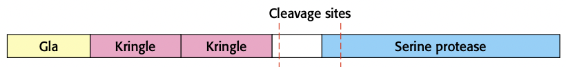
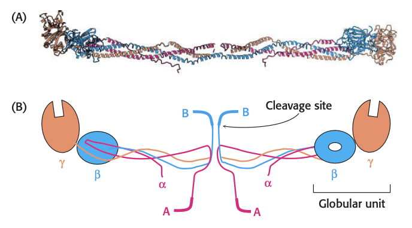
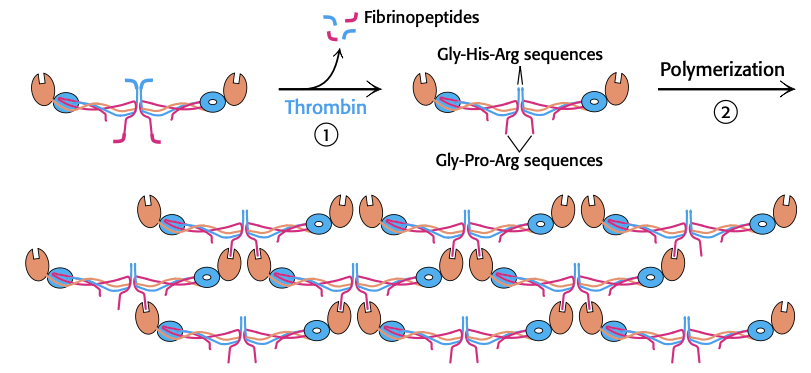
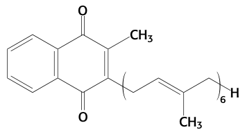
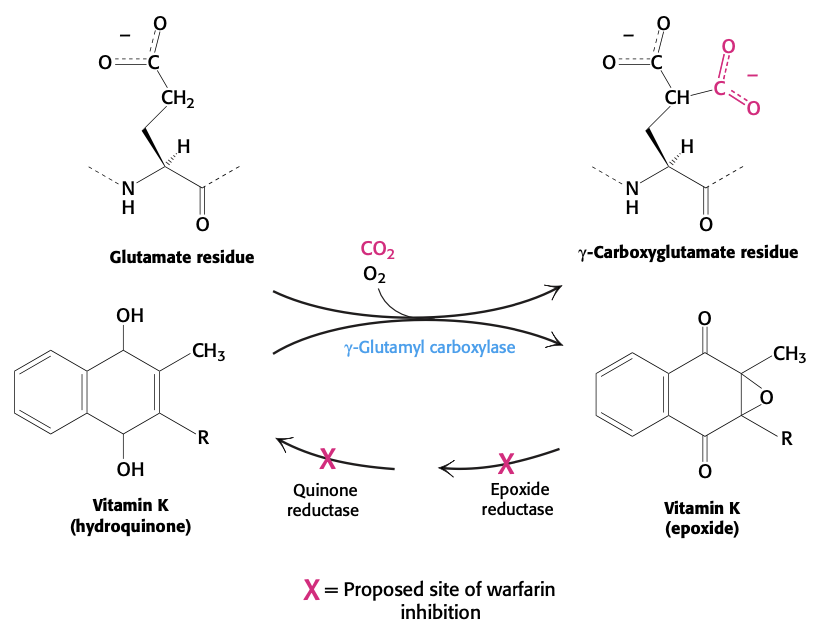
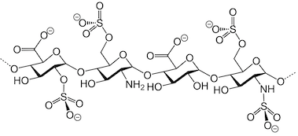
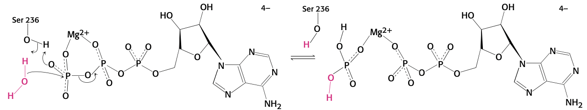
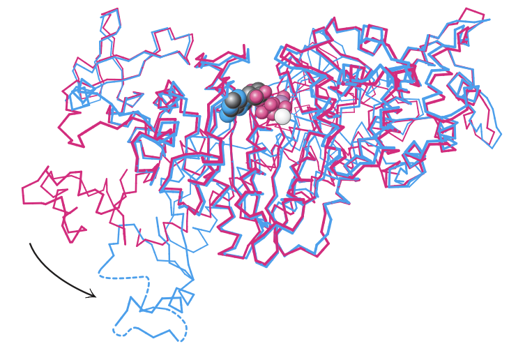
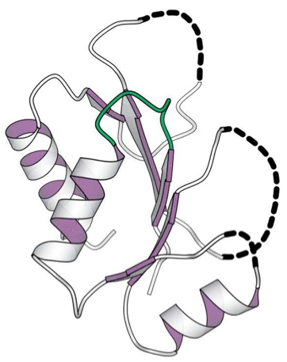
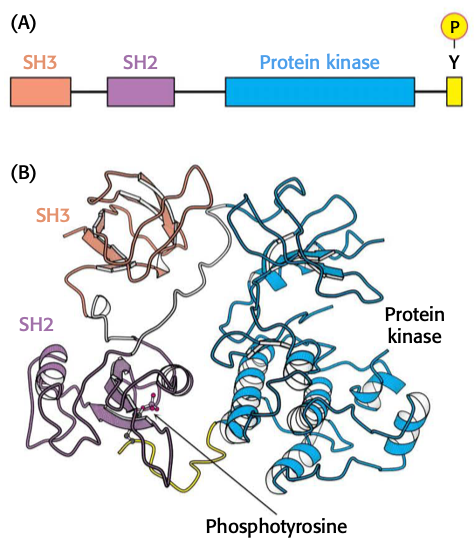

$$\gdef\kcat{k_\text{cat}}$$
$$\gdef\KM{K_M}$$
$$\gdef\Kmapp{K_M^{\text{app}}}$$
$$\gdef\Vmax{V_{\max}}$$
$$\gdef\Vamax{V_{\max}^\text{app}}$$
$$\gdef\ET{\ce{[E]}_T}$$
$$\gdef\E{\ce{[E]}}$$
$$\gdef\S{\ce{[S]}}$$
$$\gdef\ESI{\ce{[ESI]}}$$
$$\gdef\ES{\ce{[ES]}}$$
$$\gdef\EI{\ce{[EI]}}$$
$$\gdef\I{\ce{[I]}}$$
$$\gdef\Mg{\ce{Mg^2+}}$$
$$\gdef\Mn{\ce{Mn^2+}}$$
$$\gdef\PI{\ce{P_i}}$$

# Lecture 11. Protein Modules, Membranes, and Blood Clotting

- Readings
  - pp. 341-350
  - pp. 303-308
  - pp. 275-281
  - pp. 416-418

## Readings

### 12<SPACE/>Introduction
1. sheet-like structures, only two molecules thick
    - thickness of most membranes between 60 and 100 Å
2. mostly lipids and proteins: mass ratio between **1:4 and 4:1**
3. lipid bilayers due to hydrophobic and hydrophilic moieties
4. specific proteins mediate distinctive functions of membranes
5. membranes are noncovalent assemblies
    - noncovalent interactions act cooperatively
6. membranes are **asymmetric**; two faces differ
7. membranes are **fluid structures**
8. most cell membranes are **electrically polarized** (inside is -60 mV)

### 12.1<SPACE/>Fatty acids are key constituents of lipids

#### Fatty acid names are based on their parent hydrocarbons
- **A:B notation**. $\ce{C_A}$ fatty acid with $B$ double bonds
- position of double bond represented by $\Delta^p$, where $p$ is the carbon where the double bond starts
- alternative: $\omega$-$p$, $p$ is the carbon where the double bond starts, counting from the end
- fatty acids are **ionized at pH 7.4**

#### Fatty acids vary in chain length and degree of unsaturation
- usually **even number** of carbon atoms, between **14 and 24**
- **16 and 18**-carbon fatty acids are the most common

- **short chain length** $\to$ more fluid
- **more unsaturation** $\to$ more fluid

### 12.2<SPACE/>There are three common types of membrane lipids

- **lipids**. water-insoluble biomolecules that are highly soluble in organic solvents such as chloroform
- three major kinds of membrane lipids
  1. phospholipids
  2. glycolipids
  3. cholesterol

#### Phospholipids are the major class of membrane lipids
- built from **glycerol** or **sphingosine**
- glycerol $\to$ **phosphoglycerides**
- most basic phosphoglyceride: **phosphatidate**, a key intermediate in biosynthesis of other phosphoglycerides (PPGs)

- join phosphate group with **hydroxyl gruop** of different alcohols to form major phosphoglycerides
  - serine
  - choline
  - inositol
- **sphingosine** is another backbone; link to amino group (amide bond) and phosphate to hydroxyl group.

#### Membrane lipids can include carbohydrate moieties
- instead of **phosphocholine** attached to backbone, attach sugar.
- **cerebroside**. glucose or galactose attached
- glycolipids are always oriented so that sugar residues are on the **extracellular side of the membrane**

- **ganglioside**. a more complex glycolipid with branched chain of sugars

#### Cholesterol is a lipid based on a steroid nucleus
- found in almost all animal membranes
  - almost 25% membrane lipids in nerve cells
  - absent in some intracellular membranes

- not found in prokaryotes

#### Archael membranes are built from ether lipids with branched chains
- PPGs have **ether linkages** rather than **ester linkages**
- alkyl chains are branched, not linear
- stereochemistry of central glyercol is **inverted** compared to PPGs in eukaryotics/prokaryotes

#### A membrane lipid is an amphipathic molecule containing a hydrophilic and hydrophobic moiety
- **phosphotidylcholine**. roughly rectangular, with polar head group (phosphate + alcohol) and hydrocarbon tail.

### 12.3<SPACE/>Phospholipids and glycolipids readily form bimolecular sheets in aqueous media
- lipid bilayer (LBL) > micelle
  - reason: two fatty acid chains are **too bulky** to fit in interior of micelle
- salts of fatty acids form micelles because they are small
- **micelles are usually <20nm in diameter**
- LBL form spontaneously by **self-assembly process**
- **hydrophobic interactions** are the major driving force for the formation of LBLs
- other stabilization forces
  - VDW forces between tails favor close packing of tails
  - electrostatic and hydrogen bonding between polar head groups and water molecules
- biological consequences
  1. LBLs have inherent tendency to be **extensive**
  2. LBLs tend to close in on themselves (no exposed hydrocarbon chains)
  3. LBLs are **self-sealing**; holes are energetically unfavorable

#### Lipid vesicles can be formed from phospholipids
- **liposomes**. lipid vesicles
- form by suspending lipid in aqueous media and **sonicating**; forms vesicles of diameter 50nm
- add membrane proteins to liposomes by solubilizing the proteins with **detergents**
- drug delivery with liposomes often **lowers toxicity**; less distribution of drug to normal tissue 

#### Lipid bilayers are highly impermeable to ions and most polar molecules
- exception: water
  - due to low molecular weight, high concentration, and lack of complete charge
- the permeability of small molecules is correlated with their solubility in a nonpolar solvent relative to their solubility in water ($P$)
- a small molecule traverses a lipid bilayer membrane by
  1. sheding solvation shell of water
  2. dissolving in the hydrocarbon core of the membrane
  3. diffusing through the hydrocarbon core to be resolved by water

### Blood clotting (10.4)

#### Blood clotting is accomplished by a cascade of zymogen activations
- **enzyme cascade** amplifies signal
- **hemostatis**. the formation of a blood clot
- two pathways: **intrinsic** and **extrinsic** pathways
- **intrinsic pathway**
  - activated by exposure of **anionic surfaces** upon rupture of the endothelial lining of blood vessels
- **extrinsic pathway** (most crucial)
  - trauma exposes **tissue factor (TF)**, an integral membrane glycoprotein
  - upon exposure to blood, TF binds to **factor VII** to activate **factor X (a serine protease)**, which converts **prothrombin** to **thrombin**
    - thrombin activates more thrombin via **positive feedback**

#### Prothrombin requires a vitamin K-dependent modification for activation
- four domains
  - **Gla.** rich in gamma-carboxyglutamate (**gla**) residues
  - **Kringle**.
  - Kringle
  - Serine protease
- Vitamin K is required to synthesize gla
- gla is a strong chelator of $\ce{Ca^2+}$
- calcium anchors prothrombin to phospholipid membranes derived from blood platelets after injury
  - brings prothrombin close to **factor Xa** and **factor Va (stimulatory protein)** that catalyze conversion to thrombin
- cleaved at Arg-274/Thr-275 and Arg-323/Ile-324

#### Fibrinogen is converted by thrombin into a fibrin clot
- fibrinogen (Fgn) structure
  - 360 kDa
  - six chains: 2 of $A\alpha$, $B\beta$, $\gamma$
  - rod regions are triple-stranded alpha-helix coiled coils
- thrombin cuts four Arg-Gly peptide bonds in central globular region of Fgn, releasing **A and B peptides (called fibrinopeptides)**

- without A, B peptides, Fgn is called **fibrin monomer**
- knobs on $\alpha$ and $\beta$ chains link to holes in the globular regions of the $\alpha$ and $\beta$ chains
  - $\alpha$: $\ce{H3N+-Gly-His-Arg}$
  - $\beta$: $\ce{H3N+-Gly-Pro-Arg}$

- clot is stabilized by formation of **amide bonds between side chains of lysine and glutamine**
  - catalyzed by **transglutaminase (factor XIIIa)**
  - ammonium ion released

#### Vitamin K is required for the formation of $\gamma$-carboxyglutamate
- vitamin K is reduced to **hydroquinone** which is then used to attach $\ce{CO2}$ to a glutamate residue

- warfarin inhibits both **epoxide reductase and quinone reductase**

#### The clotting process must be precisely regulated
- thrombin catalyzes the formation of fibrin and **initiates the deactivation of the clotting cascade**
  - **protein C** (activated by thrombin) digests factors **Va and VIIIa**
- specific inhibitors also terminate clotting
  - **tissue factor pathway inhibitor (TFPI)**
    - inhibits **TF-VIIa-Xa complex**
  - **antithrombin III (ATIII)**
    - inhibitory action is enhanced by **heparin**; heparin increases the rate of formation of irreversible complexes between ATIII and XIIa, XIa, IXa, Xa.
    - heparin is a negatively charged polysaccharide

- **how are clots removed?**
  - **plasmin** degrades **plasmin**
  - plasmin is formed from **plasminogen**
  - **tissue-type plasminogen activator (TPA)** converts plasminogen $\to$ plasmin

#### Hemophilia revealed an early step in clotting
- **factor VIII (anti-hemophilic factor)** of intrinsic pathway is missing or has reduced activity
  - VIII stimulates activation of X via IXa.
  - **weakened intrinsic pathway response**

### 9.4<SPACE/>Myosins harness changes in enzyme conformation to couple ATP hydrolysis to mechanical work
- catalyzes ATP hydrolysis to drive motion in cells

#### ATP hydrolysis proceeds by the attack of water on the gamma phosphoryl group
- activated water performs nucleophilic attack on phosphorous of ATP
- $\Mg$, $\Mn$ binds to NTPs
  - this complex is the real substrate for ATPases
  - without the metals, enzymes essentially inactive
- bound enzyme to NTP-metal is relatively stable
  - water molecule is unable to be activated because there is no **basic residue** or **nearby metal ion** (the $\Mg$/$\Mn$ is too far away)

#### Formation of the transition state for ATP hydrolysis is associated with a substantial conformational change
- myosin ATPase should stabilize the transition state
- expect a **pentacoordinate** transition state

- can move more than 25 Å

#### The altered conformation of myosin persist for a substantial period of time
- turn over: once per second
- the **release of products, particularly inorganic phosphate**, is the rate-limiting step
- **the persistence of a conformation of myosin with ATP hydrolyzed but still bound to the enzyme is critical for coupling conformational changes**
- ATP hydrolysis within the active site is reversible
- equilibrium constant of enzyme bound reaction is about **10**.
- release of products is rate limiting
  - we know this because $\PI$ released in solution has more than one oxygen substituted from water
  - if release was faster than hydrolysis, then only one oxygen would be substituted

#### Scientists can watch single molecules of myosin move
- myosin moves approximately **74 nm** with every step

#### Myosins are a family of enzymes containing P-loop structures
- **P-loop** of mostly glycines interacts with **phosphoryl groups on a bound nucleotide**

- enzymes with **P-loop NTPase domains**
  - ATP synthase
  - G proteins (signal transduction protein)
  - elongation factor **Tu** (essential for translating mRNA into proteins)
  - DNA and RNA unwinding helicases

### 14.5<SPACE />Defects in signal-transduction pathways can lead to cancer and other diseases

#### Rous sarcoma virus
- Rous sarcoma virus carries a gene called **v-src**, encoding for protein tyrosine kinase **v-Src**.
- **c-Src**, normal protein, contains tyrosine residue that binds to SH2 domain, keeping kinase inactive.

#### Ras
- three kinds in mammalian cells: H, K, and N Ras.
- all cycle between inactive GDP and active GTP forms
- **loss of ability to hydrolyze GTP** keeps Ras proteins in active state

#### Monoclonal antibodies can be used to inhibit signal-transduction pathways activated in tumors
- EGFR is overexpressed in some human epithelial cancers
  - breast
  - ovarian
  - colorectal (CRC)
- **cetuximab** for CRC
  - competitive inhibition of binding site, but
  - sterically blocks conformational change of EGFR
- **trastuzumub** for HER2+ breast cancer
  - inhibits HER2

#### Protein kinase inhibitors can be effective anti-cancer drugs
- chronic myelogenous leukemia (CML)
  - Bcr-Abl kinase is inhibited by **Gleevec**
  - Bcr-Abl kinase is overexpressed compared to normal c-Abl kinase.

#### Cholera and whooping cough are the result of altered G-protein activity
- **cholera toxin (choleragen)** 
  - two functional units
    - β subunit binding to GM1 gangliosides of the intestinal epithelium
    - catalytic A subunit that enters cells
  - catalytic A subunit covalently attaches an ADP-ribose to an arginine residue of $G_{\alpha s}$ protein
    - $\to$ **stabilizes GTP form of** $G_{\alpha s}$
    - $\to$ active G protein continuously activates protein kinase A (PKA)
    - $\to$ PKA open a chloride channel and inhibits $\ce{Na}$ absorption
    - $\to$ results in excessive loss of NaCl
- **pertussis**
  - $G_{\alpha i}$
    - inhibits adenylate cyclase
    - closes $\ce{Ca^2+}$ channels
    - opens $\ce{K+}$ channels
  - pertussis toxin adds ADP-ribose to $G_{\alpha i}$
  - modification traps heterotrimer $G_i$ in off conformation

---

## Lecture

### Catalytic efficiency $\kcat/\KM$
- $k_2 = \kcat = \dfrac{\Vmax}{\ET}$
- $V_0 = \kcat\ES$
- $\ES = \dfrac{\E\S}{\KM}$ (by definition of $\KM$; $k_1\E\S = (k_{-1} + k_2)\ES$)
- normalize catalytic rate by how good the binding is

### Limits of catalytic efficiency
- $\dfrac{\kcat}{\KM} = \dfrac{\kcat}{\dfrac{k_{-1} + \kcat}{k_1}} = \left(\dfrac{\kcat}{k_{-1} + \kcat}\right)k_1$

### Reversible inhibitors

#### Competitive
- $K_M$ increases

#### Non-competitive
- $K_I = \dfrac{\E\I}{\EI} \underbrace{=\dfrac{\ES\I}{\ESI}}_{\text{only for noncompetitive}}$
- effectively, **less enzyme is present**
- $\Vmax$ decreases

### Allosteric regulation of enzymes
- allosteric control
  - product is allosteric inhibitor
  - product binds to regulatory protein