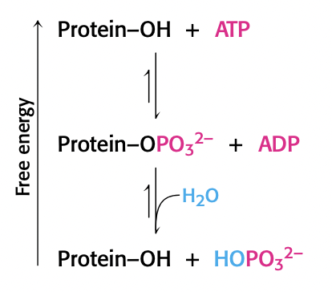
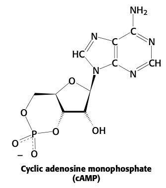
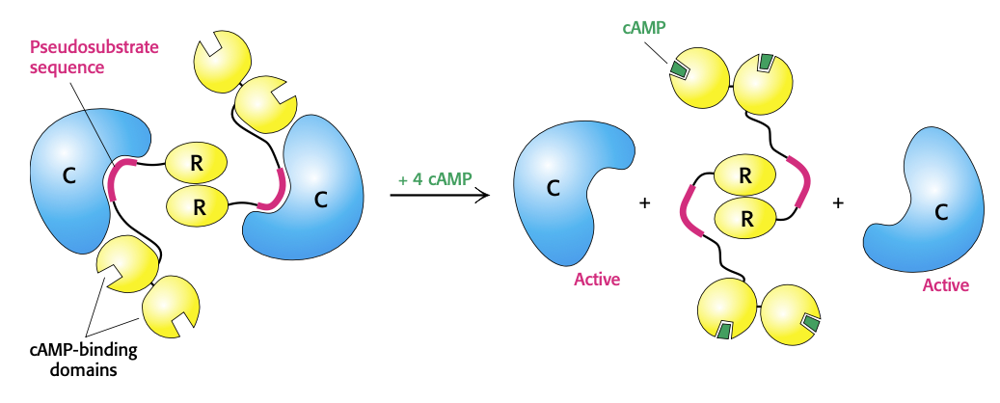
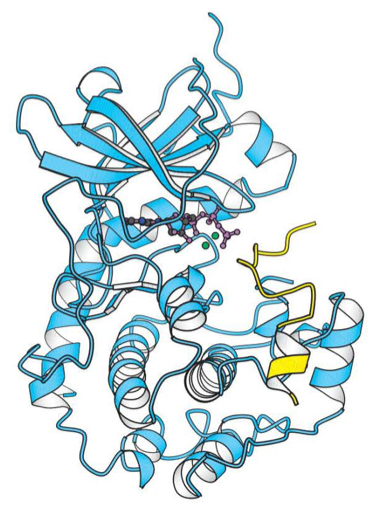
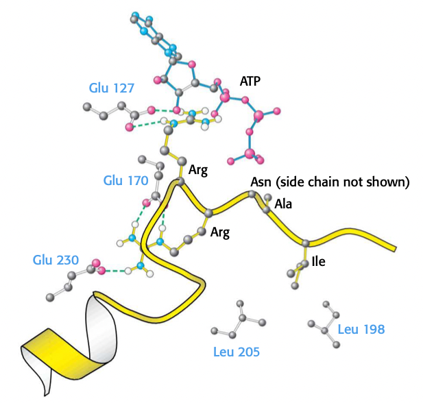
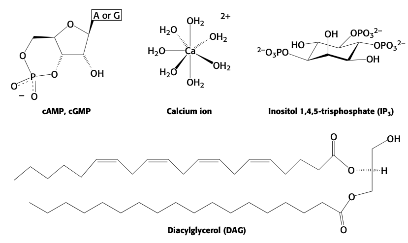

# Lecture 13

- Readings
  - pp. 293-298
    - 10.3, Covalent modification is a means of regulating enzyme activity
  - pp. 397-419
    - 14, Signal transduction pathways

## Readings

### 10.3<SPACE/>Covalent modification is a means of regulating enzyme activity
- phosphorylation and dephosphorylation are common modifications
- acetylation and deacetylation by acetyltransferases (AT)
  - **histones** are acetylated and deacetylated
  - acetylated = actively transcribed

- acetyltransferase and deacetylase are regulated by phosphorylation
- **ubiquitination** signals protein to be degraded by proteosome

#### Kinases and phosphatases control the extent of protein phosphorylation
- protein kinases catalyze phosphorylation
- more than 500 homologous protein kinases known
- ATP is most common phosphoryl donor
  - **acceptor is often hydroxyl group**
    - serine, threonine, tyrosine
- **protein kinase A** recognizes: **RRX<i>S</i>Z**
  - X small residue
  - Z large hydrophobic
- protein phosphatases reverse phosphorylation
  - dephosphorylated protein + <PI/>
  - **phosphorylation is not a condensation reaction**
    - phosphorylation and dephosphorylation are not the same reaction just reversed; they are **different reactions**

#### Phosphorylation is a highly effective means of regulating the activities of target proteins
- **why is phosphorylation so effective?**
  1. free energy of phosphorylation is large: $\pu{-25 kJ/mol}$. $\pu{5.7 kJ/mol}$ is a **factor of 10** in <KEQ/>.
  2. phosphoryl group adds two negative charges: can change protein structure via electrostatic forces
  3. a phosphoryl group can form three or more hydrogen bonds
  4. phosphorylation and dephosphorylation can take place in less than a second or over a span of hours
      - kinetics can be modified to fit physiological process
  5. phosphorylation often evokes highly amplified effects
      - exponential scaling down the signaling pathway
  6. ATP is the cellular energy currency
      - ATP has phosphoryl group donor links energy status of cell to regulation of metabolism

#### Cyclic AMP activates protein kinase A by altering the quaternary structure

- adrenaline $\to$ formation of cAMP $\to$ activation of protein kinase A
- most effects of cAMP in eukaryotic cells are achieved through activation of protein kinase A
- protein kinase A (R2C2) has two kinds of subunits
  - regulatory (R)
  - catalytic (C)
- R has RRGAI, binding sequence of protein kinase A except alanine instead of serine $\to$ cannot be phosphorylated

#### ATP and the target protein bind to a deep cleft in the catalytic subunit of protein kinase A
- residues **40 to 280** in protein kinase A are conserved and are called the **kinase fold**
- protein kinase A has two lobes
  - N lobe contacts $\ce{ATP-Mn^2+}$
  - C lobe binds peptide and has catalytic residues

### 14<SPACE/>Signal transduction pathways
- EGF is released in response to a wound
- **signal transduction**. the chain of events that converts a message into the ultimate physiological response

#### Signal transduction depends on molecular circuits
- all circuits contain certain key steps
  1. release of the primary messenger
  2. reception of the primary messenger
  3. delivery of the message inside the cell by **second messengers**
      - important second messengers include
        - **cAMP**
        - $\ce{Ca^2+}$ (complexed with 7 waters)
        - inositol 1,4,5-trisphosphate (<IP3/>)
        - diacylglycerol (DAG)
  4. activation of effectors that directly alter the physiological response
  5. termination of the signal

### 14.1<SPACE/>Heterotrimeric G proteins transmit signals and reset themselves

### 14.2<SPACE/>Insulin signaling: phosphorylation cascades are central to many signal-transduction processes

### 14.3<SPACE/>EGF signaling: signal-transduction pathways are poised to respond

### 14.4<SPACE/>Many elements recur with variation in different signal-transduction pathways

### 14.5<SPACE/>Defects in signal-transduction pathways can lead to cancer and other diseases
- see L11 readings