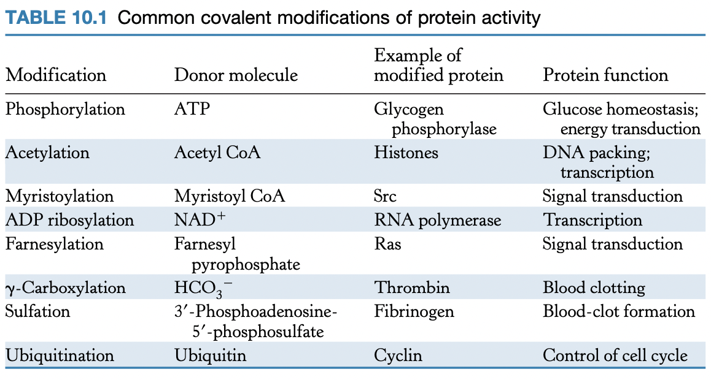

# Lecture 13

- Readings
  - pp. 293-298
    - 10.3, Covalent modification is a means of regulating enzyme activity
  - pp. 397-419
    - 14, Signal transduction pathways

## Readings

### 10.3<SPACE/>Covalent modification is a means of regulating enzyme activity
- phosphorylation and dephosphorylation are common modifications
- acetylation and deacetylation by acetyltransferases (AT)
  - **histones** are acetylated and deacetylated
  - acetylated = actively transcribed

- acetyltransferase and deacetylase are regulated by phosphorylation
- **ubiquitination** signals protein to be degraded by proteosome

#### Kinases and phosphatases control the extent of protein phosphorylation
- 

### 14<SPACE/>Signal transduction pathways

### 14.1<SPACE/>Heterotrimeric G proteins transmit signals and reset themselves

### 14.2<SPACE/>Insulin signaling: phosphorylation cascades are central to many signal-transduction processes

### 14.3<SPACE/>EGF signaling: signal-transduction pathways are poised to respond

### 14.4<SPACE/>Many elements recur with variation in different signal-transduction pathways

### 14.5<SPACE/>Defects in signal-transduction pathways can lead to cancer and other diseases
- see L11 readings