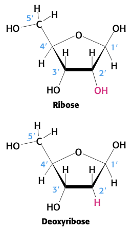
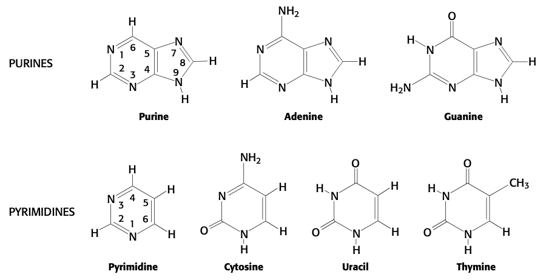
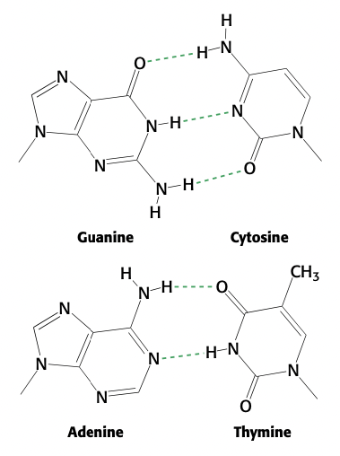
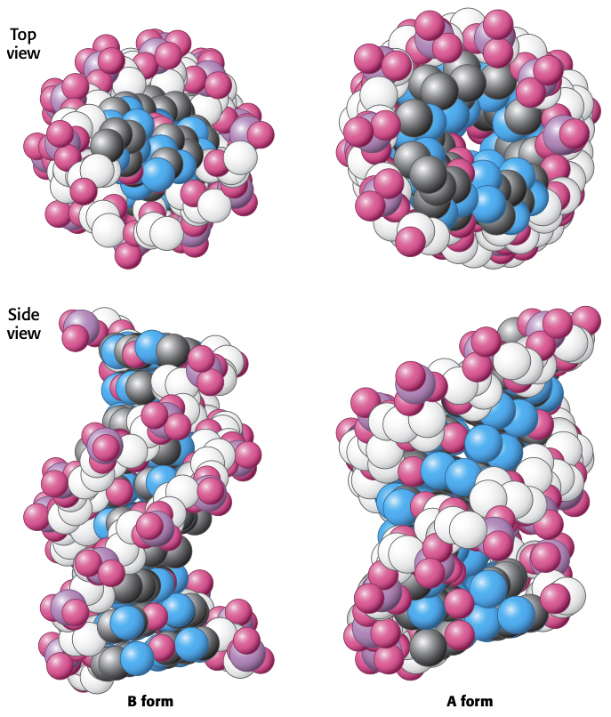
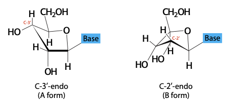
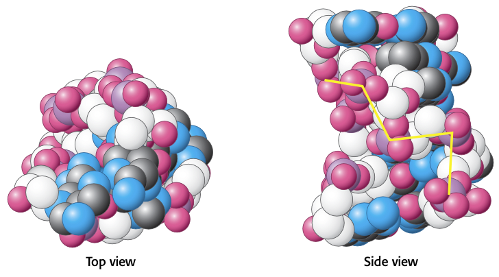
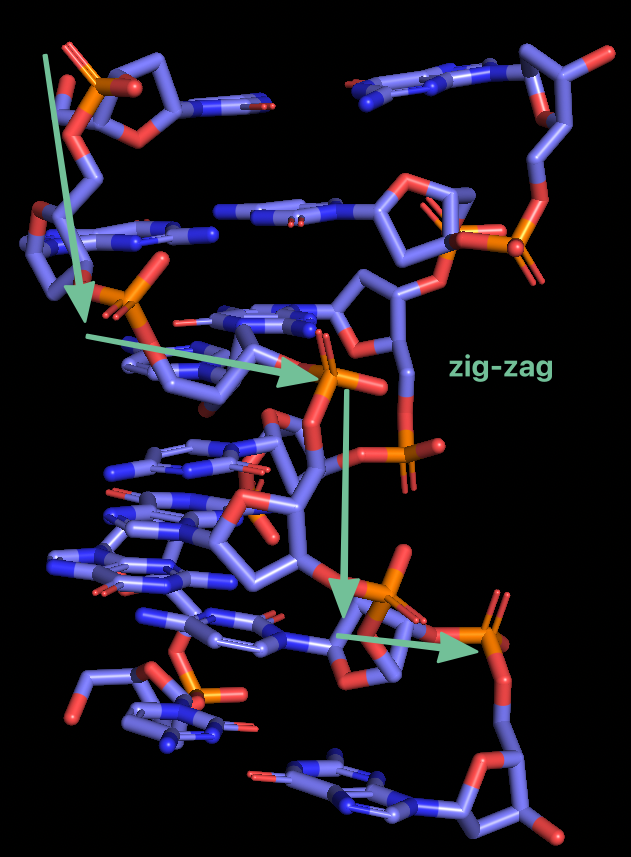
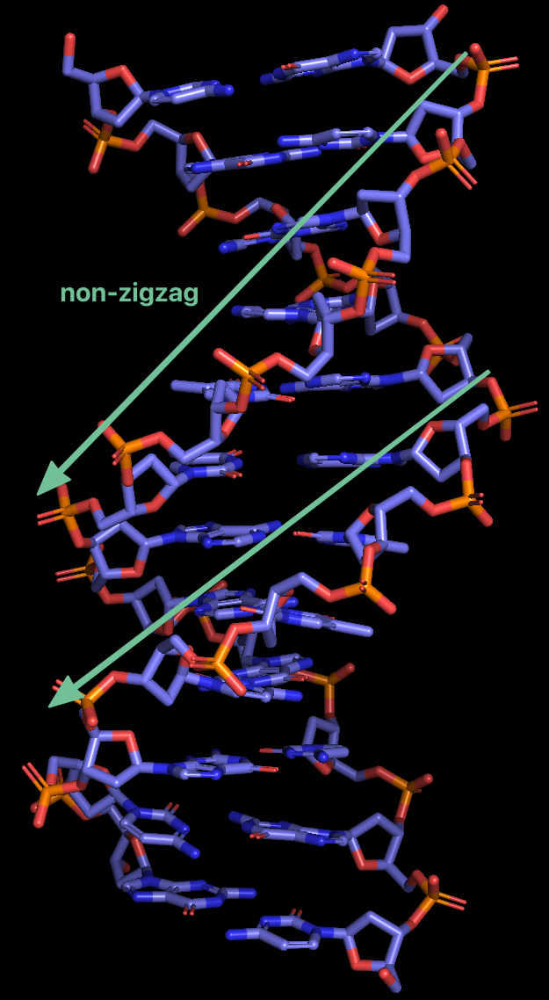
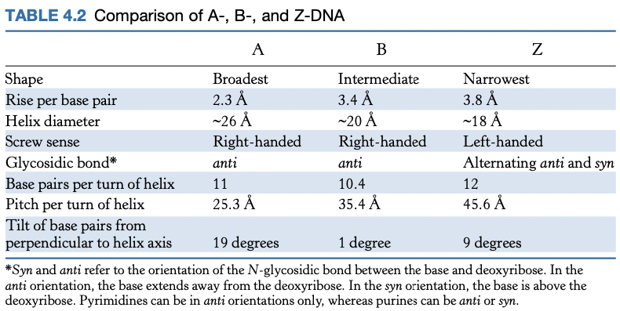

# Lecture 15. Nucleic acids

- Readings
  - pp. 4-6
  - pp. 105-118

## Readings

### 1.2<SPACE/>DNA illustrates the interplay between form and function

### 4.1<SPACE/>A nucleic acid consists of four kinds of bases linked to a sugar-phosphate backbone
- DNA is a linear polymer

#### RNA and DNA differ in the sugar component and one of the bases
- DNA: deoxyribose
- RNA: ribose
- the negative charge on the phosphodiester backbone **repels nucleophilic species which are capable of hydrolytic attack on the backbone**

#### Nucleotides are the monomeric units of nucleic acids
- base + sugar = **nucleoside**
  - purine: **N9**
  - pyrimidine: **N1**
  - (deoxy)adenosine
  - (deoxy)guanosine
  - (deoxy)cytidine
  - uridine
  - thymidine
- base + sugar + phosphoryl groups = **nucleotide**
  - monophosphates
    - (deoxy)adenylate
    - (deoxy)guanylate
    - (deoxy)cytidylate
    - uridylate
    - thymidylate
- more precise naming: **`nucleoside X'-(mono/di/tri)phosphate`**

#### DNA molecules are very long and have directionality
- by convention, base sequence is written 5' $\to$ 3'
  - one end has 5'-OH (or 5'-O-phosphate), other end has 3'-OH
- human DNA
  - ~3bn nt in each strand of DNA, divided across 23 chromosomes

### 4.2<SPACE/>A pair of nucleic acid strands with complementary sequences can form a double-helical (DH) structure
- DH structure enables **replication**

#### The DH is stabilized by hydrogen bonds and VDW interactions
- features of DNA structure
  1. antiparallel **right-handed double helix**
  2. backbone on outside
  3. bases are nearly $\perp$ to helix axis
      - adjacent bases are separated by ~3.4Å
      - 10.4 bases per turn of helix
  4. helix diameter: ~20Å

- **formation of double helix is driven by the hydrophobic effect**
- VDW forces (**stacking forces**) contribute $2$ to $4$ $\pu{kJ/mol}$ between two layers

#### DNA can assume a variety of structural forms
- most DNA in physiological conditions is in **B-form**
  - **B-form** is hydrated
- less hydrated: **A-form**

|**A form**|**B form**|
|:---------|:---------|
|fatter|skinnier|
|bases have **11 degree** tilt|perpendicular to helix axis|
|C-3' endo form|C-2' endo form|
|RNA preferred|DNA preferred|

- RNA prefers A form because 2'-oxygen is too close (steric hindrance) to nearby phosphoryl group and next base
- A form phosphoryl groups bind fewer water molecules than those in B form

#### Z-DNA is a left handed DH in which backbone phosphates zigzag
- left handed

- **some DNA molecules are circular and supercoiled**
  - only circular DNA can be supercoiled

#### Single-stranded nucleic acids can adopt elaborate structures
- **stem loop** from Watson-Crick base pairs
- other non-standard base pairs can exist as well

### 4.3<SPACE/>The double helix facilitates the accurate transmission of hereditary information

### 4.4<SPACE/>DNA is replicated by polymerases that take instructions from templates

---

## Lecture notes