# Lecture 16. Introduction to carbohydrates

- Readings
  - pp. 315-337

## Readings

### 11<SPACE/> Introduction
- carbohydrates supply details and enhancements to the biochemical architecture of the cell
- **glycobiology**. the study of the synthesis and structure of carbohydrates, and how carbohydrates are attached to and recognized by other molecules such as proteins
- **glycomics**. the study of the glycome
- **glycome**. all of the carbohydrates and carbohydrate-associated molecules

### 11.1<SPACE/>Monosaccharides are the simplest carbohydrates
- **carbohydrate**. carbon-based molecules rich in hydroxyl groups
- three trioses
  - dihydroxyacetone
  - <D/>-glyceraldehyde
  - <L/>-glyceraldehyde
- **epimer**. diastereomers that differ at one asymmetric carbon
- **anomer**. isomers that differ at a new asymmetric carbon formed on ring closure
- the asymmetric cabon farthest from the ketone/aldehyde is determines <L/> or <D/> configuration

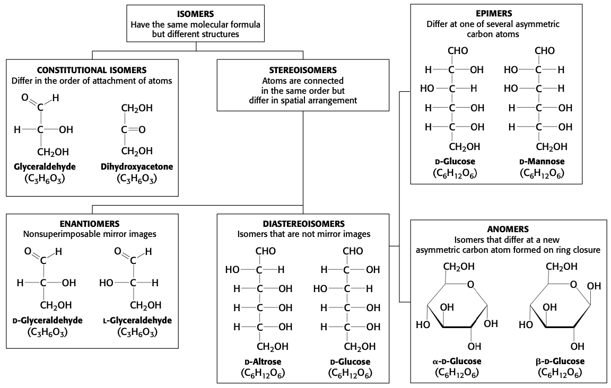

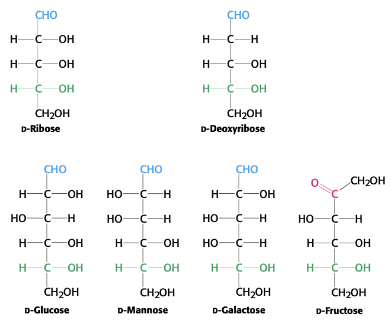

#### Many common sugars exist in cyclic forms

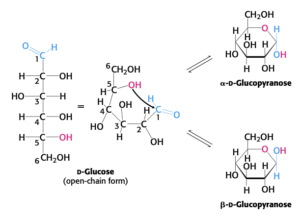

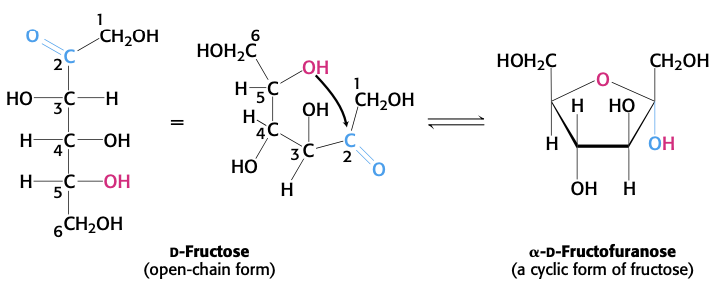

- commonly represented as **Haworth projections**
- **$\alpha$ form** means hydroxyl group is **opposite side of C6**
- equilibrium mixture: 1/3 $\alpha$, 2/3 $\beta$, 1% open-chain

#### Pyranose and furanose rings can assume different conformations

- conformation with fewer **1,3-diaxial interactions** will be favored 
- **envelope conformations** of $\beta$-<D/>-ribose
  - C-3-endo
  - C-2-endo

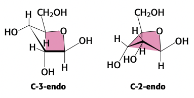

#### Glucose is a reducing sugar
- **advanced glycation end products** due to glucose being a **reducing sugar** have implications for aging, arteriosclerosis, and diabetes.

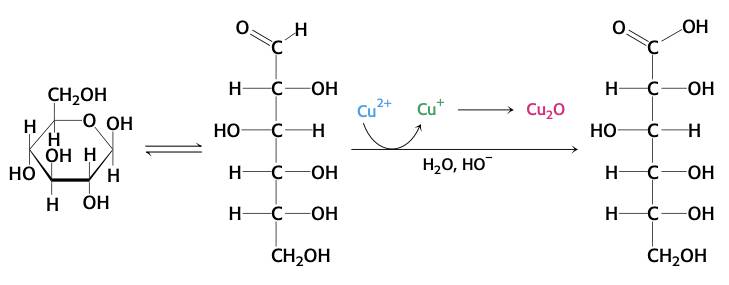

#### Monosaccharides are joined to alcohols and amines through glycosidic bonds
- O-glycosidic and N-glycosidic bonds

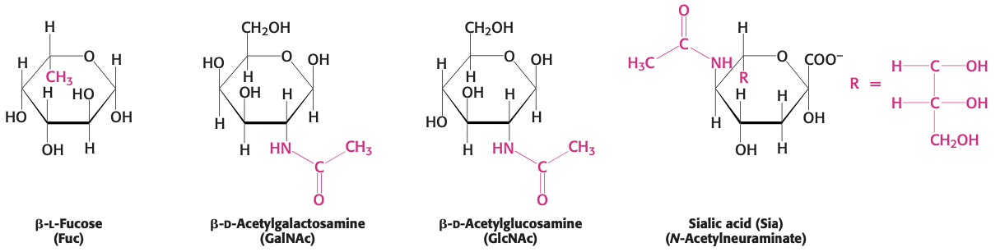

#### Phosphorylated sugars are key intermediates in energy generation and biosyntheses
- examples
  - DHAP: dihydroxyacetone phosphate
  - G3P: glyceraldehyde 3-phosphate
  - G6P: glucose 6-phosphate
- **phosphorylation makes sugars anionic**
  - prevents interaction of sugars with transporters

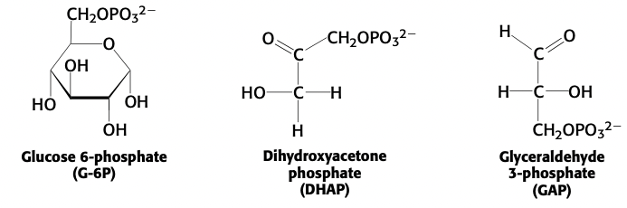

### 11.2<SPACE/>Monosaccharides are linked to form complex carbohydrates

- reducing end: carbon with hydroxyl group next to ester
- many hydroxyl groups = many combinations
- sucrose: glucose + fructose, $\alpha$(1,2)
- fructose: galactose + glucose, $\beta$(1,4)
- maltose: glucose + glucose, $\alpha$(1,4)
- $\alpha$/$\beta$ linkage is determined by the **anomeric carbon** doing the reducing
- all hydrolyzed by **sucrase**, **lactase**, and **maltase**

#### Glycogen and starch are storage forms of glucose
- high levels of glucose will disturb **osmotic balance**
- **glycogen**
  - $\alpha$(1,4) chains
  - $\alpha$(1,6) branches (about once every 10 units)
- **starch**
  - **amylose**. $\alpha$(1,4)
  - **amylopectin**. $\alpha$(1,4), $\alpha$(1,6) every 30 units

#### Cellulose, a structural component of plants, is made of chains of glucose

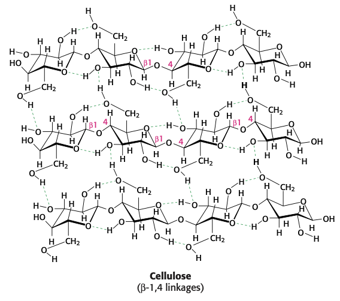

- soluble fiber slows movement of food through GI tract; improved digestion and absorption of nutrients
- insoluble fiber increase rate of passing digestion products through large intenstine

### 11.3<SPACE/>Carbohydrates can be linked to proteins to form glycoproteins
- three classes of **glycoproteins**
  - **glycoproteins**.
    - protein is largest component by weight
    - components of cell membranes; involved in
      - cell adhesion
      - binding of sperm to eggs
  - **proteoglycans**.
    - protein glycosylated to a **glycoasminoglycan**
    - predominately carbohydrate
  - **mucoproteins** (aka **mucins**).
    - N-acetylgalactosamine (GalNAc) attached to protein
    - predominately carbohydrate
    - serve as lubricants
- a protein can have many different **glycoforms**

#### Carbohydrates can be linked to proteins through asparagine (N-linked) or through serine/threonine (O-linked) residues
- Asn can accept oligosaccharide if it is part of a **NXS** or **NXT** sequence (X is any AA other than proline)

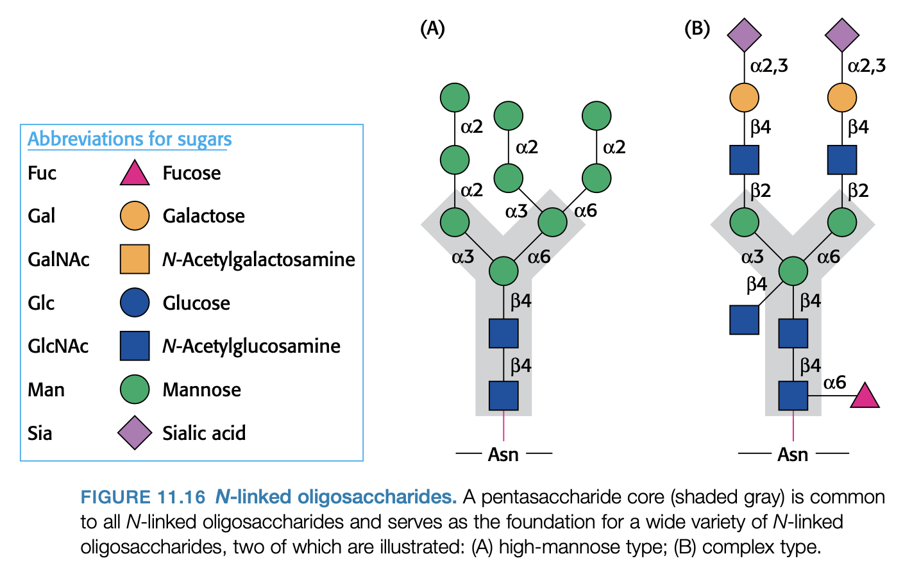

- all N-linked glycoproteins share a pentasaccharide core

#### The glycoprotein erythropoietin (EPO) is a vital hormone
- Unglycosylated protein has 10% of the bioactivity of the glycosylated form
  - unglycosylated protein is rapidly removed from the blood by the kidneys
- EPO stimulates production of RBCs

#### Glycosylation functions in nutrient sensing
- important reaction: **attach GlcNAc to S/T residues** of cellular proteins
  - catalyzed by **GlcNAc transferase**
- [GlcNAc] reflects active metabolism of carbohydrates, amino acids, and fats
  - $\uparrow$ [GlcNAc] indicates nutrients are abundant
- **O-GlcNAc transferase and kinases may cross-talk**
  - **GlcNAcase** removes carbohydrate

#### Proteoglycans have important structural roles
- glycoasminoglycan makes up as much as 95% of the biomolecule by weight
- proteoglycans function
  - in connective tissue
    - lubricants
    - structural components
  - mediate adhesion of cells to the extracellular matrix
  - bind factors that regulate cell proliferation
- **glycosaminoglycan**.
  - repeating units of disaccharides containing a derivative of an amino sugar (glucosamine/galactosamine)
  - at least one of the two monosaccharides contains a negatively charged **carboxylate** or **sulfate** group
- major glycosaminoglycans in animals
  - chondroitin sulfate
  - keratan sulfate
  - heparin
  - dermatan sulfate
  - hyaluronate
- **mucopolysaccharidoses**. family of diseases due to inability to degrade glycosaminoglycans

#### Proteoglycans are important components of cartilage

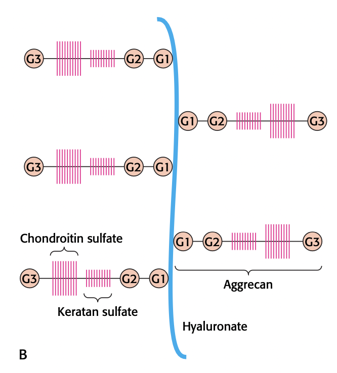

#### Mucins are glycoprotein components of mucus

#### Protein glycosylation takes place in the lumen of the ER and in the Golgi complex
- proteins are synthesized on rough ER
- ER
  - N-linked glycosylation begins
- Golgi
  - N-linked glycosylation finishes
  - O-linked glycosylation occurs

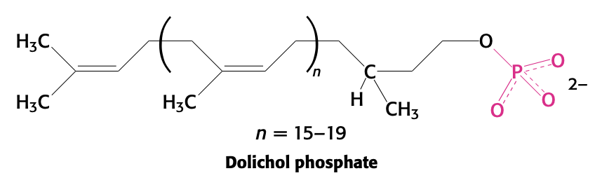

- oligosaccharides are attached to dolichol phsophate before they are transferred to Asn.
- **Golgi** is the major sorting center of the cell

#### Specific enzymes are responsible for oligosaccharide assembly
- complex carbohydrates are synthesized using **glycosyltransferases (GTs)**. catalyze the formation of **glycosidic bonds**
- glycosyltransferases account for **1 to 2%** of all gene products in all organisms examined
- most common carbohydrate donor
  - **activated sugar nucleotides, e.g. UDP-glucose**
- acceptor substrates for GTs include
  - carbohydrates
  - serine
  - threonine
  - asparagine
  - lipids
  - nucleic acids

#### Blood groups are based on protein glycosylation patterns
- the base is sometimes known as **H antigen**

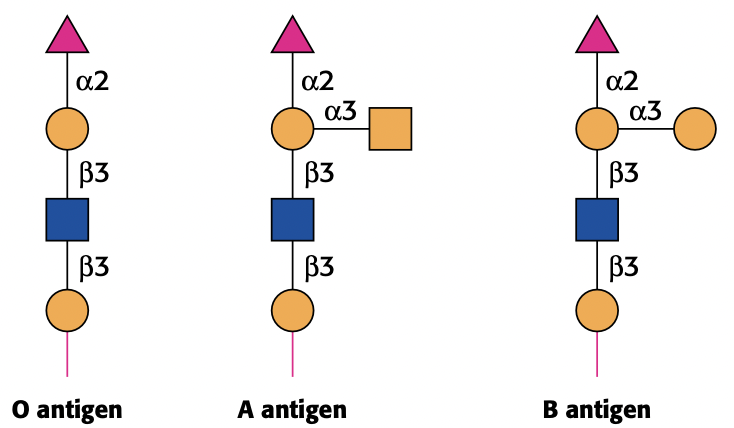

- multiple blood types makes it impossible for a parasite to mimic human blood antigens (think: random rock paper scissors strategy)

#### Errors in glycosylation can result in pathological conditions
- some forms of muscular dystrophy are due to improper glycosylation of **dystroglycan**
- another example: **I-cell disease** (aka mucolipidosis II); _lysosomal storage disease_
  - normally, carbohydrate market directs digestive enzymes from Golgi to lysosome
  - in I-cell disease, lysosomes contain large numbers of undigested **glycosaminoglycans (GAGs)** and **glycolipids (GLs)**
  - enzymes that degrade GAGs and GLs are incorrectly addressed and delivered to the wrong location
  - mannose 6-phosphate on oligosaccharide directs enzymes to lysosome
  - **N-acetylglucosamine phosphotransferase** is missing, cannot correctly form **mannose 6-phosphate**

#### Oligosaccharides can be "sequenced"
- step 1: release oligo from protein using **N-glycosidase F**
- MALDI-TOF after cutting oligosaccharide or protein using specific enzymes

### 11.4<SPACE/>Lectins are specific carbohydrate-binding proteins
- carbohydate structures are the recognition sites for **glycan-binding proteins (GBPs)**
  - lectins $\subset$ GBPs
- lectins often bind to carbohydrate moiety of glycoproteins

#### Lectins promote interactions between cells
- the **chief function of lectins is to facilitate cell-cell contact**
- a lectin usually contains two or more carbohydrate-binding sites
  - lectin interacts with carbohydrates on two different cells

#### Lectins are organized into different classes
- lectins divided into classes based on amino acid sequences and biochemical properties
  - **C ("calcium requiring") type**
    - involved in receptor-mediated endocytotsis
    - involved in cell-cell recognition

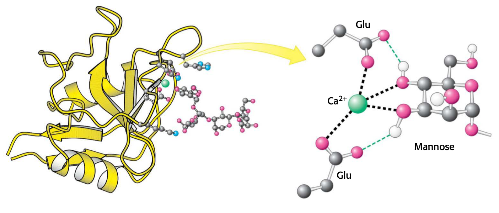

- **selectins** $\subset$ **C-type lectins**
  - selectins bind immune-system cells to sites of injury in the inflammatory response
  - L-selectin: bind to carbohydrates on lymph-node vesssels
  - E-selectin: endothelium
  - P-selectin: platelets
  - **L-selectin** produced when embryo binds to endometrium of mother's uterus
- **L-lectins**
  - exact role unknown
  - can serve as insecticide
  - e.g. **calnexin** and **calreticulin** are chaperones in the eukaryotic ER

#### Influenza virus binds to sialic acid residues
- **hemagglutinin (H)** (viral) binds **sialic acid residues** (part of the cell) on cell-surface glycoproteins
- **neuraminidase (N)** (viral) cleaves this bond when virus is budding off from infected cell
  - **oseltamivir (Tamiflu)** and **zanamivir (Relenza)** inhibit neuraminidase and are powerful anti-influenza drugs