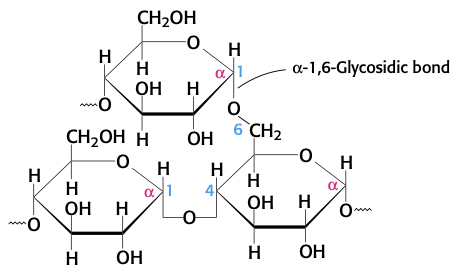

# Lecture 16. Introduction to carbohydrates

- Readings
  - pp. 315-337

## Readings

### 11<SPACE/> Introduction
- carbohydrates supply details and enhancements to the biochemical architecture of the cell
- **glycobiology**. the study of the synthesis and structure of carbohydrates, and how carbohydrates are attached to and recognized by other molecules such as proteins
- **glycomics**. the study of the glycome
- **glycome**. all of the carbohydrates and carbohydrate-associated molecules

### 11.1<SPACE/>Monosaccharides are the simplest carbohydrates
- **carbohydrate**. carbon-based molecules rich in hydroxyl groups
- three trioses
  - dihydroxyacetone
  - <D/>-glyceraldehyde
  - <L/>-glyceraldehyde
- **epimer**. diastereomers that differ at one asymmetric carbon
- **anomer**. isomers that differ at a new asymmetric carbon formed on ring closure
- the asymmetric cabon farthest from the ketone/aldehyde is determines <L/> or <D/> configuration

#### Many common sugars exist in cyclic forms

- commonly represented as **Haworth projections**
- **$\alpha$ form** means hydroxyl group is **opposite side of C6**
- equilibrium mixture: 1/3 $\alpha$, 2/3 $\beta$, 1% open-chain

#### Pyranose and furanose rings can assume different conformations

- conformation with fewer **1,3-diaxial interactions** will be favored 
- **envelope conformations** of $\beta$-<D/>-ribose
  - C-3-endo
  - C-2-endo

#### Glucose is a reducing sugar
- **advanced glycation end products** due to glucose being a **reducing sugar** have implications for aging, arteriosclerosis, and diabetes.

#### Monosaccharides are joined to alcohols and amines through glycosidic bonds
- O-glycosidic and N-glycosidic bonds

#### Phosphorylated sugars are key intermediates in energy generation and biosyntheses
- examples
  - DHAP: dihydroxyacetone phosphate
  - G3P: glyceraldehyde 3-phosphate
  - G6P: glucose 6-phosphate
- **phosphorylation makes sugars anionic**
  - prevents interaction of sugars with transporters

### 11.2<SPACE/>Monosaccharides are linked to form complex carbohydrates

- reducing end: carbon with hydroxyl group next to ester
- many hydroxyl groups = many combinations
- sucrose: glucose + fructose, $\alpha$(1,2)
- fructose: galactose + glucose, $\beta$(1,4)
- maltose: glucose + glucose, $\alpha$(1,4)
- $\alpha$/$\beta$ linkage is determined by the **anomeric carbon** doing the reducing
- all hydrolyzed by **sucrase**, **lactase**, and **maltase**

#### Glycogen and starch are storage forms of glucose
- high levels of glucose will disturb **osmotic balance**
- **glycogen**
  - $\alpha$(1,4) chains
  - $\alpha$(1,6) branches (about once every 10 units)
- **starch**
  - **amylose**. $\alpha$(1,4)
  - **amylopectin**. $\alpha$(1,4), $\alpha$(1,6) every 30 units

#### Cellulose, a structural component of plants, is made of chains of glucose

- soluble fiber slows movement of food through GI tract; improved digestion and absorption of nutrients
- insoluble fiber increase rate of passing digestion products through large intenstine

### 11.3<SPACE/>Carbohydrates can be linked to proteins to form glycoproteins
- three classes of **glycoproteins**
  - **glycoproteins**.
    - protein is largest component by weight
    - components of cell membranes; involved in
      - cell adhesion
      - binding of sperm to eggs
  - **proteoglycans**.
    - protein glycosylated to a **glycoasminoglycan**
    - predominately carbohydrate
  - **mucoproteins** (aka **mucins**).
    - N-acetylgalactosamine (GalNAc) attached to protein
    - predominately carbohydrate
    - serve as lubricants
- a protein can have many different **glycoforms**

#### Carbohydrates can be linked to proteins through asparagine (N-linked) or through serine/threonine (O-linked) residues
- Asn can accept oligosaccharide if it is part of a **NXS** or **NXT** sequence (X is any AA other than proline)

- all N-linked glycoproteins share a pentasaccharide core

#### The glycoprotein erythropoietin (EPO) is a vital hormone
- Unglycosylated protein has 10% of the bioactivity of the glycosylated form
  - unglycosylated protein is rapidly removed from the blood by the kidneys
- EPO stimulates production of RBCs

#### Glycosylation functions in nutrient sensing
- important reaction: **attach GlcNAc to S/T residues** of cellular proteins
  - catalyzed by **GlcNAc transferase**
- [GlcNAc] reflects active metabolism of carbohydrates, amino acids, and fats
  - $\uparrow$ [GlcNAc] indicates nutrients are abundant
- **O-GlcNAc transferase and kinases may cross-talk**
  - **GlcNAcase** removes carbohydrate

#### Proteoglycans have important structural roles
- glycoasminoglycan makes up as much as 95% of the biomolecule by weight
- proteoglycans function
  - in connective tissue
    - lubricants
    - structural components
  - mediate adhesion of cells to the extracellular matrix
  - bind factors that regulate cell proliferation
- **glycosaminoglycan**.
  - repeating units of disaccharides containing a derivative of an amino sugar (glucosamine/galactosamine)
  - at least one of the two monosaccharides contains a negatively charged **carboxylate** or **sulfate** group
- major glycosaminoglycans in animals
  - chondroitin sulfate
  - keratan sulfate
  - heparin
  - dermatan sulfate
  - hyaluronate
- **mucopolysaccharidoses**. family of diseases due to inability to degrade glycosaminoglycans

#### Proteoglycans are important components of cartilage

- 

#### Mucins are glycoprotein components of mucus

#### Protein glycosylation takes place in the lumen of the ER and in the Golgi complex

#### Specific enzymes are responsible for oligosaccharide assembly

#### Blood groups are based on protein glycosylation patterns

#### Errors in glycosylation can result in pathological conditions

#### Oligosaccharides can be "sequenced"

### 11.4<SPACE/>Lectins are specific carbohydrate-binding proteins