# Lecture 16. Chemistry of replication and transcription: polymerases

- Readings
  - pp. 119-123
  - pp. 827-844
  - pp. 859-876
  - pp. 925-931
  - pp. 941-947

## pp. 119-123

### 4.5<SPACE/> Gene expression the transformation of DNA information into functional molecules
- **80% of RNA in body is rRNA**
  - 23S rRNA: 1200 kDa (3700 nt)
  - 16S rRNA: 550 kDa (1700 nt)
  - 5S rRNA: 36 kDa (120 nt)
- 15% is **tRNA: 4S, 75 nt long**
- in eukaryotes, mRNA has **structural features** (e.g. **stem-loop structures**) that regulate efficiency of translation and lifetime of mRNA

#### All cellular RNA is synthesized by RNA polymerases
- mRNA is a exact copy of the 5' to 3' strand (sense, 5' to 3', coding strand)

#### Transcription begins near promoter sites and ends at terminator sites
- **promoters**. bind RNA polymerases

- eukaryotes also have **enhancers** that mediate transcription
- in prokaryotes, transcription of a **stop sequence** spontaneously dissociates RNA from RNA polymerase
- RNA synthesis can also be terminated by a protein called **rho (Rho factor)**
- in eukaryotes, mRNA modifications
  - mRNA cap: 5'-5' triphosphate linkage
  - poly(A) tail

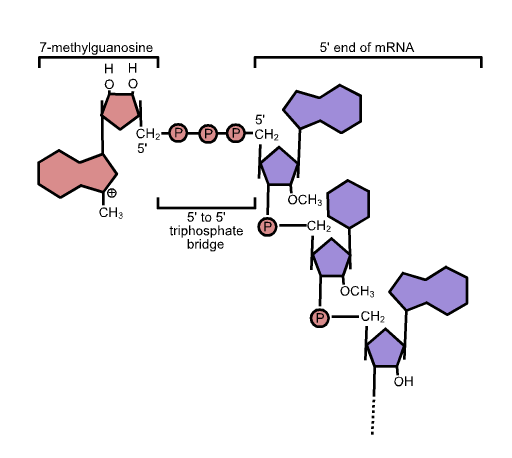

#### Transfer RNAs are the adaptor molecules in protein synthesis
- tRNAs have an AA-attachment site (AAAS) and template recognition site (TRS)
- **AAAS**
  - amino acid COOH group is esterfied to **2' or 3' OH group** (3' end of tRNA) on **adenosine (A)** at end of tRNA
    - called an **aminoacyl-tRNA**
  - attachment is catalyzed by **aminoacyl-tRNA synthetase**
- **template recognition site (TRS)**
  - 1 **anticodon**, 3' to 5'

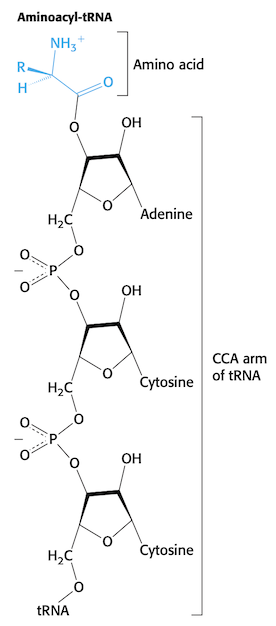

## pp. 827-844

### 28<SPACE/>DNA replication, repair, and recombination
- error rate <1 bp every $6 \times 10^9$ bp
  - multiple layers:
    - synthesis: 1 bp every $10^3$ to $10^4$
    - proofreading: 1 bp every $10^6$ to $10^7$
    - post-replication mismatch repair: 1 bp every $10^9$ to $10^{10}$
- _Deinococcus radiodurans_ has between 4 to 10 copies of its genome
  - can withstand high doses of radiation
  - can withstand dessication

### 28.1<SPACE/>DNA replication proceeds by the polymerization of dNTPs along a template
- difficulties
  1. replication needs to account for 5' to 3' direction on both strands
  2. strands must separate for replication
  3. DNA is a double helix, so strands needs to be unwound

#### DNA polymerases require a template and a primer
- DNApols catalyze **NA by 3'-OH group of polynucleotide chain** to the $\alpha$-phosphoryl group of the NTP to be added
  - this means a strand/primer must already exist

#### All DNA polymerases have structural features in common
- all DNA pols have **Klenow fragment**
  - half is **polymerase** domain
  - other half is **3' exonuclease** domain for proofreading
  - fingers, thumb grip DNA; **palm has active site**

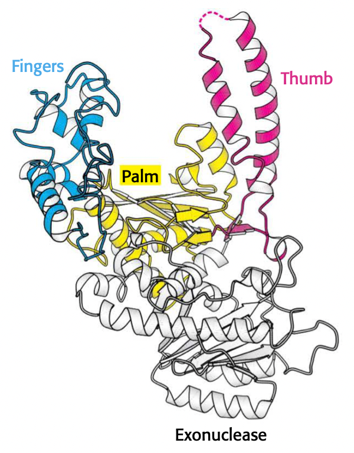

#### Two bound metal ions participate in the polymerase reaction
- **all enzymes with NTP substrates** require metal ions for activity
  - one metal binds both primer and dNTP (left)
    - aligns primer's 3' OH to attack $\alpha$ phosphate of dNTP
  - one metal binds only dNTP (right)
    - stabilizes leaving pyrophosphate
  - both stabilize transition state

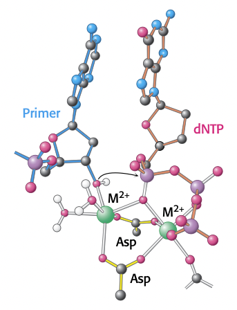

#### The specificity of replication is dictated by complementarity of shape between bases
- hydrogen bonding helps, but **shape complementarity** is the main driver of specificity
- why is shape complementarity so important?
  - enzymes check the minor groove, which selects for **proper spacing**
  - finger clamps down; if not Watson-Crick pair, then won't form a tight conformation

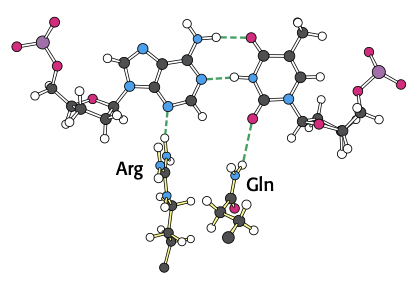

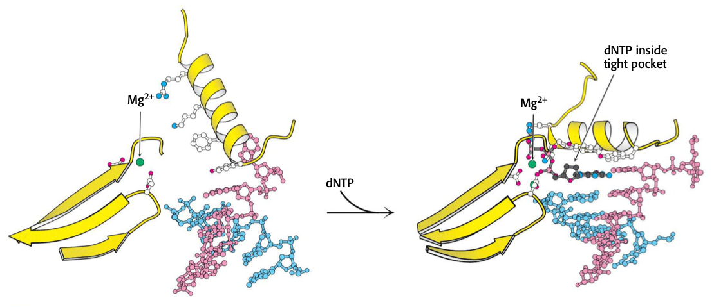

#### An RNA primer synthesized by primase enables DNA synthesis to begin
- **primer**. a nucleic acid with a free 3' end that forms a double helix with the template

#### One strand of DNA is made continuously, whereas the other strand is synthesized in fragments
- all known DNA polymerases synthesize in the 5' $\to$ 3' direction
- the **leading strand** is extending from 5' $\to$ 3', but the **lagging strand** moves from 3' $\to$ 5'

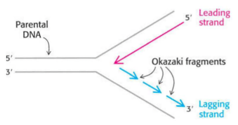

#### DNA ligase joins ends of DNA in duplex regions
- DNA ligase cannot link ssDNA or circularize ssDNA
- circular dsDNA exists
- powered by ATP in eukaryotes and archaea; NAD+ in bacteria
- _E. coli_ DNA ligase ligates when overhangs are present
- **T4 bacteriophage** works for **blunt-ended dsDNA fragments**

#### The separation of DNA strands requires specific helicases and ATP hydrolysis
- **helicases require ATP**
- helicase structure
  - hexamers
  - core has P-loop NTPase
  - core also has DNA binding lop
- asymmetric; allows for cycling

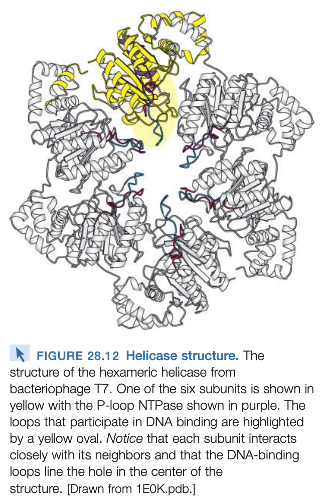
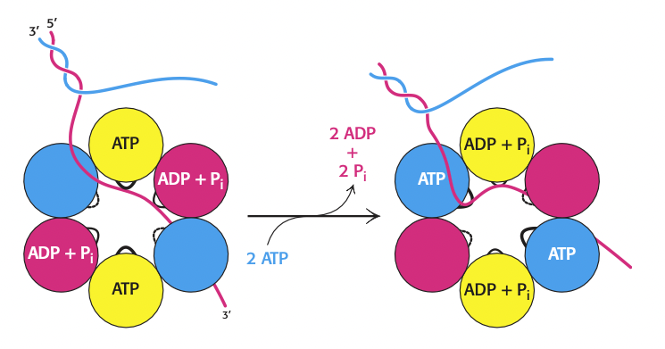

### 28.2<SPACE/>DNA unwinding and supercoiling are controlled by topoisomerases
- **right-handed superhelix** is called **negative superhelix**
- a supercoiled DNA molecule is more compact than a relaxed one of the same length
- supercoiled DNA moves faster in electrophoresis and centrifugation

#### The linking number of DNA, a topological property, determines the degree of supercoiling
- $L$. **linking number**. number of times a strand of DNA winds in the right-handed direction around the helix axis
- $T$. **twisting number**. measures the winding of strands around each other
- $W$. **writhing number**. measures coiling of the helix **axis** (i.e. supercoiling)
  - for super coils, right handed is negative
- **topoisomers**. molecules differing only in linking number
- $L = T + W$
  - $W = 0.7 \Delta L$ 

#### Topoisomerases prepare the double helix for unwinding
- **negative supercoils** are most common because they result from **unwinding**, meaning they are useful for when DNA needs to separate
  - **positive supercoils** also condense DNA, but are more difficult to prep DNA for separation
- **TOP1** catalyzes relaxation of supercoiled DNA; thermodynamically favorable
- **TOP2** adds negative supercoils to DNA using **ATP**

#### Type I topoisomerases (TOP1) relax supercoiled structures
- TOP1 structure
  - four domains
  - central cavity with diameter 20 Å (exact size of DNA)
  - Tyr723 nph attack on DNA backbone
- enzyme controls speed of unwinding
- 5'-OH attacks Tyr723 to reconnect DNA

#### Type II topoisomerases (TOP2) can introduce negative supercoils through coupling to ATP hydrolysis
- supercoiling requires input of energy: has **torsional strain**
- 30 kJ/mol for 3000bp plasmid
- **decreases linking number by 2**

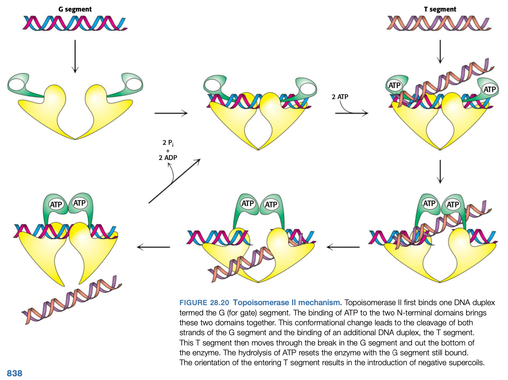

- many antibiotics work by blocking **bacterialial topoisomerase II (DNA gyrase)** activity
  - **ciprofloxacin**. interferes with breakage and rejoining of DNA chains

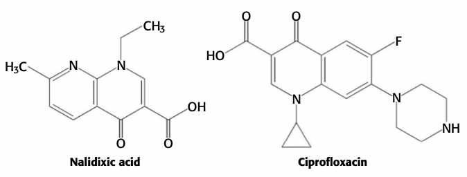

### 28.3<SPACE/>DNA replication is highly coordinated

#### DNA replication requires highly processive polymerases
- **processivity**. the ability of an enzyme to catalyze many consecutive reactions without releasing its substrate
- 1000 turns of duplex DNA slide through 35 Å hole per second

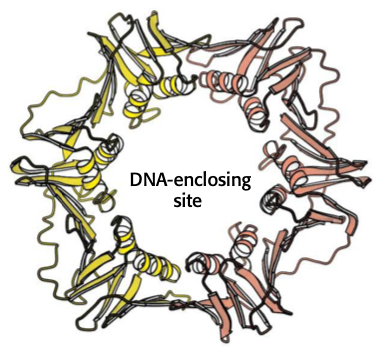

#### The leading and lagging strands are synthesized in a coordinated fashion
- **SSB.** single stranded binding protein.
- **DnaB**. the hexameric **helicase** that unwinds DNA.
- **Top2**. introducing negative supercoils to avoid DNA compression
- holoenzyme
  - $\alpha$. DNA polymerase
  - $\epsilon$. 3:5 proofreading exonuclease
  - $\theta$
  - $\beta_2$ sliding clamp
  - linker: $\gamma\tau_2\delta\delta'\chi\phi$
    - $\gamma\tau_2\delta\delta'$. clamp loader
    - $\chi$, $\phi$. interact with SSB

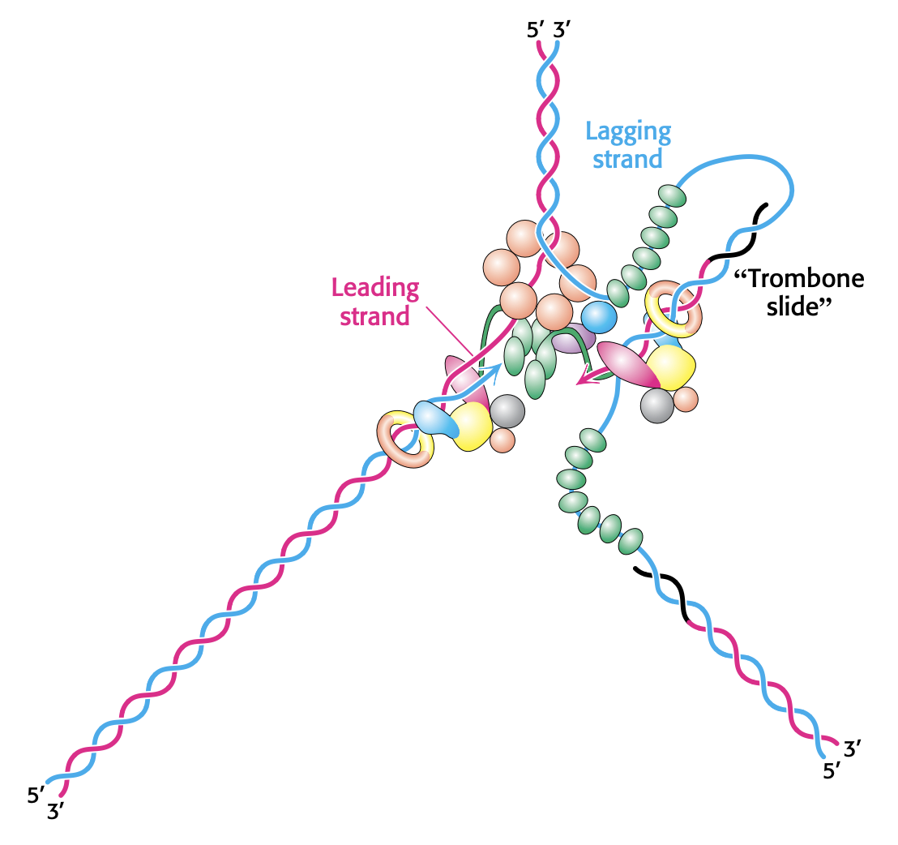

- DNApolI removes RNA primer placed **by the previous Okazaki fragment**

#### DNA replication in _E. coli_ begins at a unique site

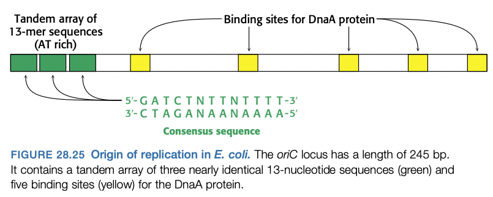

- steps to prepare for replication
  1. binding of **DnaA** proteins to DNA
      - **DnaA** $\in$ P-loop NTPase family
  2. single DNA strands are exposed in the prepriming complex
      - SSB bind to AT rich segments
      - **DnaB** loaded onto single strands by **DnaC**
      - **DnaG**, the **primase**, can now insert the primer
  3. polymerase holoenzyme assembles
      - DnaB (helicase) and sliding clamp connect
      - DnaA subunits break apart, preventing second initialization

#### DNA synthesis in eukaryotes is initiated at multiple sites
- humans have ~30,000 origins of replication
  - each ori is the starting site for a **replication unit (replicon)**
- humans don't have a distinct ori sequence
- steps to prepare for replication in eukaryotes
    1. assembly of **origin of replication complexes (ORCs)** 
        - human ORC composed of six different proteins, analogous to DnaA
    2. licensing factors recruit a helicase that exposes single strands of DNA
        - **licensing factors**: permit the formation of the initiation complex
          - **Cdc6**. cell division cycle 6
          - **Cdt1**. chromatin licensing and DNA replication factor 1
          - **Mcm2-7**. helicase
        - single strands are stablized by **replication protein A**, a ssDNA binding protein
    3. two distinct polymerases are needed to copy a eukaryotic replicon
        - **polymerase $\alpha$** begins replication
          - **primase** subunit
          - 20 nt polymerase subunit
        - replaced by **polymerase $\delta$**: principal replicative polymerase in eukaryotes
        - process called **polymerase switching**
          - after $\alpha$ adds 20 nt, **replication factor C (RFC)** displaces $\alpha$.
          - **RFC** attracts sliding clamp **PCNA (proliferating cell nuclear antigen)**
        - multiple oris are coordinated with **cyclins** and **cyclin-dependent protein kinases**
        - **Cdk2** binds to assemblies as origins of replication

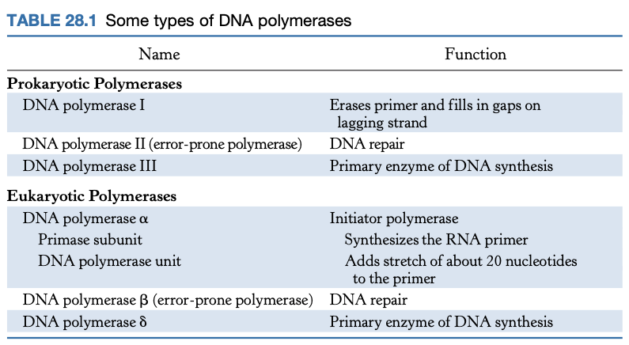

#### Telomeres are unique structures at the ends of linear chromosomes
- **telomeres** have repeating six-nt sequencing
  - G rich at 3' end: AGGGTT-3'
- single-stranded region invades the duple to form a large duplex loop, stabilized by telomere-binding proteins

#### Telomeres are replicated by telomerase, a specialized polymerase that carries its own RNA template
- **telomerase** is a special **reverse transcriptase** that carries its own template (template is RNA)

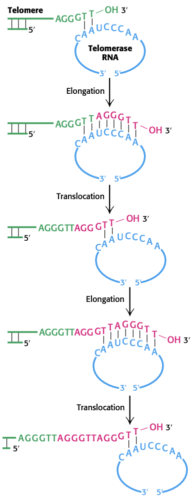

## pp. 859-876

### 29<SPACE/>RNA synthesis and processing

#### RNA synthesis comprises three stages: initiation, elongation, and termination
- **promoters**. transcription initiation sites
- _E. coli_ has about 2000 promoter sites
- what do RNA polymerases do?
  1. search DNA for promoters
  2. unwind short stretch of DNA
  3. select correct NTP and form phosphodiester bond
  4. detect termination signals
  5. interact with **activator** and **repressor** proteins that modulate rate of transcription

### 29.1<SPACE/>RNA polymerases catalyze transcription

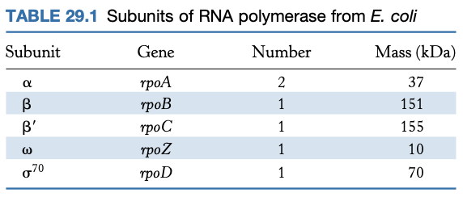

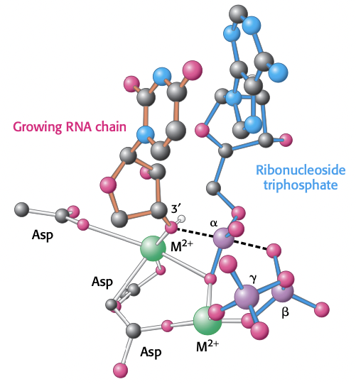

- **transcription bubble**. about 17 bp unwound

#### RNA chains are formed _de novo_ and grow in the 5' to 3' direction
- **coding/sense (+) strand** can be immediately translated
- **template strand (-)** runs from 3' to 5'
- most newly synthesized RNA chains have **pppG** or **pppA** as first base
- **addition of next nucleotide, favored by triphosphate cleavage**, drives **translocation** forward

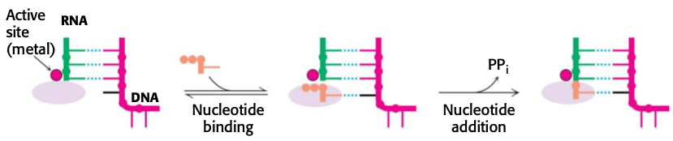

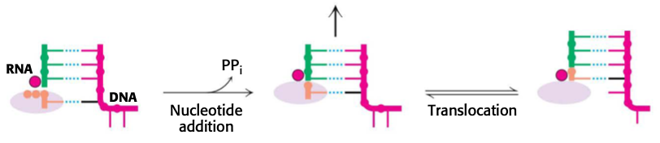

#### RNA polymerases backtrack and correct errors
- backtracking necessary for proofreading
  - less energetically favorable than elongation: breaks a **hydrogen bond**
- NTP hydrolyzed: can either elongate or backtrack
  - backtracking thus removes two nucleotides
- water performs hydrolysis

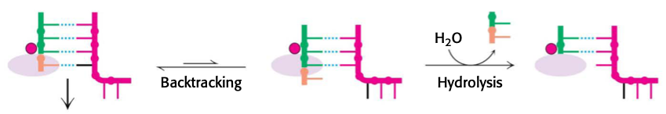

#### RNA polymerase binds to promoter sites on the DNA template to initiate transcription
- $\alpha_2\beta\beta'\omega$ is the **core enzyme**
- $\alpha_2\beta\beta'\omega\sigma$ is the **holoenzyme**
- the $\sigma$ **subunit finds promoter sides on DNA**
- two promoters: **-35 sequence** and **-10 sequence**

- strong promoters have sequences close to the consensus sequence
- weak promoters have mutations
- the **strength of the promoter regulates transcription**
- a separation of **17 nt** is optimal
- some genes have the **UP element** (-40 to -60) binds the $\alpha$ subunit of RNA polymerase and increases efficiency of transcription

#### $\sigma$ subunits of RNA polymerase recognize promoter sites
- after $\sigma$ binds, RNA polymerase slides along DNA weakly until promoter is recognized by $\sigma$
- released when RNA chain reaches 9 to 10 nucleotides
  - $\sigma$ subunits act **catalytically** (only a small number needed because they are released after transcription begins)
- the **type of $\sigma$ factor responds to environmental conditions**
  - normal sigma subunit is $\sigma^{70}$
  - if temperature is raised abruptly, sigma subunit is $\sigma^{32}$, which binds to promoters of **heat shock genes**
  - nitrogen starvation: $\sigma^{54}$

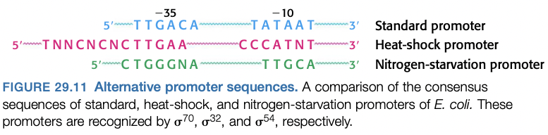

#### RNA polymerases must unwind the template double helix for transcription to take place
- transition from **closed promoter complex** to **open promoter complex** is essential to transcription
- approximately 17 bases are unwound
- free energy comes from DNA wrapping around RNA polymerase and binding to other sites on the enzyme
- -35 stays double-stranded; -10 element is unwound

#### Elongation takes place at transcription bubbles that move along the DNA template
- RNA:DNA hybrid is about 8 bp long
- coding strand of DNA has a binding site in RNA polymerase

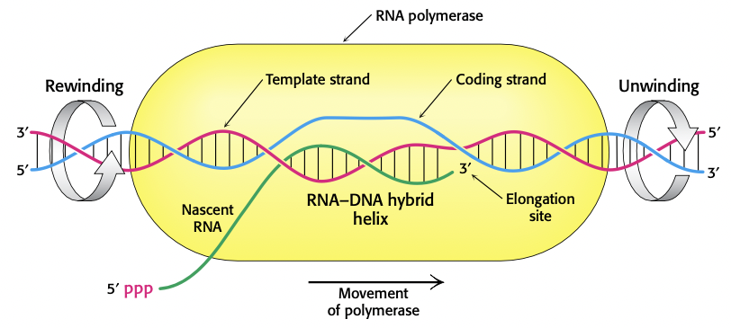

- 3'-OH of RNA is positioned to attack incoming NTP
- transcription rate: **50 nt/sec**

#### Sequences within the newly transcribed RNA signal termination
- DNA templates contain stop signals: **palindromic GC-rich region** followed by an **AT-rich region**
  - GC-rich forms a hairpin, stalling RNA polymerase
  - AT-rich region has weak binding to RNA polymerase, causing the polymerase to fall off

#### Some mRNAs directly sense metabolite concentrations

#### The _rho_ protein helps to terminate the transcription of some genes

#### Precursors of tRNA nd rRNA are cleaved and chemically modified after transcription in prokaryotes

### 29.2<SPACE/>Transcription in eukaryotes is highly regulated

#### Three types of RNA polymerase synthesize RNA in eukaryotic cells

#### Three common elements can be found in the RNA polymerase II promoter region

#### The TFIID protein complex initiates the assembly of the active transcription complex

#### Multiple transcription factors interact with eukaryotic promoters

#### Enhancer sequences can stimulate transcription at start sites thousands of bases away

## pp. 925-931

### 31<SPACE/>The control of gene expression in prokaryotes

### 31.1<SPACE/>Many DNA-binding proteins recognize specific DNA sequences

### 31.2<SPACE/>Prokaryotic DNA-binding proteins bind specifically to regulatory sites in operons

## pp. 941-947

### 32<SPACE/>The control of gene expression in eukaryotes

### 32.1<SPACE/>Eukaryotic DNA is organized into chromatin

#### The helix turn helix motif is common to many prokaryotic DNA-binding proteins

### 32.2<SPACE/>Transcription factors bind DNA and regulate transcription initiation

#### An operon consists of regulatory elements and protein-encoding genes

#### The _lac_ repressor protein in the absence of lactose binds to the operator and blocks transcription

#### Ligand binding can induce structural changes in regulatory proteins

#### The operon is a common regulatory unit in prokaryotes

#### Transcription can be stimulated by proteins that contact RNA polymerase

---

## Lecture notes
 
### Key points
1. Base stacking, hypochromicity, DNA melting
2. Discovery of DNA Pol I and mechanism
3. Pol I activities: 5' to 3'polymerase, 3' to 5' exonuclease, 5' to 3' exonuclease
4. Modern view of Pol III and DNA replication
5. RNA structure, RNA vs. DNA polymerases

### 1<SPACE/>Base stacking, hypochromicity, DNA structure
- **stabilized by $\pi$-$\pi$ stacking**
- need energy to separate strands
  - if >100 bp, need to use **heat**
- "DNA melting"
  - bases absorb UV light: $\lambda_{\max} = \pu{260 nm}$

### 2<SPACE/>Discovery of DNA polymerase I and mechanism
- Arthur Kornberg 1955
- Assumptions:
  1. Purine biosynthesis: 5'-NMP, not 3'-NMP
  2. Pyrophospate (PPi) is a good LG
- Properties of DNApolI
  1. 103 kDa
  2. uses dNTPs
  3. requires a DNA template
  4. requires a **primer**
- PPi is rapid hydrolyzed into 2 $\ce{PO4^2-}$; this hydrolysis provdes the energy to drive reaction forward
- **Klenow** fragment of DNA polymerase (structure solved at Yale)
- palm: active site
  - two $\ce{Mg^2+}$ ion metal centers
  - MgA interacts with 3' OH primer, $\alpha$ phosphate of dNTP
  - MgB interacts with $\beta$, $\gamma$ phosphates of dNTP and 2 Asp residues in polymerase
- **catalytic mechanisms**
  - acid-base (sort of)
  - approximation
  - metal ion
- what gives specificity?
  - Watson-Crick base pairing (_hydrogen bonds_)
  - shape complementarity (steric hindrance in active site)
    - DNA polymerase is optimized to fit only a purine and pyrimidine
  - **minor groove interactions**
    - check that two purines/pyrimidines are not in the same position
- mismatch rate: **1 in every 10000 nt**
  - moderately **processive** (how far it goes on the DNA before it falls off): ~20 nt
- _E. coli_ chromosome: 5 million base pairs

### 3<SPACE/>DNApolI activities
- All DNA polymerases
  - catalyze 5' to 3' <T tag="test" />
  - have 3' to 5' exonuclease activity <T tag="test" />
- DNApolI activities
  - **5:3 polymerase**
    - always reads template 3:5
  - **3:5 exonuclease**
    - prefers **non-complementarity**; provides **proofreading**
    - if mismatch, strand flips (chemically) into active site of exonuclease
    - increases accuracy **100 to 1000x**
  - **5:3 exonuclease**
    - preferred 5' end **properly paired**
    - **used to remove RNA primer**

### 4<SPACE/> The modern view of DNA polymerase III and replication
- DNA pol II, IV, V: DNA repair (not in this class)
- DNA pol III: holoenzyme does **most of the replication**
  - complex of more than 10 polypeptides: 830 kDa
  - 2 polymerases: $\alpha, \epsilon, \theta$ (dimers)
  - $\beta_2$ sliding clamp
  - $\gamma_2\delta\delta\chi\phi$ clamp loader
- **high processivity**: **500,000 nt**
  - uses a sliding clamp
- **high catalytic efficiency**
  - 1000 nt/sec
- **high fidelity**: low error rate
  - mis-incorporation rate: 1 in $10^4$
  - proofreads: 1 in $10^6$ - $10^7$
  - repair: 1 in $10^{10}$

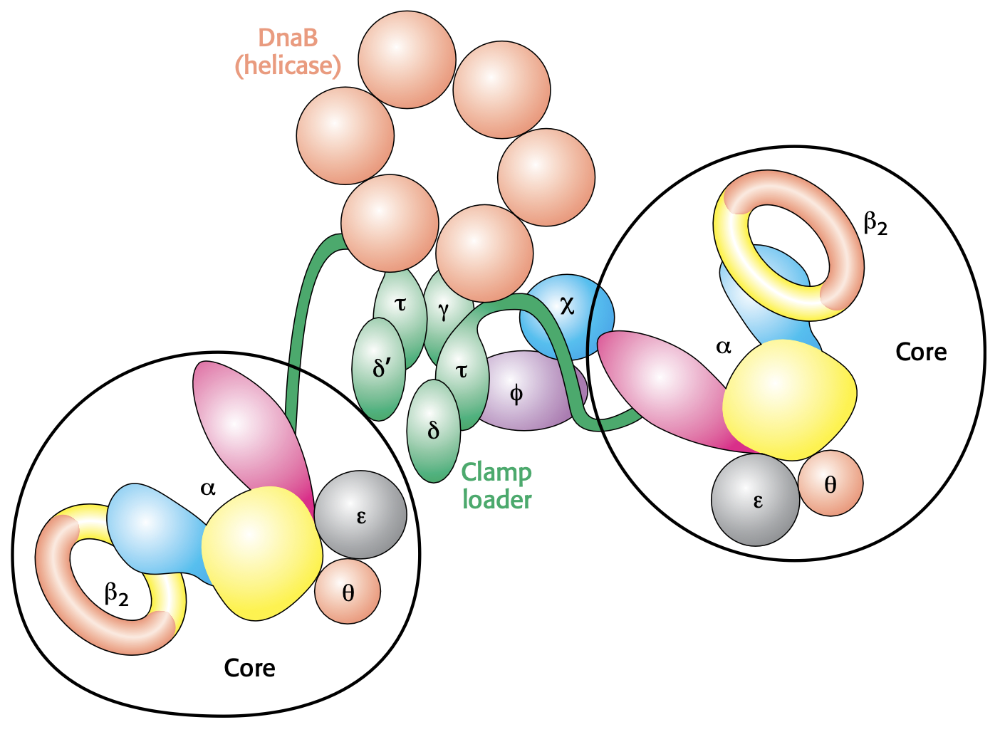

- _E. coli_ have $5 \times 10^6$ bp: less than 1/1000 replicated _E. coli_ have a mutation

#### Replication fork

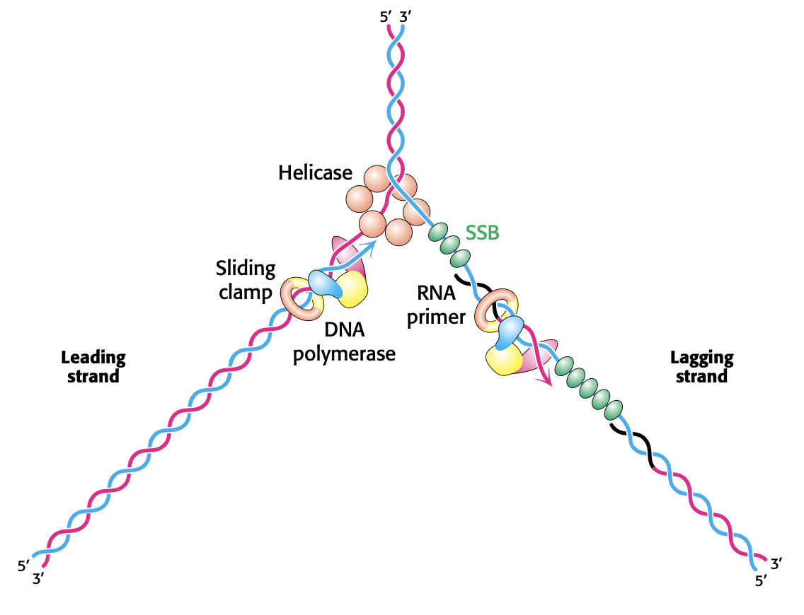

