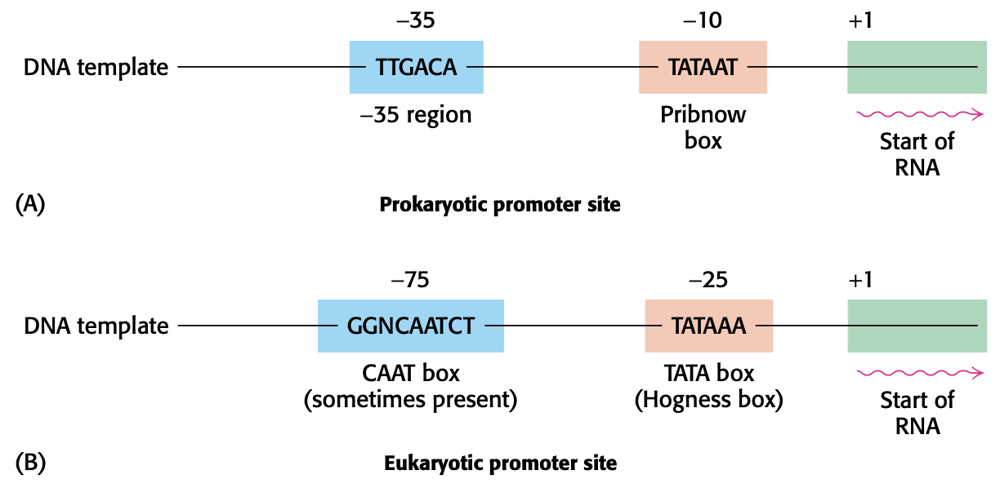

# Lecture 16. Chemistry of replication and transcription: polymerases

- Readings
  - pp. 119-123
  - pp. 827-844
  - pp. 859-880
  - pp. 925-931
  - pp. 941-947

## pp. 119-123

### 4.5<SPACE/> Gene expression the transformation of DNA information into functional molecules
- **80% of RNA in body is rRNA**
  - 23S rRNA: 1200 kDa (3700 nt)
  - 16S rRNA: 550 kDa (1700 nt)
  - 5S rRNA: 36 kDa (120 nt)
- 15% is **tRNA: 4S, 75 nt long**
- in eukaryotes, mRNA has **structural features** (e.g. **stem-loop structures**) that regulate efficiency of translation and lifetime of mRNA

#### All cellular RNA is synthesized by RNA polymerases
- mRNA is a exact copy of the 5' to 3' strand (sense, 5' to 3', coding strand)

#### Transcription begins near promoter sites and ends at terminator sites
- **promoters**. bind RNA polymerases

- eukaryotes also have **enhancers** that mediate transcription
- in prokaryotes, transcription of a **stop sequence** spontaneously dissociates RNA from RNA polymerase
- RNA synthesis can also be terminated by a protein called **rho (Rho factor)**
- in eukaryotes, mRNA modifications
  - mRNA cap: 5'-5' triphosphate linkage
  - poly(A) tail

#### Transfer RNAs are the adaptor molecules in protein synthesis
- tRNAs have an AA-attachment site (AAAS) and template recognition site (TRS)
- **AAAS**
  - amino acid COOH group is esterfied to **2' or 3' OH group** (3' end of tRNA) on **adenosine (A)** at end of tRNA
    - called an **aminoacyl-tRNA**
  - attachment is catalyzed by **aminoacyl-tRNA synthetase**
- **template recognition site (TRS)**
  - 1 **anticodon**, 3' to 5'

## pp. 827-844

### 28<SPACE/>DNA replication, repair, and recombination
- error rate <1 bp every $6 \times 10^9$ bp
  - multiple layers:
    - synthesis: 1 bp every $10^3$ to $10^4$
    - proofreading: 1 bp every $10^6$ to $10^7$
    - post-replication mismatch repair: 1 bp every $10^9$ to $10^{10}$
- _Deinococcus radiodurans_ has between 4 to 10 copies of its genome
  - can withstand high doses of radiation
  - can withstand dessication

### 28.1<SPACE/>DNA replication proceeds by the polymerization of dNTPs along a template
- difficulties
  1. replication needs to account for 5' to 3' direction on both strands
  2. strands must separate for replication
  3. DNA is a double helix, so strands needs to be unwound

#### DNA polymerases require a template and a primer

#### All DNA polymerases have structural features in common

#### Two bound metal ions participate in the polymerase reaction

#### The specificity of replication is dictated by complementarity of shape between bases

#### An RNA primer synthesized by primase enables DNA synthesis to begin

#### One strand of DNA is made continuously, whereas the other strand is synthesized in fragments

#### DNA ligase joins ends of DNA in duplex regions
- DNA ligase cannot link ssDNA or circularize ssDNA

#### The separation of DNA strands requires specific helicases and ATP hydrolysis
-

### 28.2<SPACE/>DNA unwinding and supercoiling are controlled by topoisomerases
- 

#### The linking number of DNA, a topological property, determines the degree of supercoiling

#### Topoisomerases prepare the double helix for unwinding

#### Type I topoisomerases (TOP1) relax supercoiled structures

#### Type II topoisomerases (TOP2) can introduce negative supercoils through coupling to ATP hydrolysis

### 28.3<SPACE/>DNA replication is highly coordinated

#### DNA replication requires highly processive polymerases

#### The leading and lagging strands are synthesized in a coordinated fashion

#### DNA replication in _E. coli_ begins at a unique site

#### DNA synthesis in eukaryotes is initiated at multiple sites

#### Telomeres are unique structures at the ends of linear chromosomes

#### Telomeres are replicated by telomerase, a specialized polymerase that carries its own RNA template

## pp. 859-886

### 29<SPACE/>RNA synthesis and processing

#### RNA synthesis comprises three stages: initiation, elongation, and termination

### 29.1<SPACE/>RNA Polymerases catalyze transcription

#### RNA chains are formed _de novo_ and grow in the 5' to 3' direction

#### RNA polymerases backtrack and correct errors

#### RNA polymerase binds to promoter sites on the DNA template to initiate transcription

#### RNA polymerases must unwind the template double helix for transcription to take place

#### Elongation takes place at transcription bubbles that move along the DNA template

#### Sequences within the newly transcribed RNA signal termination

#### Some mRNAs directly sense metabolite concentrations

#### The _rho_ protein helps to terminate the transcription of some genes

#### Precursors of tRNA nd rRNA are cleaved and chemically modified after transcription in prokaryotes

### 29.2<SPACE/>Transcription in eukaryotes is highly regulated

### 29.3<SPACE/>The transcription products of eukaryotic polymerases are processed

## pp. 925-931

### 31<SPACE/>The control of gene expression in prokaryotes

### 31.1<SPACE/>Many DNA-binding proteins recognize specific DNA sequences

### 31.2<SPACE/>Prokaryotic DNA-binding proteins bind specifically to regulatory sites in operons

## pp. 941-947

### 32<SPACE/>The control of gene expression in eukaryotes

### 32.1<SPACE/>Eukaryotic DNA is organized into chromatin

### 32.2<SPACE/>Transcription factors bind DNA and regulate transcription initiation