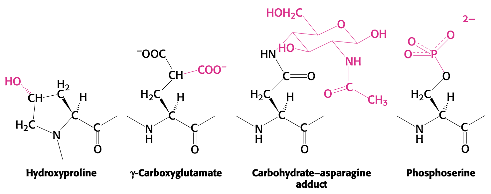

# Lecture 2. Amino Acids and Proteins

- Date: _02/02_
- Readings: _pp. 27-39, 57-59_

## Reading notes

### pp. 27-39

- proteins are linear chains of amino acids
- proteins contain a wide range of functional groups
- proteins interact with each other to form complex assemblies
- some proteins are rigid; others are flexible
    - conformational changes enable **regulated assembly of protein complexes** and **transmission of information within/between cells**

#### 2.1<SPACE />Proteins are built from a repertoire of 20 amino acids
- only <L /> amino acids are constituents of proteins
- **zwitterion**
    - $\ce{-NH2}$ is a base; pKa high (~9); protonated at neutral pH
    - $\ce{-COOH}$ is an acid; pKa low (~2); deprotonated at neutral pH because solution has less $\ce{H+}$, $\ce{-COOH}$ will donate
- Types of amino acids
    - Hydrophobic
    - Polar
    - Positively charged (basic)
    - Negatively charged (acidic)
- The 20 amino acids may have ended up in use because they have favorable chemical properties: they do not cyclize which could lead to peptide bond cleavage

#### 2.2<SPACE />Primary structure: amino acids are linked by peptide bonds to form polypeptide chains
- peptide bonds are stable **kinetically** because hydrolysis is slow
- **hydrolysis** is favored thermodynamically
- **amino end** is conventionally considered to be the beginning of the peptide
- mean molecular weight: $\pu{110 g/mol}$.
- most proteins between 50 and 2000 amino acids
- two linked cysteines together is called **cystine**
- extracellular proteins usually _have_ disulfide bonds
    - collagen
    - fibrin
- intracellular proteins usually _lack_ disulfide bonds
- X-Pro peptide bonds are **cis/trans**; not much steric difference
- other peptide bonds are **trans**
- $\ce{N-C_\alpha}$ bond: $\phi$
- $\ce{C_\alpha-C}$ bond: $\psi$

### pp. 57-59

#### Protein modification and cleavage confer new capabilities

- **acetyl groups** on N termini of proteins makes them **more resistant to degradation**
- **hydroxyl groups** on prolines (**hydroxyproline**) stabilizes fibers of newly synthesized collagen
    - insufficient vitamin C <RA /> insufficient hydroxylation <RA /> abnormal collagen fibers that cannot maintain normal tissue strength
- **$\gamma$-carboxyglutamate**
    - vitamin K deficiency <RA /> insuf. carboxylation of glutamate in **prothrombin** (clotting protein) <RA /> hemorrhage
- **carbohydrate** units on **Asp**, **Ser**, and **Thr**
    - usually on proteins that are
        - secreted, or
        - on surface of cells
    - makes proteins **more hydrophilic** and able to interact with other proteins
- **fatty acid** on **$\alpha$-amino group** or **cysteine sulfhydryl group**
    - make a more **hydrophobic** protein
- **phosphorylation** of _hydroxyl amino acids **Ser** and **Thr**_
    - phosphoserine, phosphothreonine are the most common modified amino acids in proteins
    - **insulin** works by phosphorylating hydroxyl group on  **tyrosine**
- GFP works because of chemical reaction of Ser-Tyr-Gly within center of protein
    - rearrangement and oxidation
- cleavage
    - fibrinogen
    - trypsinogen
    - proinsulin

### Questions
- What is the $\alpha$ amino group?
- Why do we still say that proteins spontaneously fold when in fact they require the right conditions (including chaperone proteins)?
- What is considered a "large" or "bulky" amino acid?
    - aromatic groups
    - F, tyr, trp
        - sheer number of atoms
        - rigid geometry of ring
    - Leu, Ile (somewhat bulky)

## Lecture notes

### Titration
- Titration works by driving $\ce{H+ + OH- <=>> H2O}$ forward, which drives $\ce{HA <<=> A- + H+}$ forward as well.
- At $\PH = \PK{a}$, $\ce{[base] = [acid]}$.
    - **HW: prove why inflection point is $\PK{a}$.**
- Imidazole: $\PK{a} = 6.99$
- Ammonia ($\ce{NH3}$): $\PK{a} = 9.25$
- the titration curve is in **equivalents of base** <T tag="search" />

#### Polyprotic acids
- e.g. $\ce{H3PO4}$
- Are there any polyprotic acids there the pKas are not separated by 2 pH units?
- Can treat dissociations as **indepedent if $\PK{a}$ separated by 2 pH units**

### Buffers
- Mix a **weak acid** and its **salt** (conjugate base)
- $\pu{20 mM}$ acetate buffer
    - $\pu{1 L}$ water
    - $\pu{0.01 M}\ \ce{AcOH}$
    - $\pu{0.01 M}\ \ce{AcO-}$
- $\PH = \PK{a} + \log \frac{\ce{[A-]}}{\ce{[HA]}}$
    - $4.76 + \log \frac{0.01}{0.01} = 4.76$
- Add 1 mmol of $\ce{HCl}$
    - $\ce{AcOH}$: $\pu{(0.01 mols + 0.001 mols)/1 L = 0.011 M}$
    - $\ce{AcO-}$: $\pu{(0.01 mols - 0.001 mols)/1 L = 0.009 M}$
-  **Buffers work best near their $\PK{a}$.** <T tag="test" />

#### Synthetic buffers by N.E. Good
- TRIS
    - tris-hydroxymethylaminomethane
    - $\PK{a} = 8.1$
- **closed buffer system.** buffering capacity does not depend on atmosphere.

#### Blood buffering
- $\ce{H+ + HCO3- <=>> H2CO3 <=>> H2O + CO2 ^}$
- blood $\PH = 7.4$ (between 6.9 and 7.7)
    - $\ce{[H+]} = \pu{40 nM}$
- **equivalents** are moles for single-charged <T tag="lookup" />
- lactic acid <RA /> removes bicarbonate in the blood
- breathing <RA /> reduces pCO2 in the blood
- ratio of $\ce{[HCO3]}$ to pCO2 should be 20 (log 20 = 1.3)
    - pCO2 = $0.03 \times \ce{[H2CO3]}$
- **open buffer systems.** one that exchanges with the atmosphere

### Proteins and amino acids
- G.J. Mulder: named the "universal" molecule **primary** (from Greek, **proteos**).
- first amino acid identified: asparagine (from asparagus juice)
    - but not known to be amino acid
- **leucine** was the first amino acid to be identified as a protein constituent
- **amino acids should be drawn in zwitterionic form at physiologic pH** <T tag="test" />
- relative configuration: <D />, <L /> nomenclature
    - **Fischer notation**
    - based on glceraldehyde
    - D/L name comes from the optical rotation of **glcyeraldehyde only**; they don't tell optical rotation of any other molecule
- absolute configuration: R, S
    - all amino acids are **S** configuration except for **cysteine**.

#### Proteins
- Amino acids, once joined together, are called **residues** (not amino acids)
    - reaction happens in the **ribosome** (avoids 55.5 M water)
    - **amide bonds** are **kinetically stable**

## Practical techniques

### Buffers
- Calculate the pH of a buffer with Henderson-Hasselbalch equation.
- Calculate the pH of a blood buffer where $pCO2 = 0.03 \times \ce{[H2CO3]}$.
- Plotting titration curves. (look at Example 16.5 in Chang, Chemistry 10e)