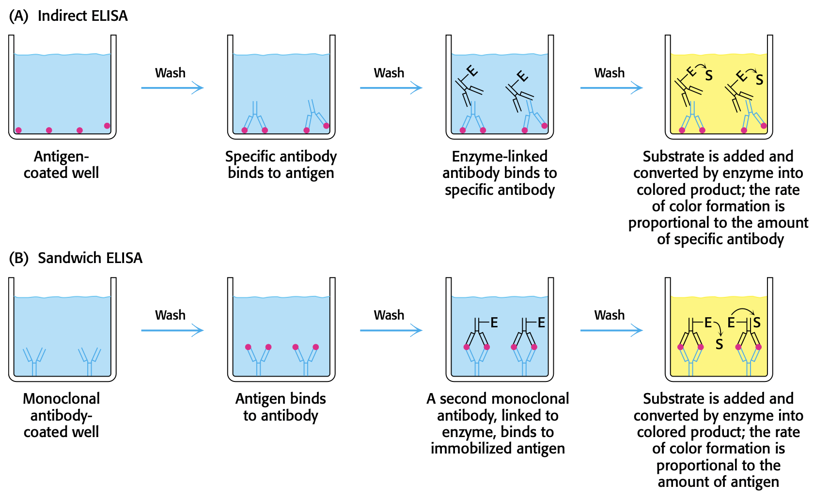

# Lecture 3. Protein Purification 1

- Readings: _pp. 65-84, 92-95_

## Readings

### pp. 65-84 (Chapter 3)

- proteins can be separated based on
  - solubility
  - size
  - charge
  - binding ability
- **the proteome is the functional representation of the genome**
  - the **proteome is much larger than the genome**
    - almost all gene products can be modified in some way

#### 3.1<SPACE />The purification of proteins is an essential first step in understanding their function

- **the assay: how do we recognize the protein that we are looking for?**
  - an **assay** tests for some unique identifying property of the protein
  - for enzymes, **assay measures enzyme activity**
    - e.g. lactate dehydrogenase
    - NADH absorbs light at 340 nm, $\ce{NAD+}$ does not
    - NADH is product, $\ce{NAD+}$ is reactant; assay measures absorbance developed as reaction proceeds.
  - also need a way of determining **protein concentration**
  - assay + protein concentration = **specific activity**, which will rise as _purity increases_
- **proteins must be released from the cell to be purified**
  - perform **differential centrifugation**, and then assay the different fractions and closely work with the one with _highest activity_
- **proteins can be purified according to solubility, size, charge, and specific binding affinity**
  - purification techniques
    - solubility
      - **salting out**. proteins are less soluble at high salt concentrations
      - **dialysis**. used to remove small molecules in cell fractionate; not used for purification
    - size
      - **gel-filtration chromatography**. small molecules get stuck in beads and flow slower; large molecules flow faster
    - charge
      - **ion-exchange chromatography**.
        - **elute**. release
        - elute by increasing concentration of salt (salt competes in binding to charged beads) in eluting buffer
    - specific binding affinity
      - **affinity chromatography**.
        - used to isolate proteins **expressed from cloned genes**
          - add additional amino acids such as a _His tag_
          - _His_ binds strongly to nickel(II)
          - elute by addition of **imidazole** that binds to metal ions and displaces the protein
    - **high performance liquid chromatography (HPLC)**
      - column materials more finely divided $\implies$ greater resolving power
      - requires pressure applied to column to get usable flow rates
- How do we know purity is increasing?
  - specific activity increases
  - number of different proteins decreases $\implies$ **gel electrophoresis**
    - $v = Ez/f$
      - $v$. velocity of migration
      - $E$. electric field strength
      - $z$. net charge on molecule (protein)
      - $f$. frictional coefficient
    - $f = 6\pi\eta r$
      - $r$. radius
      - $\eta$. the viscosity of the medium
    - conducted in a gel so that $\eta$ is high, leading to better separation
    - proteins migrate from **negative to positive**, usually from **top to bottom**
    - mobility of chains is linear proportional to the **logarithm of their mass**
      - some carbohydrate rich proteins don't follow this empirical relation
    - very little protein needed: less than $\pu{0.1 \mu g}$
    - proteins that differ in mass by 2% (about 10 aa) can be distinguished with SDS-PAGE
  - **isoelectric focusing**. use pH gradient, separate by **isoelectric point**
    - can resolve proteins that differ in pH by as little as 0.01 ($10^{0.01} \approx 1$), so differences of one net charge can be separated.
    - do **NOT** use SDS
  - **two dimensional electrophoresis (TDE)**: SDS-PAGE with isoelectric focusing
    - use a **single-lane gel**
  - can now couple **TDE** with **mass spec**
- **ultracentrifugation is valuable for separating biomolecules and determining their masses**
  - quantify rate of movement of particle when subjected to centrifugal force: **sedimentation coefficient** $s$
    - $s = m(1 - \bar{\nu}\rho)/f$
      - $m$. mass
      - $\rho$. density of the medium
      - $\bar{\nu}$. **partial specific volume**; the change in volume of solution when a measured amount of solute is added
        - reciprocal of particle density, since $\bar{\nu_i} = \left(\frac{\partial V}{\partial m_i}\right)_{T, P, m_{j \neq i}}$
    - **Svedberg units (S)**, equal to $\pu{10^{-13} s}$
      - smaller $S$ means is slower movement
    - $1 - \bar{\nu}\rho$ is the bouyant force
      - if $\bar{\nu}\rho \geq 1$, particle doesn't move or will float
  - often use **gradient centrifugation** that uses a **sucrose gradient (different densities of sucrose)**
  - fractions are collected by a hole in the bottom of the tube
  - often needs $S$ to differ by a factor of 2
  - **sedimentation equilibrium (SE)** is a very accurate method for determining the mass of a protein without denaturing it
    - centrifuge slowly, sedimentation is counterbalanced by diffusion
    - SDS-PAGE denatures the protein, so we can get mass of **subunits** in a quaternary structure, whereas SE gives the mass of the intact complex
- **protein purification can be made easier with the use of recombinant DNA technology**
  - proteins can be expressed in large quantities
  - affinity tags can be fused to proteins
  - proteins with modified primary structures can be readily generated

#### 3.2<SPACE />Immunology provides important techniques with which to investigate proteins

- **antibodies to specific proteins can be generated**
  - **epitope**. the part of the antigen that is recognized
  - antibodies can only bind to small molecules if the small molecule is bound to a macromolecule carrier
  - **polyclonal antibodies.** heterogeneous mixtures of antibodies
- **monoclonal antibodies with virtually any desired specificity can be readily prepared**
  - problem: antibody producing cells isolated from an organism have short life spans
  - immortal cell lines that produce mAbs: derived from **multiple myeloma**
    - nothing is known about specificity of generated antibodies; not useful for immunological methods
  - **Milstein and Kohler**
    - fuse a short-lived antibody-producing cell with an immortal myeloma cell
      - inject antigen into mouse
      - extract spleen
      - fuse plasma cells from spleen with myeloma cell to form **hybridoma cells**
- **proteins can be detected and quantified using an enzyme-linked immunosorbent assay (ELISA)**
  - ELISA: detect and quantify protein
    - reacts with colorless substrate to produce colored product
    - if color appears, then antigen present
    - **Indirect ELISA**. detects **antibodies** bound to antigens
      - useful for diagnostics that test whether antibodies are present
      - **rate of color formation** is proportion to amount of **antibody**
    - **Sandwich ELISA**. detects antigens directly
        - rate of color formation is directly proportional to the amount of **antigen** present

- **Western blotting permits the detection of proteins separated by gel electrophoresis**
    - can detect **very small quantities of a protein of interest**
    - steps
        1. SDS-PAGE
        2. transfer to polymer sheet
        3. primary antibody to antigen
        4. secondary antibody (linked to fluorescence, some kind of detection) that binds to primary antibody
- **fluorescent markers make the visualization of proteins in the cell possible**
  - highest resolution of _fluorescence microscopy_ is about $\pu{200 nm}$
  - tag antibodies with **electron-dense markers** (e.g. **gold**, **ferritin**); then we can use _electron microscopy_
    - **immunoelectron microscopy** can get resolution of $\pu{10 nm}$

### pp. 92-95

#### 3.4<SPACE />Peptides can be synthesized by automated solid-phase methods

## Lecture notes

### Amino acids
- Reduced cysteine (add hydrogen)
- Disulfide cysteine is called a **cystine**
- **aromatic amino acids**
    - Y and W do most of the absorbing
    - F is symmetric and thus has reduced $\pi \rightarrow \pi^*$ transition due to **selection rules**
- **cationic amino acids**
    - R has three resonance forms (**guanidino group**)
- **modified amino acids**
    - **phosphotyrosine**. controls cell growth
    - **$\gamma$-carboxylglutamate**.
    - **4-hydroxyproline**. on position 4
        - found in collagen
- **1 hydrogen weighs $\pu{1 Da}$**
    - converts directly to $\pu{g/mol}$

### Protein purification

1. Break open cells
    - grind
    - freeze/thaw
    - detergents
        - two types of detergents:
            - ionic
            - non-ionic
    - sonification
    - rapid changes in pressure
        - $\ce{N2}$ bomb
2. centrifuge the **lysate**
    - low speed (500g): **nuclei**
    - medium speed (10,000g): **mitochondria**
    - high speed (100,000g for 2 hours): **microsomes** (membranes with ribosomes; **ER**)
    - cytosol remains
3. Separate
    - solubility
        - **salting out**
            - $\uparrow$ ionic strength, $\downarrow$ solubility
            - **ammonium sulfate**
            - example:
              - ppt = **precipitate**
              - fibronogen ppt @ $\pu{0.8M} \ce{(NH4)2SO4}$
              - albumin ppt @ $\pu{2.4M} \ce{(NH4)2SO4}$
              - redissolve precipitates in buffer, lower concentration of $\ce{(NH4)2SO4}$, remove $\ce{(NH4)2SO4}$ through **dialysis**.
    - size
      - **gel filtration (size exclusion) chromatography**
        - beads
          - 0.1mm in size
          - polymer of dextran, agarose, polyacrylamide
    - charge
      - **anion exchange resin**
        - resin is positively charged; often use **DEAE (diethylamine ethane)**
        - the protein (negatively charged) will _exchange_ with the counter-ion chloride present initially
      - **cation exchange resin**
        - resin is negatively charged; often use **acetate (carboxymethyl)**
    - affinity (some cases)
      - **Nickel** binds **Histidine** because the lone pair in histidine chelates with nickel.

## Questions

- How do we purify a protein we know nothing about?
  - How do we discover new proteins?
- How are the reagents used in affinity chromatography discovered?
  - e.g. Nickel beads
- How are the beads in affinity chromatography made?
  - [custom affinity medium](https://bitesizebio.com/24746/how-to-make-a-custom-affinity-medium-for-protein-purification/)
- How do we measure the concentration of a protein? (p. 67, "There are various rapid and reasonably accurate means of determining protein concentration.")
- [**Why is arginine easy to protonate?**](https://www.ncbi.nlm.nih.gov/pmc/articles/PMC4420524/)
