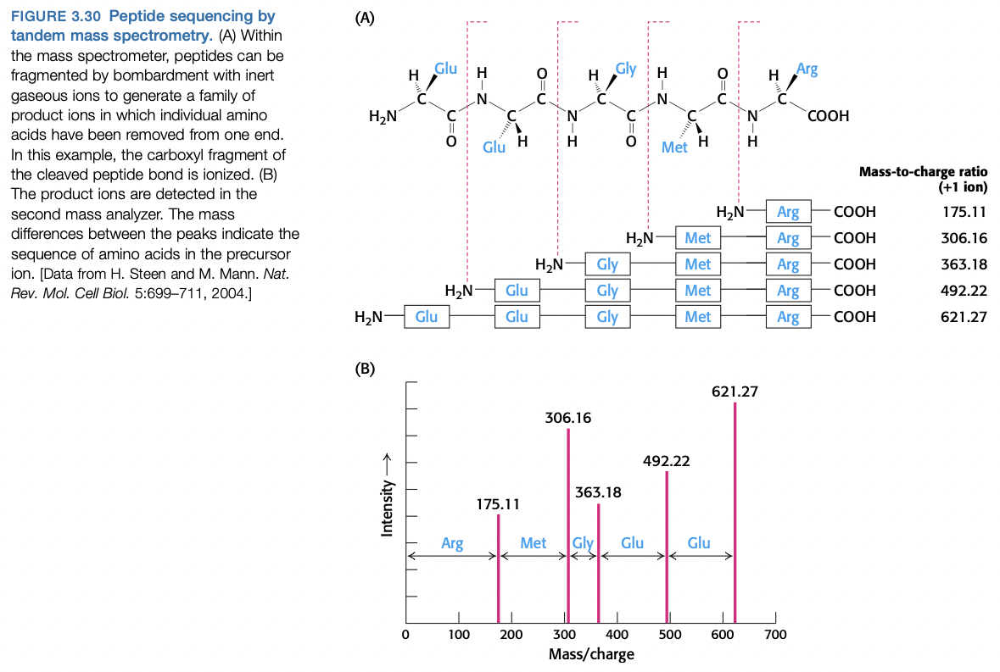
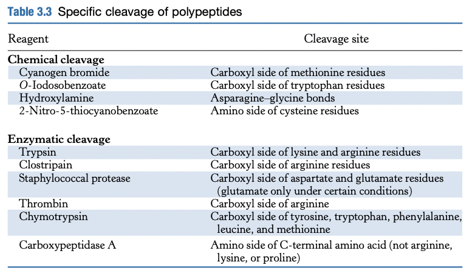

# Lecture 4. Protein Purification 2, Protein Structure 1

- Readings: _pp. 35-49, 59-62, 85-92_

## Readings

### pp. 35-49

#### 2.3<SPACE />Secondary structure: polypeptide chains can fold into regular structures such as the alpha helix, beta sheet, turns, and loops
- beta turn
- omega loop
- **the alpha helix is a coiled structure stabilized by intrachain hydrogen bonds**
  - **4 residues away**
    - 3.6 residues per turn of helix
    - rise per residue: $\pu{1.5 \ang}$
      - pitch = $\pu{3.6 \times 1.5 \ang = 5.4 \ang}$
  - **side chains point outward**
  - destabilize $\alpha$-helix:
    - branching at $\beta$-carbon
      - valine, threonine, isoleucine
    - hydrogen-bond donors/acceptors that compete for main-chain NH and CO groups
      - serine
      - aspartate
      - asparagine
    - no NH group, ring structure
      - **proline** (only a $\alpha$-helix)
- **beta sheets are stabilized by hydrogen bonding between polypeptide strands**
- **beta turn**
  - 4 residues
  - hydrogen bond between CO of $i$ and NH of $i + 3$
- **fibrous proteins provide structural support for cells and tissues**
  - **keratin**
    - repeating seven amino acid sequence called **heptad repeat**
    - every seventh residue is **leucine**
  - **collagen**
    - glycine, proline, hydroxyproline
    - no hydrogen bonds
    - stabilized by steric repulsion of pyrrolidine rings of proline and hydroxyproline
    - superhelical cable of 3 strands is stabilized by hydrogen bonds
    - only glycine can fit inside the cable; the prolines face outwards from the cable

#### 2.4<SPACE />Tertiary structure: Water-soluble proteins fold into compact structures with nonpolar cores
- in aqueous solution, protein folding is driven by the tendency of hydrophobic residues to be excluded from water
- most NH and CO grups are paired in hydrogen bonding if they are to be located in the interior of a protein, away from water
- porins: exceptions that prove the rule
- **motifs**. combinations of secondary structure present in many proteins
  - **helix-turn-helix**, common in DNA-binding proteins
- **domain**. a region of a polypeptide chain that folds into a compact globular unit and connects to other parts of the chain via a flexible segment of polypeptides.

#### 2.5<SPACE />Quaternary structure: polypeptide chains can assemble into multisubunit structures
- refers to the spatial arrangement of subunits

### pp. 59-62

#### Summary
- important properties of peptide bonds
  - resistant to hydrolysis (kinetically)
  - planar
  - contains a hydrogen-bond donor and acceptor
  - uncharged, allowing for close packing
- visualizing proteins
  - **space filling models**. useful for visualizing conformational changes
  - **backbone models**. shows overall coruse of polypeptide chain
  - **ribbon diagram**. shows secondary structure
    - cylinders for membrane spanning $\alpha$-helices

### pp. 85-92

#### 3.3<SPACE />Mass spectrometry is a powerful technique for the identification of peptides and proteins
- **mass spec** lots us measure the atomic composition of an _unknown_ molecule
- three components
  - ion source
  - mass analyzer
  - detector
- how it works
  1. convert analyte molecules into gaseous, charged forms (**gas-phase ions**)
  2. apply electrostatic potentials to measure $m/z$ (mass-to-charge) ratio
- ion sources perform step 1
  - until recently, proteins could not be ionized efficiently because of **high molecular weight and low volatility**
  - **MALDI** (matrix-assisted laser desorption/ionization)
    - analyte evaporated in the presence of the **matrix** (a volatile, aromatic compound)
    - laser vaporizes the matrix
  - **ESI** (electrospray ionization)
    - droplets are passed through charged nozzle
    - low pressure to vaporize
- **Peptides can be sequenced by mass spec**
  - traditionally, peptides were sequenced with **Edman degradation**
    - N-terminal amino acid labeled with **phenyl isothiocyanate**
    - cleavage yields **phenylthiohydantoin (PTH)**-amino acid derivative
  - **tandem mass spec**
    - break **precursor ions** with **helium/argon gas** and measure new fragments (**product ions**)

- **proteins can be specifically cleaved into small peptides to facilitate analysis**

- SDS-PAGE can be used to determine the number of distinct polypeptide chains
- **genomic and proteomic methods are complementary**
  - DNA sequence cannot tell us about post-translational modifications/disulfide bonds
- **the amino acid sequence of a protein provides valuable information**
  1. compare with other known sequences for similarities
    - protein families can help us infer structure and function
  2. compare same protein in different species for evolutionary pathways
  3. search for internal repeats
      - reveals history of protein itself
  4. many proteins have signal sequences, which tell us where it localizes
  5. sequence data provides a basis for preparing antibodies
  6. amino acid sequences enable DNA probes for the encoding genes
- **individual proteins can be identified by mass spec**
  - protein cleavage + chromatographic separation + mass spec = **peptide mass fingerprinting**

## Lecture notes

### Key points
1. purification table
2. SDS-PAGE
3. IEF and 2D gels
4. Levels of protein structure
5. Determination of primary structure

 

- An **assay** is a measure of activity
  - cannot detect something without an assay: _assays are the foundation of biochemistry!_

### UV absorption
- Due to $\pi \to \pi^*$ transitions
  - F, Y, W all have delocalized electrons
  - W: peak at 280 nm
  - Y: peak at 276 nm
- **Beer's law**. $I = I_0e^{-\varepsilon c l}$
  - $\varepsilon$. the extinction coefficient; measure of effectiveness of absorption
    - $\varepsilon$ is a function of the light's wavelength ($\lambda$)
  - $c$. concentration
  - $\ln \frac{I_0}{I} = \varepsilon c l$
  - Define $\ln \frac{I_0}{I}$ to be the **absorbance**.
  - Measure at **280 nm** experimentally
- For a protein, $\veps(\lambda) \sim N_W + N_Y$
  - UV is not useful **before you have a pure protein**
  - Once you have a pure protein, UV is one of the most accurate methods for tracking concentration of protein
- **Bradford assay** ("Bio-Rad assay")
  - Coomassie G-250, MeOH, acidic conditions
    - Red color
    - $\lambda_{\max} = \pu{465 nm}$
    - Initially in cationic form
  - Basic, aromatic: stabilize anionic form
    - Blue color
    - $\lambda_{\max} = \pu{595 nm}$
  - Can detect concentrations between $0.1$ to $\pu{1.5 mg/ml}$
  - Assay: $\pu{20 \mu L}$ + $\pu{1 ml}$ reagent

### BCA assay
- Uses fact that peptide bonds can reduce $\ce{Cu^2+}$
- "Biuret"/Lowry assay (use sodium tartrate)
  - named because the complex formed by peptides and copper is the same reaction when performed with **biurea**
- BCA (use bicinchoninic acid)
- $\lambda_{\max} = \pu{562 nm}$
- much more sensitive than Bradford assay
  - Can detect concentrations between $0.005$ to $\pu{1.25 mg/ml}$

### Specific activity
- specific activity = $\frac{\text{total enzyme activity}}{\text{total amount of protein}}$
- **purification table**
  - activity goes down because you lose some protein
  - you want your purification to lose more junk than you lose protein
  - **relative purification**. always normalized to the **lysate**'s specific activity (_not the previous step's_)
- It is possible for **activity** to increase during the purification process.
  - Problematic assay
  - How? Contamination?

### Gel electrophoresis
- **Cathode** is negatively charged, on top
- **Anode** is positively charged, on bottom
  - negatively charged proteins move against electric field toward the positive charge (anode)
- Force due to electic field: $\vec{F} = z\vec{E} = m\vec{a}$
- Friction: $\vec{F}_f = f\vec{v}$
  - $f$. friction coefficient
    - depends on **mass**, **shape**, and **viscosity**
- Terminal velocity: $zE = fv \implies v = \frac{zE}{f}$
- Need to remove **shape** and **charge**
  - Accomplished with **SDS (sodium dodecyl sulfate)** (aka sodium lauryl sulfate) (a detergent)
    - Found in toothpaste and shampoo
    - 1 SDS molecule per 2 amino acids (on average)
  - Unfolds protein
  - Gives uniform $z/m$ ratio (charge/mass ratio)
- Need to get rid of **disulfide bonds**
  1. $\beta$-mercaptoethanol
  2. better reagent: **dithiothreitol (DTT)**
    - Cleland's reagent
- Use a **sieve** to make smaller molecules move faster
- Make gel via **radical polymerization**
  - Acrylamide with persulfate (create radicals), TEMED (catalyst)
  - **Bis-acrylamide** for cross-linking chains
- **mobility/relative field**: $R_f = \frac{\text{movement of molecule}}{\text{movement of dye-front}} \propto \log M_W$
  - **dye-front**. the molecule that moved the farthest
- Can visualize proteins by staining with
  - Coomassie blue
  - Silver (more sensitive)

### Isoelectric focusing (IEF)
- **isoelectric point** ($\pI$). the $\PH$ where net charge of protein is 0.
  - e.g. **cytochrome C**: $\pI = 10.6$
    - positively charged at physiological pH
  - e.g. **albumin**: $\pI = 4.8$
    - negatively charged at physiological pH
- We can focus our protein at its $\pI$.
- Can resolve two proteins if $\Delta\pI = 0.01$ (a single charge).

### Two dimensional gels
- Combine SDS-PAGE with IEF
- Perform IEF _first_,
- SDS-PAGE _second_

### Protein structure
1. **Primary structure**
    - amino acid sequence **and** pattern of disulfide bonds
2. **Secondary structure**
    - local arrangement of amino acids in 3D space
3. **Tertiary structure**
    - Global 3D fold
4. **Quaternary structure**
    - Arrangement of subunits (multiple polypeptide chains)

#### Determining primary structure
1. **Edman degradation**
    - Chemistry not tested
    - the **elution times** for each PTH-amino acid differs
2. **Mass spectrometry**
    - Two flavors
      - **Mass fingerprinting**
        - Use specific protease to digest protein
        - **Trypsin** cuts after positively charged residues: K, R (not H)
        - Use database of all known proteins to match molecular weights with calculated molecular weights from digesting all proteins in the proteome
        - Weigh peptides with **mass spec**; "soft" ionization (give peptides small charge)
          - **MALDI-TOF (matrix assisted laser desorption-ionization, time of flight)**
          - $q\vec{E} = m\vec{a}$
      - **(Discuss in Lecture 5)**

## Questions
- What does biurea do?
  - https://www.mycrobe.org/blog/2018/7/26/biuret-assay
  - It's not part of the assay.
- What is the Lowry assay? How does it differ from biuret assay? From BCA?
- How is it possible for **activity** to increase during the purification process?
- Why is the velocity the same if the charge/mass ratio is the same?
  - The friction coefficient $f$ is proportional to mass.
- Why do we use gel electrophoresis instead of just column chromatography?
  - Column chromatography is for size-exclusion; we don't actually know what proteins we get in each fraction
  - Gel electrophoresis isn't for purification, but lets us get the molecular weight of proteins, and determine the number of proteins in our sample
- Why do we need tandem mass spec for protein sequencing? (pp. 87)
- How do you make a DNA probe from only the amino acid sequence? (pp. 91)