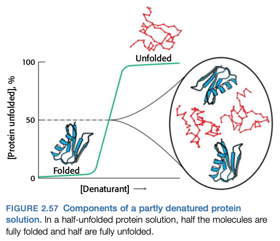
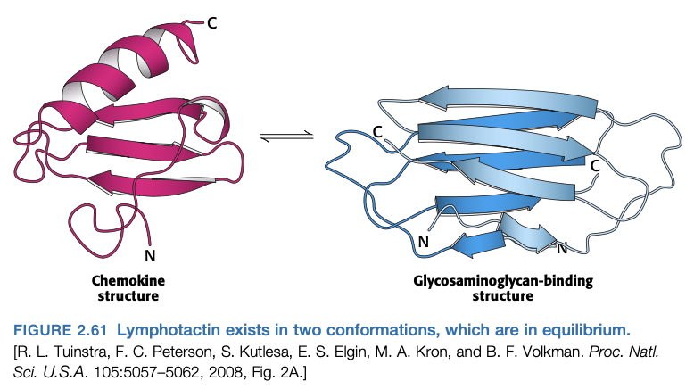
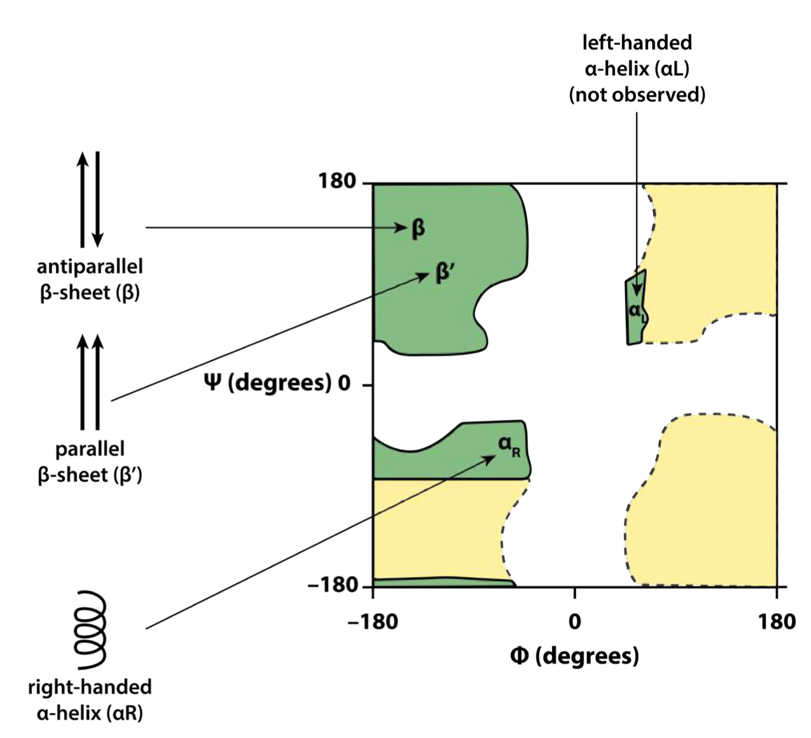

# Lecture 5. Protein Structure 2, Protein Folding

- Readings: _pp. 6-9, 49-59, 169-182_

## Readings

### pp. 6-9

- **noncovalent bonds**
  1. **ionic interactions**
      - Coulomb energy: $E = \frac{kq_1q_2}{Dr}$
        - $D = 80$ in water
  2. **hydrogen bonds**
      - bond length: $\pu{1.5 \ang}$ to $\pu{2.6 \ang}$
      - length between non-hydrogen atoms: $\pu{0.9 \ang}$ + ($\pu{1.5 \ang}$ to $\pu{2.6 \ang}$)
      - energy: $4$ to $20 \pu{kJ/mol}$
  3. **var der Waals interactions**
      - energy: $2$ to $4 \pu{kJ/mol}$
  4. **hydrophobic effect**
      - water forms cages around hydrophobic substances
      - when two hydrophobic substances come together, water is released from cage and can interact with bulk solution $\rightarrow$ energetically favorable

### pp. 49-60

#### 2.6<SPACE />The amino acid sequence of a protein determines its three-dimensional structure
- some proteins can spontaneously refold; others need **chaperone proteins** to prevent undesirable interactions
- some proteins do not assume a defined structure until they interact with molecular partners
- **amino acids have different propensities for forming alpha-helices, beta-sheets, and turns**
    - what determines whether a particular sequence forms an $\alpha$-helix, $\beta$-strand, or a turn?
        - $\alpha$ helix
            - alanine, glutamate, leucine
        - $\beta$ strand
            - valine, isoleucine
        - turns
            - glycine, asparagine, proline
        - often depends on **tertiary structure**; the same sequence can form different secondary structures under different circumstances
- **protein folding is a highly cooperative process**
    - _all or none_
    - logical: if one part of a protein is destabilized, it will destabilize the other parts of the protein

- **proteins fold by progressive stabilization of intermediates rather than by random search**
    - the essence of protein folding is the tendency to retain _partly correct intermediates_
    - $\Delta\Delta G$ between folded and unfolded states of a 100-residue protein is $\pu{42 kJ/mol}$.
        - the means that correct intermediates only provide small stability
        - less than thermal energy, $\pu{2.5 kJ/mol}$
    - **nucleation-condensation model**. a conceptual framework where local regions with significant structural preference will tend to adopt their favored structures and interact with other structures, leading to increased stabilization
- **some proteins are inherently unstructured and can exist in multiple conformations**
    - example 1: **intrinsically unstructured proteins (IUPs)**
        - estimated 50% of eukaryotic proteins have at least one unstructured region of $\geq 30$ amino acids in length
        - unstructured regions are rich in **charged and polar amino acids** with few hydrophobic residues
        - important in signaling and regulatory pathways
    - example 2: **metamorphic proteins**
        - exist in ensemble of structures of approximately equal energy in equilibrium
        - example: **lymphotactin** (a chemokine)

- **protein misfolding and aggregation are associated with some neurological diseases**
    - **amyloidoses.** the set of diseases that result in the deposition of protein aggregates
    - still unknown how aggregates lead to cell death (and whether or not they do).

### pp. 169-182

- molecular families have features in common
    - bovine vs. human ribonuclease (8RAT and 2RNF).
    - angiogenin (2ANG) and ribonuclease are part of the same protein family

#### 6.1<SPACE />Homologs are descended from a common ancestor
- **paralogs**. homolougs present within one species
- **orthologs**. homologs present within different species and have similar or identical functions

#### 6.2<SPACE />Statistical analysis of sequence alignments can detect homology
- homology is detectable by significant similarity in nucleotide/amino acid sequence and almost always manifest in three-dimensional structure
- find alignment with **reward for each match, and penalty for gaps**
- use statistics to check if alignment is statistically significant
- **The statistical significance of alignments can be estimated by shuffling**
    - shuffle one sequence, and then run the alignment again
    - if the number of matches is similar, then unlikely to be significant
- **Distant evolutionary relationships can be detected through the use of substitution matrices**
    - distance proteins might have residues changed, but similar functionality because residues have similar properties
    - amino acid similarity can be assessed by
        - conservative/nonconservatice
        - number of nucleotide mutations needed
    - **Blosum-62 (blocks of amino acid substitution matrix)** is commonly used to score amino acid similarity.
    - application: **leghemoglobin** (from lupine) and **hemoglobin** (humans); statistical significance increases when using Blosum-62.
    - **rules of thumb**
        - $>25\%$ sequence similarity; likely statistically significant
        - $15$ to $25\%$ sequence similarity; requires analysis
        - $<15\%$ sequence similarity; unlikely statistically significant
- note: a lack of statistically significant sequence similarity does not rule out homology.
- **Databases can be searched to identify homologous sequences**
    - use `blastp` (BLAST for proteins) to search for homologous sequences

#### 6.3<SPACE />Examination of three-dimensional structure enhances our understanding of evolutionary relationships
- tertiary structure is the level of _function_
- **Tertiary structure is more conserved than primary structure**
    - e.g. the _globins_
    - unsuspected relations
        - **actin**. major component of the cytoskeleton (1ATN)
        - **heat shock protein 70 (Hsp70)**. assists in protein folding in the cell (1ATR)
- **Knowledge of three-dimensional structures can aid in the evaluation of sequence alignments**
    - critical regions are more conserved than non-critical regions
    - **sequence template**. a map of conserved residues that are structurally and functionally important and are characteristic of paricular families of proteins.
- **Repeated motifs can be detected by aligning sequences with themselves**
    - Align different segments of the same protein with each other to see if they share domains
- **Convergent evolution illustrates common solutions to biochemical challenges**
    - e.g. **serine proteases**
        - cleave peptide bonds by hydrolysis
        - **serine, histidine, aspartic acid**: catalytic triad
- **Comparison of RNA sequences can be a source of insight into RNA secondary structures**
    - Watson-Crick base pairing; where two nucleotides always pair, even if mutated, indicates base pairing

## Lecture notes

### Primary structure
- determination of **primary structure**
    1. mass spec fingerprinting
        - weigh peptides with **MALDI-TOF**
        - $\vec{a} = \frac{\vec{E}}{m}$
    2. MS/MS (tandem mass spec)
        1. isolate 1 peptide $X$ with first mass spec
        2. send peptide $X$ to second mass spec
            - **hard ionization**; breaks peptide into fragments
            - **b ions**; correspond to N-terminal fragments
            - **y ions**; correspond to C-terminal fragments
        3. use difference in weight of **y ions** to sequence
            - lightest ion must be C-terminus
            - second lightest must be 2 residues

### Secondary structure
- 1951: Linus Pauling, Corey
    - proposed alpha helices, beta strands
- **$\mathbf{\alpha}$-helix**
    - pitch (distance after 360 rotation)
        - 5.4 $\pu{\ang}$
    - 3.6 amino acids per turn
    - **rise** between two amino acids: $\frac{5.4 \ang}{3.6 \mathrm{aa}} = 1.5 \ang/\mathrm{aa}$
- **$\mathbf{\beta}$-strands**; strands next to each other form a **$\mathbf{\beta}$-sheet**
    - parallel and antiparallel
    - R groups lie above and below the plane
    - an **extended structure**
    - parallel
        - bonds tilted, equally spaced
- **reverse turn**

#### Dihedral angles
- planar peptide bonds combined with tetrahedral $\ce{C}_\alpha$ leads to **dihedral angles**
- use **right hand rule** to determine whether angle is positive or negative
- **Ramachandran plot**
    - tutorial: https://proteopedia.org/wiki/index.php/Tutorial:Ramachandran_principle_and_phi_psi_angles
- fully extended polypeptide
    - $\phi = \psi = 180^\circ = -180^\circ$
- only certain $\phi$, $\psi$ angles allowed due to steric hindrance
- alpha-helices and beta strands
    - formed from repeating $\phi$ and $\psi$ angles

### Tertiary structure
- **interactions between side chains stabilize the tertiary structure**
- **interactions between main chain stabilize the secondary structure**

#### Experimental techniques
1. Multidimensional NMR
    - limited to proteins <30 kDa
2. X-ray crystallography
3. Cryo-electron microscopy

#### Visualizing protein structure
- RNAase A
- **Jane Richardson**: pioneered **cartoon** topology representation of proteins
    - $\beta$ strand
        - arrow: N-terminus $\to$ C-terminus
    - $\alpha$ helix
        - corkscrew

#### Motifs
- **4-helix bundle**
    - hydrophilic side chains point out
    - hydrophobic side chains point inward
    - structure shared by proteins
        - myohemeythrin
        - cytochrome b562
        - cytochrome c'
        - tobacco mosaic virus protein
        - human growth hormone
- **beta sandwich fold** (immunoglobulin fold)
    - 4 stranded sheet and 3 stranded sheet
- there is a **limited number of stable 3D folds**

#### Protein folding problem
- **Anfinsen's hypothesis.** amino acid sequence alone (given the same environment) dictates folded structure

