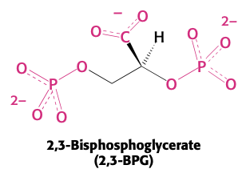
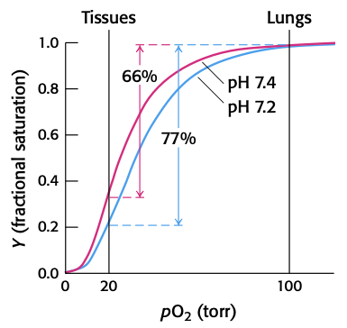
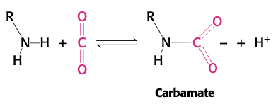
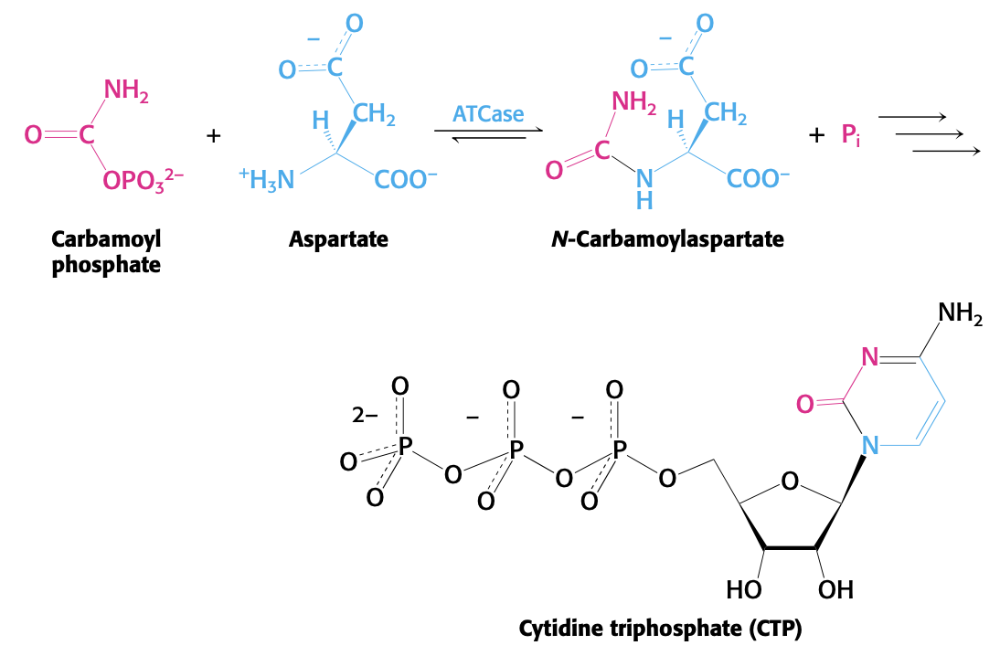
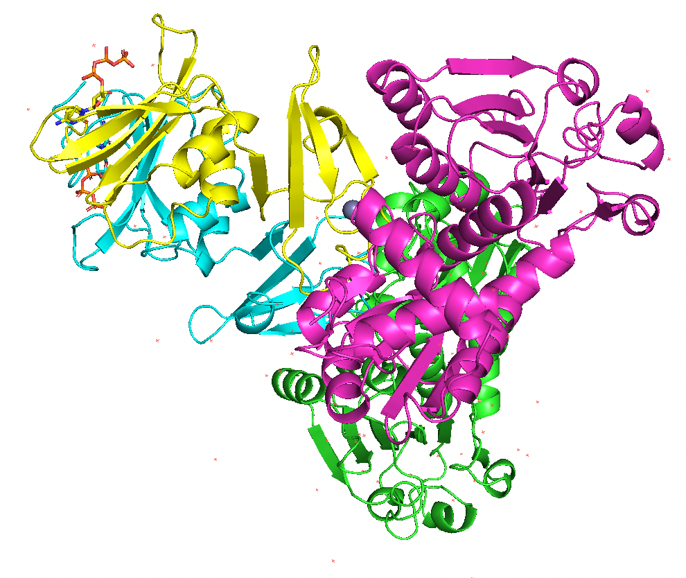
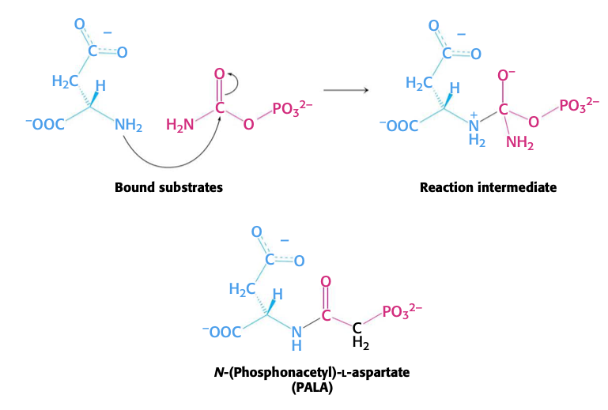
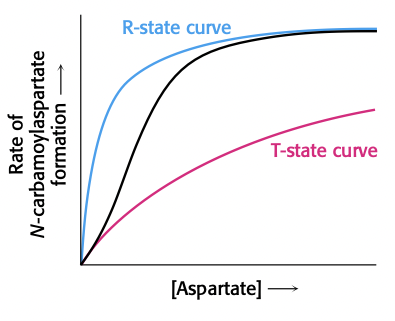
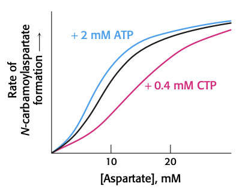

# Lecture 6. Hemoglobin and Allostery

- Readings: _pp. 191-212, 286-292, 356-358_

## Readings

### pp. 191-212

- supplying oxygen to the body
  1. circulatory system that actively delivers oxygen to cells in body
  2. use of oxygen-transport and oxygen-storage proteins: **hemoglobin** (blood) and **myoglobin** (muscles)
- myoglobin and hemoglobin were first proteins with 3D structured determined by XRC
- first examples of mutations as basis of disease: sickle-cell anemia

#### 7.1<SPACE />Myoglobin and hemoglobin bind oxygen at iron atoms in heme

- **prosthetic group**. a molecule that binds tightly to a protein and is essential for its function
- $\ce{Fe^2+}$ state is capable of binding oxygen ($\ce{Fe^3+}$ is other form that can exist)
- myoglobin: **fifth coordination site** occupied by imidazole ring of a histidine residue; the **proximal histidine**
- oxygen binding at the **six coordination site**
- **fMRI detects the change in heme electronic structure that occurs when oxygen binds**
  - signals from protons in water molecules are altered by the magnetic properties of hemoglobin
  - the magnetic properties change depending on binding to oxygen
- **The structure of myoglobin prevents the release of reactive oxygen species**
  - heme-oxygen bond is a complex between a $\ce{Fe^3+}$ ion and $\ce{O2-}$ (superoxide anion) .
  - oxygen must leave myoglobin as dioxygen and not superoxide
    - if iron left in ferric state: **metmyoglobin** $\to$ cannot store oxygen!
    - superoxide is a reactive oxygen species; damaging!
    - this is accomplished with a **distal histidine** that donates a hydrogen bond to the bound oxygen molecule, stabilizing the superoxide
- **Human hemoglobin is an assembly of four myoglobin-like subunits**
  - **hemoglobin A (HbA)**. the hemoglobin tetramer
  - four heme groups
    - iron-iron distances of $24$ to $\pu{40 \ang}$

#### 7.2<SPACE />Hemoglobin binds oxygen cooperatively

- oxygen-binding curve
  - **fractional saturation (Y)** vs. $\ce{pO2}$
    - $Y$. the fraction of possible binding sites that contain bound oxygen
  - in lungs, $\ce{pO2} \approx \pu{100 torr}$
  - in resting tissues, $\ce{pO2} \approx \pu{40 torr}$
  - in actively metabolizing tissues, $\ce{pO2} \approx \pu{20 torr}$
  - due to cooperativity, hemoglobin has the property where it prioritizes actively metabolizing tissue in delivering oxygen
  - myoglobin binds too tightly for useful release
  - no cooperativity hemoglobin binds too loosely (not enough $\ce{O2}$ captured)
  - hemoglobin allows for **66% of binding sites** to contribute to oxygen transport
- **Oxygen binding markedly changes the quaternary structure of hemoglobin**
  - upon binding of oxygen, $\alpha_1\beta_1$ and $\alpha_2\beta_2$ dimers rotate approximately 15 degrees with respect to one another.
  - dimers are _freer to move_ in the oxygenated state than in deoxygenated state ($R$, relaxed state)
    - binding sites, when relaxed, are free of strain and able to bind oxygen with higher affinity
- **Hemoglobin cooperativity can be potentially explained by several models**
  - **concerted/MWC model**.
    - binding of ligand _shifts equilibrium_ between T and R states
    - only two states: T and R
  - **sequential model**.
    - 5 different binding states, each with increasing affinity
  - reality: concerted because 3 oxygen bound is in R state, but sequential because 1 oxygen bound is in T state with 3x affinity (vs 20x for R state)
- **Structural changes at the heme groups are transmitted to the $\alpha_1\beta_1$-$\alpha_2\beta_2$ interface.**
  - iron moving into plane of porphyrin ring is transmitted to interface through the **proximal histidine** and the alpha helix it is attached to
- **2,3-bisphosphoglycerate in red cells is crucial in determining the oxygen affinity of hemoglobin.**
  - T state is actually unstable; hemoglobin naturally will bind too tightly to oxygen (won't release it)
  - 2,3-BPG stabilizes the T state.
  - present in **same concentration as hemoglobin**: $\pu{2 mM}$
  - 2,3-BPG binds in center of tetramer in pocket available only in T form
    - to go from T to R form, bonds between Hb and BPG must be broken

- fetal hemoglobin has $\gamma$ chains instead of $\beta$ chains; makes binding BPG weaker, meaning Hb binds oxygen more tightly
  - this difference enables transfer of oxygen from mother to fetus
- CO binds Hb 200 times stronger than oxygen, can displace oxygen and also cause bound oxygen to not be released
  - treated with _hyperbaric oxygen therapy_

#### 7.3<SPACE />Hydrogen ions and carbon dioxide promote the release of oxygen: the Bohr effect

- other cues cause Hb to release its oxygen
- rapidly metabolizing tissues generate large amounts of hydrogen ions and carbon dioxide
  - carbon dioxide and hydrogen ions are **allosteric effectors** of Hb
  - **Bohr effect**. the regulation of oxygen binding by hydrogen ions and carbon dioxide.
  - Hb binds oxygen less tightly at lower pH
    - actively metabolizing tissue has pH 7.2; allows for 77% release, not just 66%

- addition T state stability comes from pH drops, which protonate histidine (HisB146), allowing it to form salt bridges with AspB94.
  - staying in T state: oxygen more likely to be released
- CO2 effect
  - mechanism 1
    - CO2 acidifies inside of RBC: drops pH, protonation of HisB146, etc.
  - mechanism 2: direct chemical interaction
    - CO2 reacts with terminal amino acids to form _negatively charged_ **carbamate** $\to$ salt bridges $\to$ stabilized T form

- RBCs use a **membrane-transport protein** to exchange $\ce{HCO3-}$ for $\ce{Cl-}$.

#### 7.4<SPACE />Mutations in genes encoding hemoglobin subunits can result in disease

- **Sickle-cell anemia results from the aggregation of mutated deoxyhemoglobin molecules.**
  - beta chain, p.Glu6Val
- **Thalassemia is caused by an imbalanced production of Hb chains.**
  - alpha-Thalassemia: shortage of alpha chains $\to$ beta tetramers that bind oxygen too strongly
  - beta-Thalassemia: shortage of beta chains $\to$ alpha chains form insoluble aggregates $\to$ RBC cell death, anemia
- **The accumulation of free alpha-hemoglobin chains is prevented.**
  - 4 alpha alleles, 2 beta alleles; alpha chains should be in excess and precipitate out
  - there exists a 11-kDa protein (approx 100 aa) called **$\alpha$-hemoglobin stabilizing protein (AHSP)**.
  - AHSP binds to same interface ($\alpha\beta$ interface), prevents alpha chain from misfolding until a beta chain arrives
- **Additional globins are encoded in the human genome.**
  - **neuroglobin**; expressed high levels in brain and retina
  - **cytoglobin**; expressed throughout the body

##### Hill plot

### pp. 286-292

- enzymatic activity is regulated in **5 principal ways**
  1. **allosteric control**
      - one of the best-understood allosteric proteins: **aspartate transcarbamoylase (ATCase)**
  2. multiple forms of enzymes
      - **isozymes/isoenzymes**. homologous enzymes within a single organism that catalyze the same reaction but differ slightly in structure and regulatory properties.
      - often expressed in distinct tissue/organelle/stage of development.
  3. reversible covalent modification
      - protein kineases and phosphatases
  4. proteolytic activation
      - **zymogens**
  5. controlling the amount of enzyme present

#### 10.1<SPACE />Aspartate transcarbamoylase is allosterically inhibited by the end product of its pathway
- catalyzes the first step in teh biosynthesis of **pyrimidines** (CTP and UTP)
- $\ce{P_i}$ is **orthophosphate**

- CTP inhibits ATCase: **feedback inhibition**
- **Allosterically regulated enzymes do not follow Michaelis-Menten kinetics**
  - sigmoidal instead of hyperbolic (MM-kinetics)
- **ATCase consists of separable catalytic (c) and regulatory (r) subunits**
  - ATCase can be physically separated using **_p_-hydroxymercuribenzoate** which reacts with sulfhydryl groups
  - larger subunit is _catalytic subunit_
    - subunit consists of 3 chains
    - 2 catalytic subunits in ATCase
  - small subunit is _regulatory subunit_
    - subunit consists of 2 chains
    - 3 regulatory subunits in ATCase
  - **interaction of subunits produces regulatory and catalytic properties**

- **Allosteric interactions in ATCase are mediated by large changes in quaternary structure.**
  - r chain interaction with c chain is stabilized by a **zinc ion** bound to four cysteine residues
  - **PALA (_N_-(phosphonacetyl)-<L />-aspartate)** resembles an intermediate along the catalytic pathway
    - competitive inhibitor of ATCase
  - **allosteric constant (L)**. the ratio of tense state (T) to relaxed state (R): $L = \frac{T}{R}$
    - for most allosteric enzymes, $L \in [10^2, 10^3]$
  - **homotropic allosteric regulator**. a molecule that is a substrate and a regulatory molecule of an enzyme
  - **the activity of allosteric enzymes is more sensitive to changes in substrate concentration near $K_M$**
    - **threshold effect**. all or nothing
    - $K_M$ is the concentration for half of $V_{\max}$

- **Allosteric regulators module the T-to-R equilibrium.**
  - binding of CTP increases $L$ from 200 to 1250. (favors T state more)
  - ATP decreases $L$ from 200 to 70.
  - Biological motivation?
    - high number of purines $\to$ more pyrimidines needed
    - high amount of ATP $\to$ lots of energy for mRNA synthesis and DNA replication

### pp. 356-358

#### 12.5<SPACE />Lipids and many membrane proteins diffuse rapidly in the plane of the membrane
- lipids and membrane proteins are constantly in lateral motion: **lateral diffusion**
  - lateral diffusion visualized using **FRAP (fluorescence recovery after photobleaching)**
- rate of recovery of fluorescence depends on the laterial mobility of the fluorescence-labeled component
  - $S = (4Dt)^{1/2}$
    - $S$. average distance traveled
    - $t$. time
    - $D$. diffusion constant
    - $D \approx \pu{1 \mu m^2/s}$ for lipids in membranes
- **proteins vary markedly in their lateral mobility**
- **The fluid mosaic model allows lateral movement but not rotation through the membrane.**
  - **transverse diffusion/flip-flop** only happens one every several hours
- **Membrane fluidity is controlled by fatty acid composition and cholesterol content.**
  - $T_m$, the **melting temperature**, is the temperature at which a membrane becomes disordered and fluid-like.
  - each additional $\ce{-CH2-}$ group makes a favorable contribution of about $\pu{-2 kJ/mol}$ to the free energy of interaction between two adjacent hydrocarbon chains (increases $T_m$)
  - To maintain membrane fluidity/rigidity;
    - **Bacteria** regulate **number of double bonds**
    - **Animals** regulate **cholesterol**
      - cholesterol disrupts tight packing
- **Lipid rafts are highly dynamic complexes formed between cholesterol and specific lipids.**
  - cholesterol can form complexes with
    - sphingomyelin
    - GPI-anchored proteins
      - GPI: **glycosylphosphatidylinositol**, a phosphoglyceride that can be attached to the C-terminus of a protein as a post-translational modification
  - these interactions make membranes less fluid, but also less prone to phase-transitions

- **All biological membranes are asymmetric.**
  - membranes maintain asymmetry because **membranes are always synthesized by the growth of preexisting membranes.**

## Lecture notes
- **primary structure**. describes the pattern of **all covalent bonds** (includes disulfide bonds!)
- **secondary structure**. local arrangement of atoms in space
- **tertiary structure**. 3D fold (global arrange of atoms in space)
  - **zinc finger motif**.
    - used in DNA binding transcription factors

### Key points
1. Levinthal's paradox, Anfinsen's hypothesis
2. Forces that drive folding
3. Myoglobin; a molecular store for oxygen in muscle
4. X-ray crystallography and phase problem
5. Resolution
6. Myoglobin structure

### Reagents
- **urea**
- **guanidinium chloride**
- both urea and guanidinium chloride compete for hydrogen bonds
- **denatured state** = **unfolded state**
- **RNAse A** has 4 disulfide bonds
  - experiment 1: both **removing urea** and **oxidizing SH group**
    - if protein folding happened randomly, 105 possible pairings, about 1% activity
    - found 100% activity instead
  - experiment 2: kept **urea** and **oxidizing SH group**
  - experiment 3: remove **urea** and add **trace beta-ME**
- **Anfinsen's hypothesis**. all information necessary for proper folding contained in AA sequence and thermodynamically most favored state is the **native state**
  - wins **Nobel Prize** for protein folding
- **?foldase contamination**
  - disproved by Bruce Merrifield
    - wins **Nobel Prize** for protein synthesis
  - invented **solid-phase peptide synthesis**
    - synthesized RNAse A: 100% specific activity

### Levinthal's paradox
- 100 AA
  - Assume each AA can only have 3 conformations.
  - $3^{100} \approx 5 \times 10^{47}$ possibilities
  - Assume we can sample each conformation on the order of 1 atomic vibration: $\pu{10^{-13} s}$ 
  - Time to fold: $5 \times 10^{34}$ seconds

#### Current model
- **proteins fold rapidly into partially correct folded intermediates**
  - intermediate; state is called a **molten globule**
    - secondary structure
    - supersecondary structure
  - unfolded $\to$ molten globule $\to$ native state

### Protein folding is cooperative
- plot
  - _% unfolded protein_ against
  - _concentration of urea_
- if we measure **% activity** at the 50% folded state, we see 50% activity; this means 50% of the proteins are completely folded, from which we can conclude protein folding is **cooperative**

### Forces that drive folding
1. electrostatic forces: not really very important
    - previously thought to be a major contributor
      - why? $U = \frac{q_1q_2}{Dr}$, where $D$ is **dielectric constant**
        - $D = 4$ inside protein
        - $D = 80$ in water, where most charged side chains are found
2. hydrogen bonds: more important
    - result of unequal electron sharing
    - (NOF)H to (NOF)
    - very directional
    - water dilutes the energy of hydrogen bond contributions
    - does not drive **tertiary structure**
3. van der Waals interactions
    - weak and non-specific interactions
    - VDW radius: $\pu{3.5 \ang}$
    - due to fluctuating dipoles
    - strength falls off $\propto \frac{1}{r^6}$
    - no directionality
4. hydrophobic interactions: **dominant force in protein folding**
    - **entropy driven**
    - stems from fact that nonpolar groups cluster together in water
    - pure water has lots of **entropy**
      - in **bulk water**, formation of flickering clusters of water
    - nonpolar molecules force water to form **highly ordered cages**
    - nonpolar groups joining together reduces the number of water molecules that have to be in ordered cages (more water in bulk water, increasing entropy)
    - contributes $\pu{-200 kcal/mol}$
  - protein folding is opposed by **chain entropy**
    - contributes ~$\pu{190 kcal/mol}$
  
#### Takeaways
1. $\Delta G_{N-U} \approx \pu{-10 kcal/mol}$
    - difference between native and folded
2. Proteins are marginally stable
    - makes it possible to get rid of problematic proteins
3. Most proteins fold spontaneously
    - occassionally, proteins need to fold in a _protected environment_
    - **molecular chaperones**. two types
      1. **small chaperones** (aka **heat shock proteins (hsps)**)
      2. **chaperonins**. e.g. GroEL
          - **Yaffe** discovered the eukaryotic homologue of chaperonins
    - Kuru $\leftarrow$ **prion protein (PrP)** $\to$ misfolded protein (PrPprion)

### X-ray crystallography

#### Myoglobin
- $K_D = \frac{\ce{[Mb][O2]}}{\ce{[Mb:O2]}} = P_{50}$
  - $P_{50}$ is the partial pressure of oxygen needed to have 50% saturation.
- $y = \frac{p\ce{O2}}{K_d + p\ce{O2}}$

#### Resolution vs. magnification
- electron microscopy
  - resolution ~$\pu{10 \ang}$
- resolution $\sim \frac{\lambda}{2}$
- X-ray: $\lambda \in \pu{[1, 1.5] \ang}$

#### Steps
1. crystallize protein: ordered array
2. expose to xrays
3. detect scattered xrays
4. calculate the structure

- XRC works because
  1. **electrons scatter X-rays**
  2. scattered waves recombine to create a diffraction pattern
  3. pattern and **intensity** of spots depends on structure

## Questions

- Why does the distal histidine's hydrogen bond prevent superoxide from leaving (and instead only encourages dioxygen leaving)?