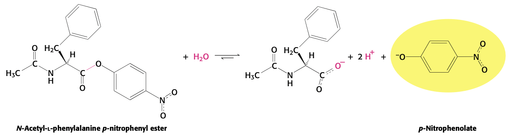
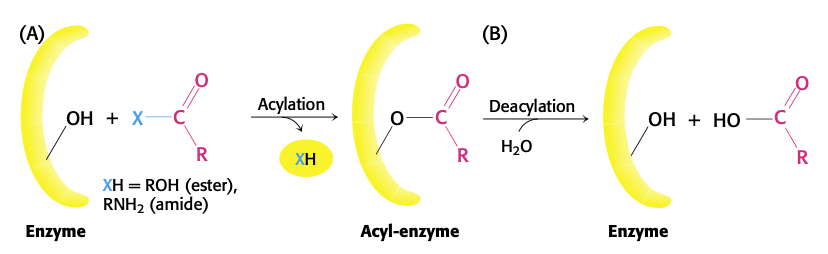
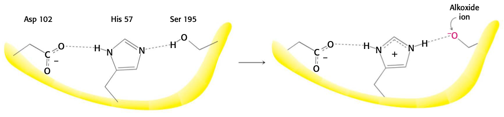
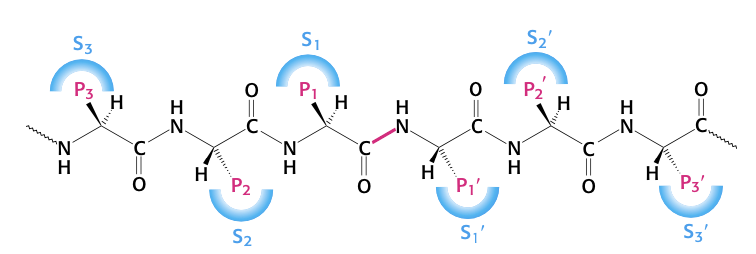

# Lecture 8. Enzyme Chemistry

- Readings
  - pp. 215-218
    - Chapter 8 Introduction
    - 8.1, Enzymes are powerful and highly specific catalysts
  - pp. 225-242
    - 8.4, Michaelis-Menten model accounts for the kinetic properties of many enzymes
  - pp. 251-264
    - Chapter 9 Introduction
    - 9.1, Proteases facilitate a fundamentally difficult reaction

## Readings

### Chapter 8 Introduction
- striking characteristics of enzymes: **catalytic power** and **specificity**

### 8.1<SPACE />Enzymes are powerful and highly specific catalysts
- even the hydration of carbon dioxide to carbonic acid is catalyzed (**carbonic anhydrase**)
- most proteolytic enzymes also catalyze the hydrolysis of an ester bond
  - useful experimentally
- **specificity** of enzyme is due to precise interaction of substrate with the enzyme

#### Many enzymes require cofactors for activity
- **apoenzyme + cofactor = holoenzyme**
- two kinds of cofactors
  - **metals**
  - small organic molecules called **coenzymes**
- cofactors can be tightly or loosely bound
  - tightly bound cofactors are called **prosthetic groups**

#### Enzymes can transform energy from one form into another
- photosynthesis
- using ATP in various ways
  - e.g. myosin: ATP $\to$ contracting muscles
  - e.g. pumps in cell membranes and organelles

### 8.4<SPACE />Michaelis-Menten model accounts for the kinetic properties of many enzymes

- **enzyme kinetics**. the study of the rates of enzyme-catalyzed reactions.

#### Kinetics is the study of reaction rates
- For reaction $\ce{A -> P}$, reaction rate $V = -\frac{dA}{dt} = \frac{dP}{dt}$
- **pseudo-first-order reactions**. reactions that are second-order, but one of the reactants is present in excess and thus does not contribute to the reaction rate.
- sometimes, enzyme reactions can approximate **zero-order reactions**
- we plot $V_0$ on our graph: the **initial reaction velocity**
- Michaelis-Menten model
  - $\ce{E + S <=>[k_1][k_{-1}] ES <=>[k_2][k_{-2}] E + P}$
  - assume: because we are measuring at $t = 0$, there is no product
  - $\ce{E + S <=>[k_1][k_{-1}] ES ->[k_2] E + P}$

#### The steady-state assumption faciliates a description of enzyme kinetics

### Chapter 9 Introduction
- explores 4 kinds of enzymes:
  - serine proteases
  - carbonic anhydrases
  - restriction endonucleases
  - myosins

#### A few basic catalytic principles are used by many enzymes
- strategy 1: **binding energy**. the free energy released in the formatino of a large number of weak interactions between the enzyme and the substrate
- four additional strategies
  1. **covalent catalysis**.
      - active site contains a reactive group, usually a powerful nucleophile
      - e.g. chymotrypsin
  2. **general acid/base catalysis**.
      - molecule other than water plays the role of a proton donor/acceptor
      - e.g. chymotrypsin
  3. **catalysis by approximation**.
      - brings substrates close together
  4. **metal ion catalysis**.
      - formation of nucleophiles
        - zinc(II) ion in carbonic anhydrase
      - act as electrophiles, stabilizing negative charge
        - magnesium(II) ion in EcoRV
      - increase binding energy between enzyme and substrate
        - myosins

### 9.1<SPACE />Proteases facilitate a fundamentally difficult reaction
- hydrolysis is thermodynamically favorable
- slow: half life of  10 to 1000 years
  - due to partial double bond character
  - carbonyl group is **less electrophilic** because of resonance, making it less susceptible to Nu attack
    - esters are more reactive because positive charge will be on oxygen, rather than nitrogen
  
#### Chymotrypsin possesses a highly reactive serine residue
- **Ser195**
  - chymotrypsin was inactivated with **DIPF (diisopropylphosphofluoridate)**

#### Chymotrypsin action proceeds in two steps linked by a covalently bound intermediate
- Enzyme kinetics are often easily monitored by having the enzyme act on a **substrate analog** that forms a **colored product**
  - called a **chromogenic substrate**
- For chymotrypsin, use **_N_-acetyl-<L />-phenylalanine _p_-nitrophenyl**

- **stopped flow method**
  - allows us to compute the initial rate of reaction for one that is too fast to detect
- burst phase and steady state phase
  - burst phase because acylation is fast
  - steady state requires enzyme turnover, slow because hydrolysis is slow

#### Serine is part of a catalytic triad that also includes histidine and aspartate

- **oxyanion hole** stabilizes the **tetrahedral intermediate**
- **scissile bond**. the bond to be cleaved
- $\mathrm{S_1}$ pocket is the right shape for large, hydrophobic amino acids

#### Catalytic triads are found in other hydrolytic enzymes
- **trypsin** and **elastase** are homologs of chymotrypsin.
- catalytic triad has emerged non-homologously at least three times $\to$ this catalytic strategy is an especially effective approach to the hydrolysis of peptides and related bonds

#### The catalytic triad has been dissected by site-directed mutagenesis
- $K_M$ measures binding; unchanged by mutation
- S221A $\to$ $k_{\text{cat}}$ fell to 1 millionth of its value for wild type enzyme
- N155G $\to$ reduces $k_{\text{cat}}$ to 0.2% of its value; **oxyanion hole** stabilizing is important.

#### Cysteine, aspartyl, and metalloproteases are other major classes of peptide-cleaving enzymes
- cysteine: **papain**
  - mammalian homologs: **cathepsins** (involved in immune system, cellular turnover)
  - convergent evolution: **caspases** (apoptosis)
- aspartyl: aspartic acid; **renin**, **pepsin**, **HIV protease**
  - uses _water (hydroxide)_ as nucleophile
- metalloprotease: **thermolysin**, **carboxypeptidase A**
  - metal is almost always a **zinc ion**
  - also activates a water molecule to act as nucleophile
- all
  1. generate a nucleophile to attack the peptide carbonyl group
  2. polarize the peptide carbonyl group
  3. stabilize a tetrahedral intermediate

#### Protease inhibitors are important drugs
- captopril inhibits **angiotensin-converting enzyme (ACE)**
- **HIV protease inhibitors**
  - two carbonyl groups of inhibitor are hydrogen bonded to water molecule, which is hydrogen bonded to peptide NH group in the flaps
  - this interaction does not occur in _cellular proteases_ (specific to HIV protease)