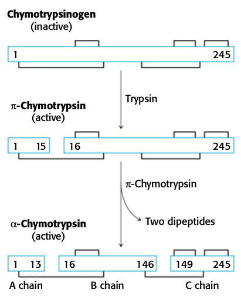

$$\gdef\DG{\Delta G_\text{rxn}}$$
$$\gdef\DGS{\Delta G_\text{rxn}^\circ}$$
$$\gdef\DGSS{\Delta G_\text{rxn}^{\circ \prime}}$$
$$\gdef\Keq{K_\text{eq}^{\prime}}$$
$$\gdef\keq{k_\text{eq}}$$

# Lecture 9. Enzymes as catalysts

- Readings
  - pp. 219-225
    - 8.2, Gibbs free energy is a useful thermodynamic function for understanding enzymes
  - pp. 299-303
    - 10.4, Many enzymes are activated by specific proteolytic cleavage

## Readings

### 8.2<SPACE />Gibbs free energy is a useful thermodynamic function for understanding enzymes

#### $\DGS$ is related to the equilibrium constant

- $\DGS$
  - reactants present at 1M concentration
  - 1 atm pressure
- $\DGSS$. **standard free energy change at pH 7**
  - activity of water is 1
  - activity of $\ce{H+}$ is 1 (corresponds to pH 7)
- $\DG = \DGS + RT \ln Q$
  - a reaction can be made spontaneous by adjusting concentrations of reactant and product

### 10.4<SPACE />Many enzymes are activated by specific proteolytic cleavage
- an energy source is not needed for cleavage (hydrolysis of exergonic)
- examples
  - digestive enzymes
  - blood clotting
  - some hormones (insulin)
  - collagen
  - developmental processes: collagenase
  - apoptosis (**procaspases**)

#### Chymotrypsinogen is activated by specific cleavage of a single peptide bond

- 

- produced in the **acinar cells** of the **pancreas**
- bile breaks down lipids
- pepsin, trypsin, chymotrypsin break down proteins

#### Proteolytic activation of chymotrypsinogen leads to the formation of a substrate-binding site
1. the newly formed amino group of Ile16 turns inward and forms an ionic bond with Asp194.
2. new ionic bond triggers
    - Met192 moves to surface
    - Residues 187 and 193 move farther apart from each other
    - **forms the substrate specificity site**; this cavity is not present in the zymogen
3. Oxyanion hole forms by moving the Gly93

#### The generation of trypsin from trysinogen leads to the activation of other zymogens

- **trypsin is the common activator of all pancreatic zymogens**
  - trypsinogen
  - chymotrypsinogen
  - proelastase
  - procarboxypeptidase
  - prolipase
- trypsin is activated by **enteropeptidase**

#### Some proteolytic enzymes have specific inhibitors
- how to terminate proteolysis?
  - **serpins**. serine protease inhibitors
- e.g. pancreatic trypsin inhibitor
  - has free energy of binding of $\pu{-75 kJ/mol}$
  - **inhibitor is a substrate with a long half life**
- amount of trypsin >> amount of inhibitor
  - job of inhibitor is to bind to any **prematurely activated trypsin molecules** in the pancreas or pancreatic ducts
- e.g. **$\alpha_1$-antitrypsin / $\alpha_1$-antiproteinase**
  - protects tissues from degradation by elastase
  - _antielastase_ would be a better name
  - elastase can dissolve the lungs $\to$ results in **emphysema**
  - smoking causes emphysema
    - smoke **oxidizes Met358 of the inhibitor**, preventing it from binding to elastase

---

## Lecture notes

### $\alpha$-chymotrypsin
- three chains: A, B, C
  - A chain is very small; 15 aa
- held together with disulfide bonds
- only 25kDa in size
- structure solved
  - by David Blow at MRC
  - **first crystal structure of any enzyme**

### Assay for chymotrypsin activity
- chymotrypsin also hydrolyzes _esters_ in vitro
- use para-nitrophenylacetate (PNPA)
  - hydrolysis will result in **para-nitrophenol** (easily deprotonated; bright yellow) and acetate

### Why is Ser195 a good nucleophile?
- clues
  1. pH = 7.6: **His57**
  2. chemical modification: **Asp102**
- **catalytic triad**: **Ser195, His57, Asp102**

### Catalytic mechanism of chymotrypsin
1. covalent catalysis (Ser-125 temporarily modified)
2. acid/base catalysis (His-57 acts as acid and base)
3. approximation (holds substrate in proper orientation for Ser-195)
4. **most important: "transition state" (tetrahedral intermediate) stabilization**
    - Pauling: "enzymes bind transition states better than substrates or products"
  
### Thermodynamics vs. kinetics
- $\ce{A + B <=>[\keq^\ddagger] X^\ddagger ->[k'] P}$
- $\ce{X^\ddagger}$: "least populated intermediate"
- $\frac{dP}{dt} = k_1AB = k'$
- **transition state theory**