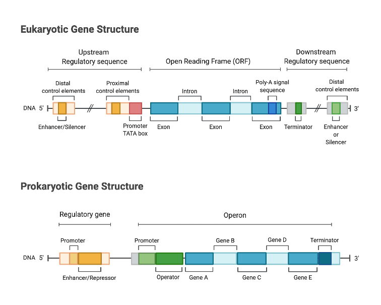
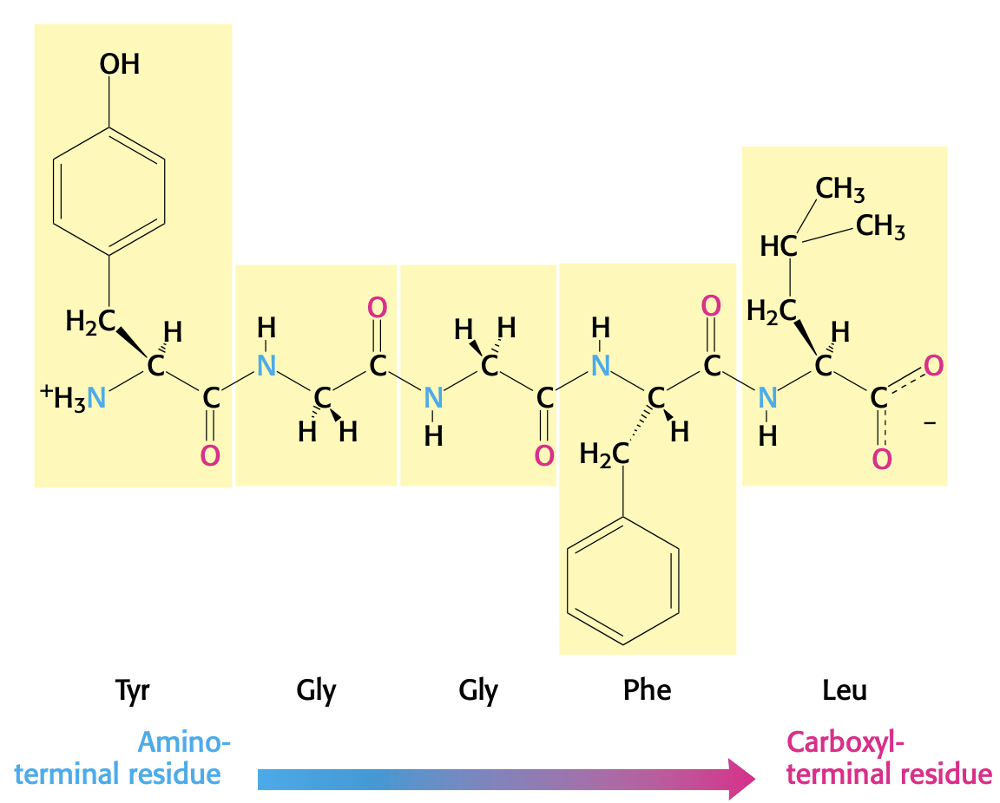
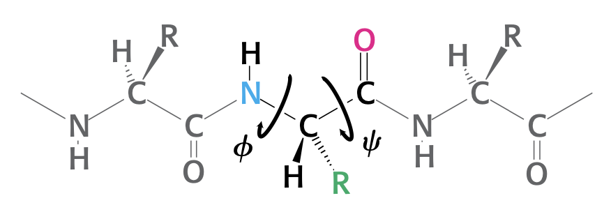

# Reference sheet

## Prokaryotic gene vs. eukaryotic gene

## Amino acid sequence example

- By convention, the $\ce{N}$-terminus is taken to be the beginning of the polypeptide chain.

## Torsion angles

## Equations
- Henderson-Hasselbalch equation
    - <C chem="\PH = \p{K_a} + \log \dfrac{\ce{[A-]}}{\ce{[HA]}}" />

## Reagents
- **sodium dodecyl sulfate (SDS)**. anionic detergent that disrupts nearly all noncovalent interactions in native proteins.
- **$\beta$-mercaptoethanol**. reduces disulfide bonds.
    - used in SDS-PAGE
- **Coomassie blue**. used to stain SDS-PAGE gels to see where proteins are located.

## Biochemistry techniques
- ELISA: detect and quantify protein
    - reacts with colors substrate to produce colored product
- Western blot: proteins
- Northern blot: RNA
- Southern blot: DNA

## Techniques

### Computing pH of a solution