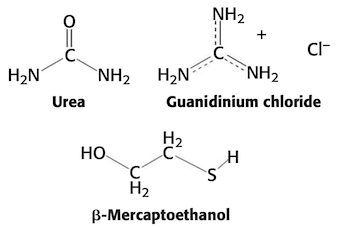

# Reference sheet

## Prokaryotic gene vs. eukaryotic gene

## Amino acid sequence example

- By convention, the $\ce{N}$-terminus is taken to be the beginning of the polypeptide chain.

## Torsion angles

## Equations
- Henderson-Hasselbalch equation
    - <C chem="\PH = \p{K_a} + \log \dfrac{\ce{[A-]}}{\ce{[HA]}}" />

## Reagents
- **sodium dodecyl sulfate (SDS)**. anionic detergent that disrupts nearly all noncovalent interactions in native proteins.
- **$\beta$-mercaptoethanol**. reversibly reduces (i.e. cleaves) disulfide bonds.
    - used in SDS-PAGE
- **Coomassie blue**. used to stain SDS-PAGE gels to see where proteins are located.
- **urea**, **guanidinium chloride**. disrupt a protein's noncovalent bonds

## Biochemistry techniques
- ELISA: detect and quantify protein
    - reacts with colors substrate to produce colored product
- Western blot: find proteins in complex mixture
    - Useful for monitoring protein purification
    - Useful for monitoring cloning of genes
- Northern blot: RNA
- Southern blot: DNA

## Techniques

### Computing pH of a solution

## Purifying proteins

### Ion exchange chromatography
- Use **anion-exchange** if your protein is negatively charged (your protein will exchange with the anions).
- Use **cation-exchange** if your protein is positively charged (your protein will exchange with the cations).

### Determining protein concentration: colorimetric assays
- Bradford (Coomassie Brilliant Blue) assay
    - protein binding causes spectral shift to 595 nm
- BCA (bicinchoninic acid) assay
    - protein reduces $\ce{Cu2+}$ to $\ce{Cu1+}$
    - BCA complexes with $\ce{Cu1+}$ and forms a purple color
    - detect **absorbance** at 562 nm
- make a standard curve using **standard protein** of similar **molecular weight** and **amino acid concentration**
- **dithiothreitol (DTT)**. breaks disulfide bonds
- **SDS**. stabilizes exposed hydrophobic regions of proteins

### Gel electrophoresis
- globular protein would migrate faster through the gel than a fibrous protein
    - because globular protein has less surface area and resistance than the fibrous protein.
- polyacrylamide gel ingredients
    - water
    - tris buffer
    - 40% acrylamide (29 parts):bisacrylamide (1 part) mixture
    - 10% SDS
    - 10% ammonium persulfate
    - tetramethylethylenediamine (TEMED)
- less acrylamide = larger pores
    - larger pores for bigger proteins
    - smaller pores for smaller proteins
- $R_f = -\alpha \log M_w$
    - $M_w$. molecular weight

- The ($\ce{.HCl}$) notation in the structure indicates that something in the cocaine molecule is protonated, and the resulting positive charge is compensated for by a Cl- anion. (from `PS1`)

- Ionic strength
    - $\frac{1}{2} \sum_i c_i z_i^2$
        - $c_i$. concentration of ion $i$

## Xray crystallography
- Bond lengths are $\pu{1-2 \ang}$
- Good resolution: $\pu{1.5 \ang}$

## Enzymes
- Chymotrypsin
    - Carboxyl side of **tryptophan**, **tyrosine**, **phenylalanine**, and **methionine**.