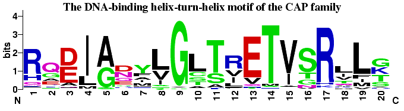

# glossary

## R
- **Rosetta Energy Units (REU).**

## V
- [**Vero.**](https://en.wikipedia.org/wiki/Vero_cell) a family of kidney epithelial cell cultures derived from the African green monkey.
    - **Vero E6** cells show some contact inhibition, so are suitable for propagating viruses that replicate slowly.

## W
- [**WebLogo.**](https://weblogo.berkeley.edu/logo.cgi) a tool that can generate a graphical representation of a multiple sequence alignment.

