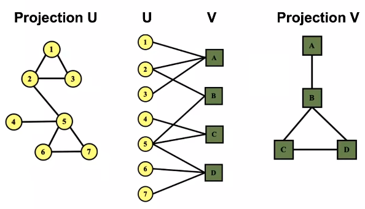

# L1. Introduction; Machine learning for graphs

## 1.3 Choice of graph representation

### Bipartite graphs
- a graph whose nodes can be divided into two **disjoint sets** $U$ and $V$.

### Folded/projected bipartite graphs

### Representations

- **adjaceny matrices (AM).**
    - AMs are **sparse**
    - **Definition (Density).** the **density** of a matrix is defined as $\boxed{E/N^2}$.
- **edge list.**
- **adjacency list.**
    - easier to work with if the network is **large** and **sparse**

### Connectivity of _undirected graphs_

### Connectivity of _directed graphs_
- **Definition (strongly connected).** a digraph is **strongly connected** if every node has a path to every other node.
- **Definition (weakly connected).** a digraph is **weakly connected** if the graph is connected when we disregard edge directions.
- **Definition (strongly connected components).** **strongly connected components (SCCs)** are subgraphs that are **strongly connected**.