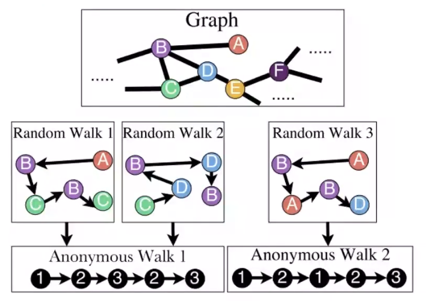

$\gdef\A{\mathbf{A}}$
$\gdef\Z{\mathbf{Z}}$
$\gdef\z{\mathbf{z}}$
$\gdef\Sim#1#2{\tr{\z_{#1}}\z_{#2}}}$
$\gdef\dp#1#2{#1^\intercal#2}$

# Lecture 3. Node embeddings

## Node embeddings
- Graph representation learning
    - Goal: learn a function $f: V \rightarrow \R^d$
- Motivation
    - Similarity of embeddings between nodes indicates their similarity in the network.
        - e.g. nodes may be considered close together if they are connected by an edge.
    - Node embeddings encode network information
- Setup
    - graph $G(V, E)$ with adjacency matrix $\A$
    - embeddings $\z_v \in \R^d$ for node $v \in V$.
    - $\text{similarity}(u, v) \approx \dp{\z_u}{\z_v}$
    - Node labels and node features are **not utilized**.

### Shallow encoding
- encoder is just an _embedding lookup_
- learn a matrix $\Z$ of embeddings

### What is node similarity?
- Key chioce of methods depends on **how they define similarity**.
- The embedding methods in this lecture define similarity based on **random walks**.

## Random walk approaches for node embeddings
- Notation
    - $\P{v | \z_u}$. the (predicted) probability of visiting node $v$ on random walks starting from $u$.
    - $R$. random walk _strategy_.
    - $N_R(u)$. neighborhood of $u$ obtained by random walk strategy $R$.
- $\dp{\z_u}{\z_v}$. approximates the probability that $u$ and $v$ co-occur on a random walk over the graph.
- Objective
    - $\max_f \sum_{u \in V} \log \P{N_R(u) | \z_u}$
    - Equivalently, <T tag="why?" />
        - $\L = \sum_{u \in V} \sum_{v \in N_R(u)} -\log \P{v | \z_u}$
        - $\min \L$
    - Parameterize $\P{v | \z_u}$ with softmax
        - $\P{v | \z_u} = \dfrac{\exp(\tr{\z_u}\z_v)}{\sum_{n \in V} \exp(\tr{\z_u}\z_n)}$
- Computational complexity: $O(|V|^2)$, too expensive. <T tag="why?" />
    - Solve with **negative sampling** (see **Noise Contrastive Estimation**, [paper](https://arxiv.org/pdf/1402.3722.pdf))
        - $\P{v | \z_u} = \dfrac{\exp(\Sim{u}{v})}{\sum_{n \in V} \exp(\Sim{u}{n})} \approx \log \sigma(\Sim{u}{v}) - \sum_{i = 1}^k \log \sigma(\Sim{u}{n_i})$, $n_i \sim P_V$
        - in practice, $k \in [5, 20]$
- Process
    1. Run short, fixed-length random walks starting from each node on the graph.
    2. For each node $u$ collect $N_R(u)$, the multiset of nodes visited on random walks starting from $u$.
    3. Estimate $\L$ (i.e. estimate $\P{v | \z_u}$, then sum up values) with negative sampling.

### How should we randomly walk?
- Simple random walks: **DeepWalk**
    - Cons: notion of similarity is too constrained
- **node2vec**
    - Goal: nodes with similar _network neighborhoods_ are embedded close in feature space
    - Develop biased, second order random walk $R$ to generate network neighborhood $N_R(u)$ of node $u$.
        - Combine **local** view and **global** view (BFS and DFS)
    - Two parameters
        - **return parameter** $p$
        - **in-out parameter** $q$
            - intuitively, $q$ is the ratio of BFS and DFS.
    - Random walker has three choices:
        1. return back: $1/p$
        2. stay same distance: $1$ (for each edge)
        3. walk further: $1/q$ (for each edge)
        - probabilities are unnormalized

### Which embedding to use?
- Use the embedding with the random walk that matches application.

## Embedding entire graphs
- Goal: Want to embed a subgraph or entire graph $G$ into a graph embedding $\z_G$.
    - e.g. classifying toxic vs. non-toxic molecules
    - e.g. identifying anomalous graphs

### Idea 1: Sum of node embeddings
- Simply sum or average embeddings in the graph $G$.

### Idea 2: virtual (super) node
- Create a virtual node that connects to the (sub)graph, then run a node embedding technique.

### Idea 3: [Anonymous walk embeddings](https://arxiv.org/pdf/1805.11921.pdf)

- Effectively, the identity of the nodes doesn't matter, just the structure.
- Represent the graph as a probability distribution over these walks
- $\z_G[i] =$ probabilty of anonymous walk $w_i$ in $G$

#### Enhancement: Learn embedding $z_i$ of anonymous walk $w_i$
- **Idea:** embed walks so that the next walk can be predicted.
- $\Delta$. window size (number of context nodes)
- $T$. number of random walks sampled.
- Objective
    - $\sum_{t = \Delta}^{T - \Delta} \log \P{w_t | w_{t - \Delta}, ..., w_{t + \Delta}, \z_G}$
    - i.e. predict $w_t$ from context of previous and following walks, for all valid positions $t$ (more training data)

**Preview (Lecture 8).** Hierarchical graph embeddings.