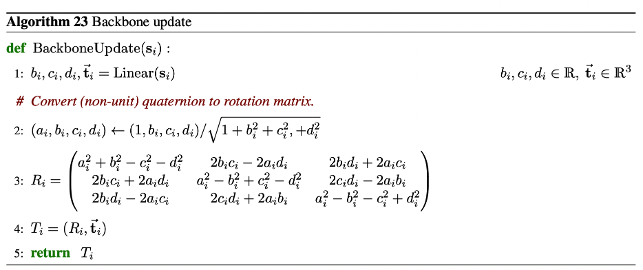

# AlphaFold 2 (AF2)

## abbrevaitons
- **IPA.** invariant point attention

## how to use
- inputs
    - multiple sequence alignment
        - assembled using standard tools ([HHsuite](https://github.com/soedinglab/hh-suite), [HMMER](http://hmmer.org/))
        - databases searched
            - [MGnify](https://www.ebi.ac.uk/metagenomics/)
            - [BFD](https://bfd.mmseqs.com/)
            - [UniRef90](https://www.uniprot.org/help/uniref)
    - multiple sequence alignment (MSA) should contain _at least 30 sequences_
    - an MSA of _100 sequences_ is generally good enough to use without templates
- caveats
    - uncertain domain placement
        - AF2 is unaware of membranes; membrane proteins won't leave space for the cell membrane
        - clashes can occur
    - complexes
        - AF2 is trained to only predict single chain protein structures
            - heteromers are more problematic 
        - some have success predicting complexes by joining two sequences with a _linker_
            - ideas in AF2 can definitely be extended to complexes
            - needs to be benchmarked

## model structure
- three modules: inputs, evoformer, and structure
    - inputs
        - out:
            - **MSA representation.**
            - **pair representation (templates).** templates are pairwise amino acid distance predictions
    - evoformer
        - in: MSA, pair representations
        - out: refined MSA, pair representations
    - structure
        - in: MSA, pair representations
        - out: list of Cartesian coordinates representing position of each atom of the protein, including sidechains

## measures of uncertainty
- **predicted local distance difference test (pLDDT).** alphafold's per-residue prediction of its lDDT-Cα; provides a measure of _local confidence_
    - closely related to [lDDT](https://www.ncbi.nlm.nih.gov/pmc/articles/PMC3799472/). measures the percentage of correctly predicted interatomic distances
    - ranges from _0 to 100_
    - prediction files contain the pLDDT in the _B-factors_ (higher is better, which is opposite of typical B-factors)
    - low pLDDT (pLDDT < 50): _a prediction of disorder_
- **predicted aligned error (PAE).** alphafold's prediction of its position error at residue $X$, if the predicted and true structures were aligned on residue $Y$.
    - displayed as a _two-dimensional plot_

## mohammed al-quraishi, [a fount of good ideas](https://archive.md/3k7y9)

### inputs
- $\{s_i\}$.
- $\{\mathbf{m}_{si}\}$. MSA representation
    - $s$ indexes over sequences: $s = 1$ is the sequence for the protein we want to predict structure for; $s > 1$ are the other protein sequences in the MSA
    - $i$ indexes over amino acids for each sequence, e.g. $i = 3$ is the third amino acid
- $\{\mathbf{z}_{ij}\}$. pair representation
- $\{\mathbf{s}_i\}$. &ldquo;single&rdquo; sequence representation

### outputs
- $\{\mathbf{x}^a_i\}$. atom coordinates
- $\{r^{\text{pLDDT}}_i\}$. per-residue confidence

### backbone update

### information flow

### crops

### continuous refinement
