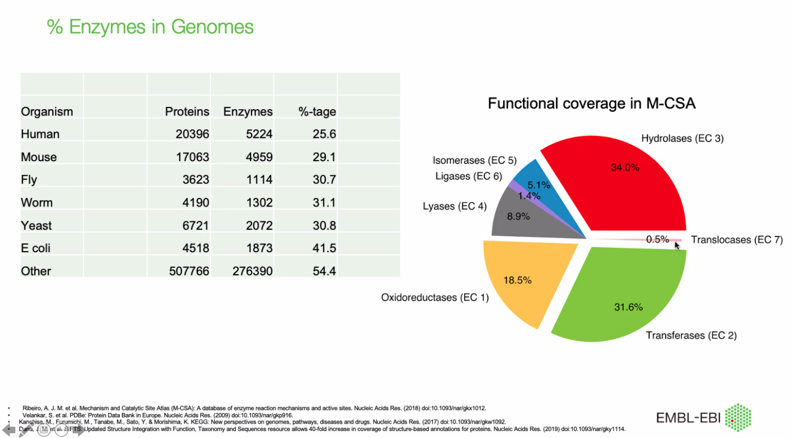
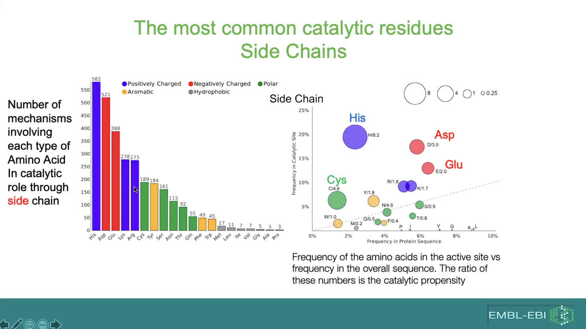
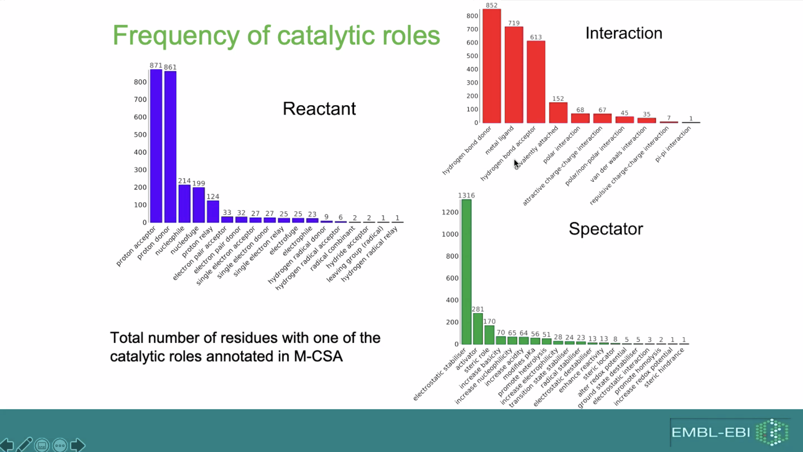
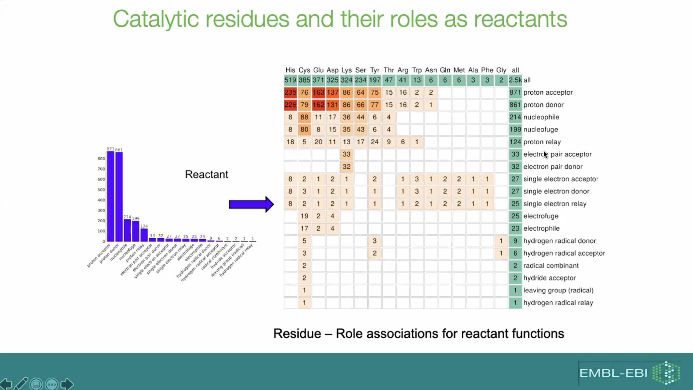
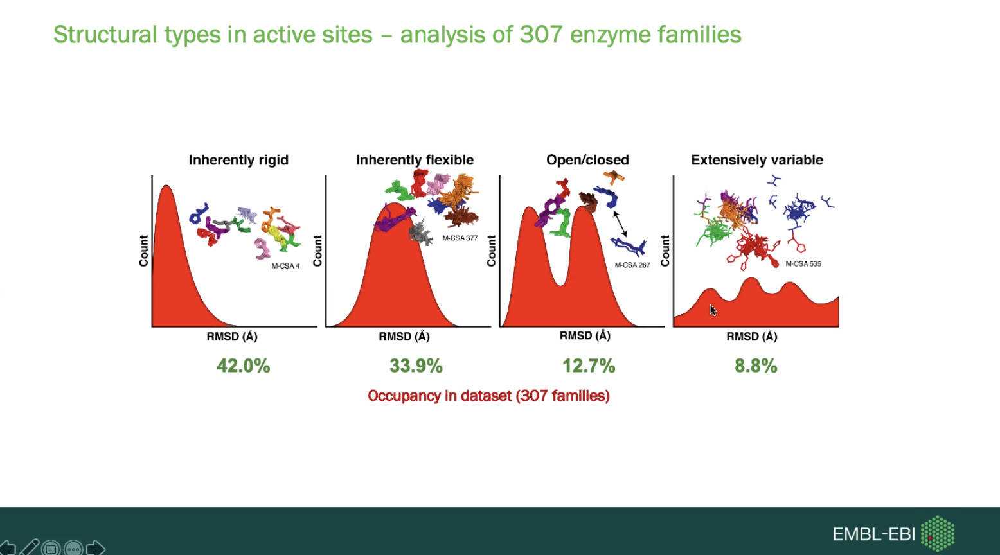

# computational enzymology

## history
- a few enzymes have been designed _ab initio_ using quantum chemical techniques

## motivation
- enzymes are considered _green chemistry_
- can we predict specificity and function from sequence and structure?
- applications
    - drug design
    - enzyme design
    - pathway redesign
    - green chemistry
- 54% of drug targets are enzymes; 75% of which are human enzymes
    - we can learn to target pathogenic enzymes as well

## problem statement
- to capture, analyze, validate, and ultimately predict enzyme mechanisms
- to discover how enzyme function in a family changes during evolution

## overview
- enzyme data (M-CSA)
- enzyme function
- finding enzyme transformations: Transform MIN-er
- 
- predicting function with AlphaFold models

## introduction to enzymes
- EC number
- databases of enzymes
    - EC Numbers
    - KEGG
    - Reactome
    - Brenda
    - SFLD
    - Sabio-RK
- enz consititute a large percentage of genomes

## enzyme data (M-CSA)
- about 1000 entries
    - 684 with detailed mxn description
    - covers 80% of ECs with structure in PDB

## enzyme function
- small amino acids are the ones who use their main chain in catalysis

### evolution of enzyme function changes
- build an **EC exchange matrix** (map when EC numbers change via evolution)
- changes in substrates are much more frequent than changes in chemistry (enzyme types)
- functional similarity vs sequence similarity?
    - no simple correlation
    - catalytic sites are very conserved

- floppy active site leads to slow enzyme due to entropic effects
    - we also know moving protein chain is very slow compared to the chemistry

## predicting function

- can we use our knowlege of enzymes to predict transformations of small molecules 
    - give an enzyme seq and structure, can we predict substrates and products?
- aim: combine power of cheminformatics to handle small molecules and reactions with knowledge about enzymes (structure, evolution function)
- two aspects: small molecules transformations and mechanisms

### Transform-MinER
- **rxn file format**
- provide atom-atom mapping between reactants and products: Reaction Decoder Toolkit (RDT)

## enzyme mxns: residue roles
- can we pred enz mxns?
- what is enz mxn?
    - the mvmts and ixns of atoms in the active site of an enz that drive transformation (trfm) of the rxts into the prds
- goal: given an active site and rxn of an enz, pred possible mechanisms based on the mechanistic information in M-CSA
    - the mechanisms can then be validated by quantum mechanical calculations

## towards function preduction, using alphafold models
- 