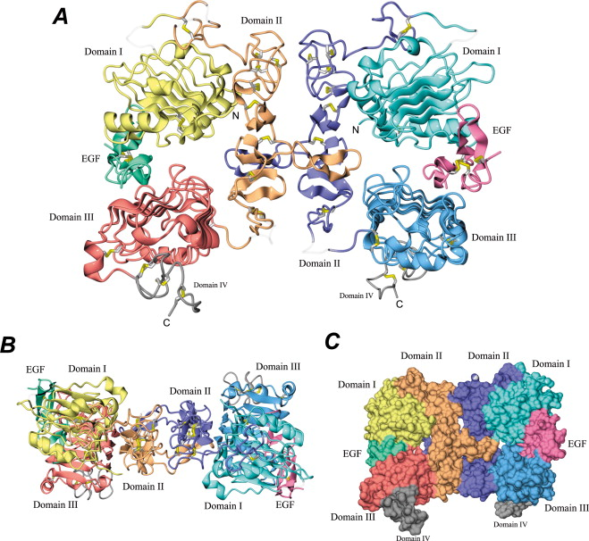

# Lecture 4. Protein Design: Fundamentals and Applications

## Questions
- What are the isoforms of EGFR? What are the isoform precursors?

## Part 0: Exercises
1. Answer any of the following questions
    - How many molecules of amino acids do you take with a piece of 500 grams of meat? (on average an amino acid is ~100 Daltons)
        - 
    - Why are there only 20 natural amino acids?
        - 20 amino acids was good enough for evolution
    - Why most molecular helices are right handed?
        - sterics
    - Where did amino acids come from before enzymes that make them, and before life started?
        - ?
        - RNA served as catalysts
    - What do digital databases and nucleosomes have in common?
        - they both store data
        - **nucleosome**. the basic repeating unit of eukaryotic chromatin
2. Pick any protein (from any organism) of your interest that has a 3D structure and answer the following questions.
    - Briefly describe the protein you selected and why you selected it.
        - **EGFR (epidermal growth factor receptor)** is 
    - Identify the amino acid sequence of your protein.
        - How long is it? What is the most frequent amino acid?
        - How many *protein sequence homologs* are there for your protein? Use `pBLAST` to search for homologs and `ClustalOmega` to align and visualize them.
  - Does your protein belong to any **protein family**?
  - Identify the structure page of your protein in RCSB
    - When was the structure solved? Is it a good quality structure?
    - Are there any other molecules in the solved structure apart from protein?
    - Does your protein belong to any *structure classification family*?
  - Open the structure of your protein in any 3D molecule visualization software
    - Visualize the protein as "cartoon", "ribbon" and "ball and stick".
    - Color the protein by secondary structure. Does it have more helices or sheets?
    - Color the protein by residue type. What can you tell about the distribution of hydrophobic vs hydrophilic residues?
    - Visualize the surface of the protein. Does it have any "holes" (aka *binding pockets*)?

## Part 1: Visualizing EGFR
- [2GS2: Kinase domain (intracellular)](https://www.rcsb.org/structure/2GS2)
  - Paper: [An Allosteric Mechanism for Activation of the Kinase Domain of Epidermal Growth Factor Receptor](https://doi.org/10.1016/j.cell.2006.05.013)
- [EGFR (Homo Sapiens) (GenBank)](https://www.ncbi.nlm.nih.gov/gene?Db=gene&Cmd=DetailsSearch&Term=1956)

- [Crystal Structure of the Complex of Human Epidermal Growth Factor and Receptor Extracellular Domains](https://doi.org/10.1016/S0092-8674(02)00963-7)



```python
# protein.faa
# isoform H
MFNNCEVVLGNLEITYVQRNYDLSFLKTIQEVAGYVLIALNTVERIPLENLQIIRGNMYYENSYALAVLS
NYDANKTGLKELPMRNLQEILHGAVRFSNNPALCNVESIQWRDIVSSDFLSNMSMDFQNHLGSCQKCDPS
CPNGSCWGAGEENCQKLTKIICAQQCSGRCRGKSPSDCCHNQCAAGCTGPRESDCLVCRKFRDEATCKDT
CPPLMLYNPTTYQMDVNPEGKYSFGATCVKKCPRNYVVTDHGSCVRACGADSYEMEEDGVRKCKKCEGPC
RKVCNGIGIGEFKDSLSINATNIKHFKNCTSISGDLHILPVAFRGDSFTHTPPLDPQELDILKTVKEITG
FLLIQAWPENRTDLHAFENLEIIRGRTKQHGQFSLAVVSLNITSLGLRSLKEISDGDVIISGNKNLCYAN
TINWKKLFGTSGQKTKIISNRGENSCKATGQVCHALCSPEGCWGPEPRDCVSCRNVSRGRECVDKCNLLE
GEPREFVENSECIQCHPECLPQAMNITCTGRGPDNCIQCAHYIDGPHCVKTCPAGVMGENNTLVWKYADA
GHVCHLCHPNCTYGCTGPGLEGCPTNGPKIPSIATGMVGALLLLLVVALGIGLFMRRRHIVRKRTLRRLL
QERELVEPLTPSGEAPNQALLRILKETEFKKIKVLGSGAFGTVYKGLWIPEGEKVKIPVAIKELREATSP
KANKEILDEAYVMASVDNPHVCRLLGICLTSTVQLITQLMPFGCLLDYVREHKDNIGSQYLLNWCVQIAK
GMNYLEDRRLVHRDLAARNVLVKTPQHVKITDFGLAKLLGAEEKEYHAEGGKVPIKWMALESILHRIYTH
QSDVWSYGVTVWELMTFGSKPYDGIPASEISSILEKGERLPQPPICTIDVYMIMVKCWMIDADSRPKFRE
LIIEFSKMARDPQRYLVIQGDERMHLPSPTDSNFYRALMDEEDMDDVVDADEYLIPQQGFFSSPSTSRTP
LLSSLSATSNNSTVACIDRNGLQSCPIKEDSFLQRYSSDPTGALTEDSIDDTFLPVPEYINQSVPKRPAG
SVQNPVYHNQPLNPAPSRDPHYQDPHSTAVGNPEYLNTVQPTCVNSTFDSPAHWAQKGSHQISLDNPDYQ
QDFFPKEAKPNGIFKGSTAENAEYLRVAPQSSEFIGA
```

### Domains

### Other readings
- **epiregulin**. encoded by the EREG gene

## Part 2: Protein Structure Prediction

<Video src="/htgaa/l4/igf1.mp4" caption="Insulin-like growth factor 1. Predicted structure in cyan (81% confident), actual crystal structure in green (PDBID: 1B9G)." />

---

## Lecture notes

### Shugang Zhang
- Silkworm silk vs. spider silk
    - silkworm silk doesn't stretch, whereas spider silk does
- Pauling originally called the $\alpha$-helix the $\alpha$-spiral
- RNA tie club
- Susan Lindquist
    - Director of Whitehead Institute
- Pioneers of protein design
    - Sir Alan Fersht
        - Structure and Mechanism of Protein Structure
    - Bill DeGrado
    - David Baker
- Chirality
    - Left-handed proteins
    - Right-handed sugar
- 11 amino acids interact with water molecules
- The genetic code has patterns in the **second base**
- Hair is keratin: mostly $\alpha$-helix
- **Helical dipole moment** is the key to stabilize $\alpha$-helices
- **hydrophobic side chains and hydrophilic side chains don't affect the formation of $\alpha$-helices**
- Design
    -  alpha helices
        - for coiled-coiled formations:
            - every 3, 4, and 7 prefer to be hydrophobic
            - i, i+3, i+4, i, i+7
    - beta sheets
        - alternating hydrophilic and hydrophobic residues
- spider silk is stretchy because it has both beta sheets and alpha helices
- lots of diseases are due to beta-sheet aggregates
    - huntingtons
        - Q40 Perutz helix
- **Turns** are very improtant
    - small amino acids, with a little bit of charge
- Shuguang research
    - self-assembling peptides form nanofibers
        - wound-healing: beta sheets
- Interesting research
    - the replacement of hydrophobic residues with hydrophilic ones that are structurally similar doesn't really change the structure and function
        - this might be the reason for the flexibility of proteins!
    - **QTY** code