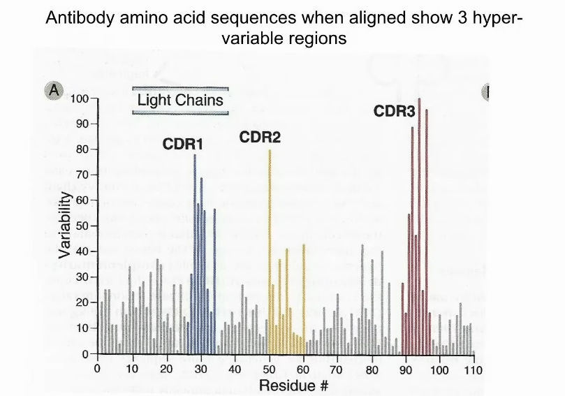
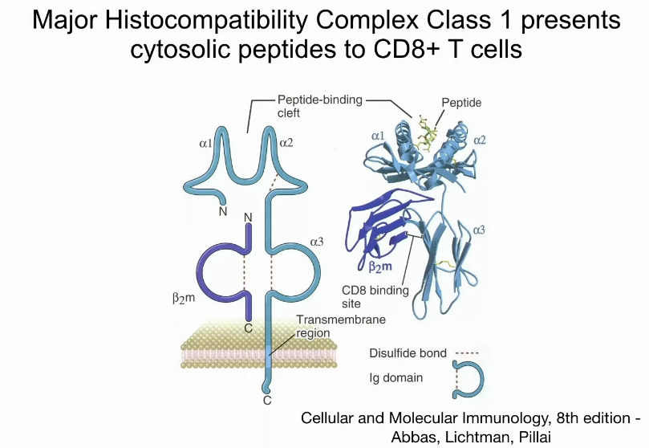
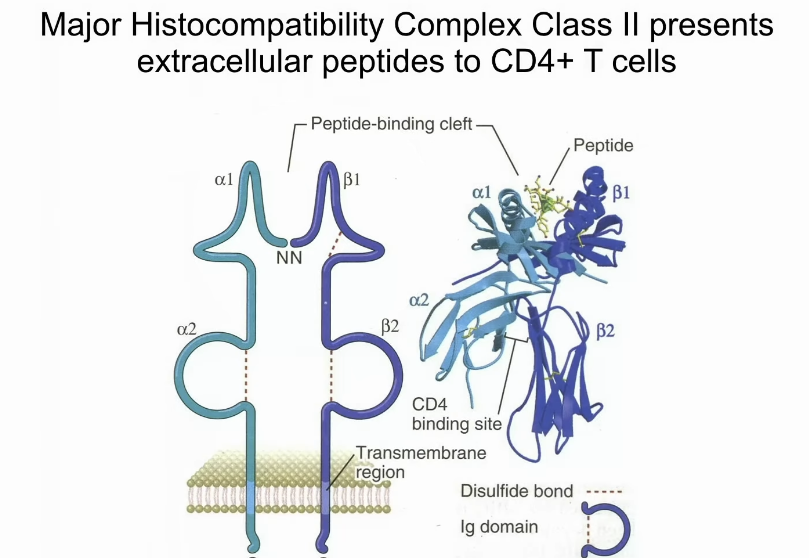
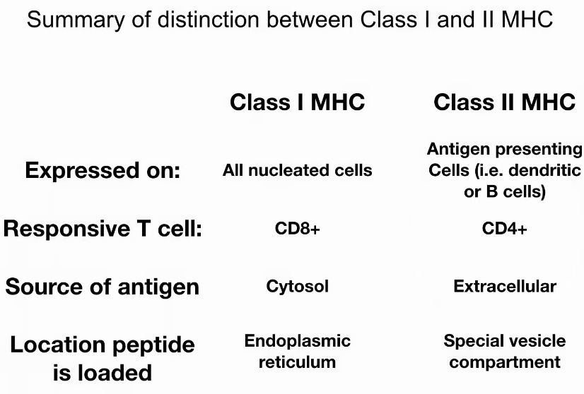

# Overview of the Immune System

## [Part 1: Diversity, Specificity, and B cells](https://www.youtube.com/watch?v=FpXIGTFD8Qs)

1. Overview
2. Properties
    1. Specificity
    2. Diversity
    3. Memory

### Overview

- **Definition (immunity).** resistance to disease based on prior exposure
- Historically, Edward Jenner realized that milk maids exposed to cowpox were immune to smallpox.
    - The first **vaccine**.
- Two levels of immunity
1. **innate immunity**. the immunity you are born with
    - inborn
    - immediate; no delayed response
    - does not change with prior exposure
    - less specific
2. **adaptive immunity.**
    - acquired with exposure
    - delayed
    - highly specific
    - two types of adaptive immunity
        1. Humoral immunity (protein-mediated)
            - the proteins are **antibodies (Ab)**
            - the cells that make antibodies are called **B cells**
            - **B cells** mature in the **bone marrow**
        2. Cell-mediated
            - mediated by **T-cells**
            - **T-cells** mature in the **thymus**
        - progenitor of B and T cells is the **common lymphoid progenitor**
    - both types of adaptive immunity have **antigen (Ag) receptors.**
        - **antigens** are substances that activate the immune system
    - **B cell antigen receptor/Ab/Immunoglobulin (Ig)**
        - different forms
            - **IgM**. membrane-bound form
            - **IgG**. secreted into the blood
    - **T cell receptor (TCR)**
        - only one form: **membrane-bound** only
    - Differences in types of antigens recognized
        - **B cell receptors** can recognize
            - small molecules
            - proteins
            - DNA
            - carbohydrates
        - **T cell receptors** can recognize
            - peptides presented to T-cell by **MHC class 1 and 2**

### Properties of the immune system

#### Specificity
- **B cells**
    - 
    - **complementarity determining regions (CDRs)** are the regions of receptor that can bind to antigens
        - small differences in AA sequence has large changes in affinity for Ag
    - each B cell expresses 1 Ab; unique specificity for Ag
        - **clonal expansion** to make more of that Ab

#### Diversity
- **B cells**
    - research performed by Susumo Tonegawa
    - **VDJ recombination**
        - _multiple gene segments_ are shuffled to generate diversity
        - 45 variable segments
        - 23 diversity segments
        - 6 joining segments
        - light chain only has VJ segments
        - heavy chain has VDJ segments
    - **VDJ recombination** is lymphocyte specific
        - recombination mediated by Recombination Activating Genes 1 and 2 (**RAG1** and **RAG2**)
    - diversity
        1. each V/D/J segment has a unique sequence
        2. **junctional imprecision**. recombination is not precise but can lead to insertion or deletion of nucleotides
        3. **somatic hypermutation/affinity maturation**. elevated mutation rate at the Ig locus
    - **allelic exclusion** leads to only one Ab gene expressed in each B cell

#### Memory
- **memory**. the ability to recall a previously experienced substance

|comparison|primary|secondary|
|:---------|:------|:--------|
|lag|5-10 days|1-3 days|
|[Ab]|smaller|larger|
|Ab affinity ($K_d$, lower is better)|$10^{-7}$ M|$10^{-11}$ M|

- what lasts in the body is the **memory B cell**
    - expresses a given antibody
    - memory results from VDJ recombination being irreversible

### Effector functions of antibodies
1. **neutralization**
    - Ab can bind to foreign substance and prevent normal function of that substance
2. recruit phagocytic cells (induce **phagocytosis**)
3. recruit killing (**natural killer**) cells 

#### Applications of antibodies
- Herceptin is used to treat HER2+ breast cancer

## [Part 2: Memory, T cells, and Autoimmunity](https://www.youtube.com/watch?v=SqGmQ6CFYHw)

1. Antigen presentation
2. TCR and class restriction
3. Autoimmunity

### Antigen presentation
- Motivating question: How are immune cells able to see within cells? An infection by _Listeria_ takes place within cells.
- **antigen presentation.** peptides are displayed on the cell surface
    - T-cells observe antigens presented by other cells
- antigen presentation mechanism involves a molecule called the **major histocompatibility complex (MHC)**
    - two classes: MHC class 1, MHC class 2
    - **MHC Class 1**. expressed/displayed by **all nucleated cells**
        - 
        - peptides sit in cup (beta sheet with two alpha helices)
        - peptides held by MHC Class 1 are derived from cytoplasm
        - proteins from cytoplasm are processed by **proteasome** and then transported into the lumen of the ER to become a vesicle that will join with the membrane
        - **CD8+ T cells** observe/recognize **MHC Class 1**
    - **MHC Class 2**. expressed/displayed only on **antigen presenting cells**
        - 
        - **antigen presenting cells** include
            - B cells
            - phagocytic cells
            - dendritic cells
        - peptides presented
            - come from **extracellular space**
            - processed by **lysosomal proteases**
        - **CD4+ T cells** observe/recognize **MHC Class 2**
    - 

### T cell receptor (TCR)
- two chains: $\alpha$ and $\beta$ chain
    - each comprised of two Ig domains
- **diversity of T cell receptors**
    - comes from **VDJ recombination**
        - not splicing: in the genomic DNA through recombination
- **co-receptors** on the T cell: **CD4** and **CD8**, expressed on different subsets of T cells
    - **CD4**. recognize MHC class 2
        - antigens from extracellular plasma
        - **CD4+ T cells** are **helper T cells**
        - enhances B cell function
            - causes **affinity maturation** (from weak binding to tighter binding)
            - **isotype switching**. B cell can create different classes, or **isotypes**, of antibodies; recruits different **effector functions**
                - $\mu$ exon: IgM
                - $\gamma$ exon: IgG; secreted in blood, effective for bacterial infections
                    - effector function: promotes phagocytosis
                - $\alpha$ exon: IgA; promotes mucosal immunity because it can pass through epithelial lining
                - $\epsilon$ exon: IgE; effective against **worms**
            - lets B cells differentiate into **memory B cells**
        - interaction between T and B cells occurs in the **lymph nodes**
    - **CD8**. recognize MHC class 1
        - antigens from cytoplasm that were recognized by B cell
        - thus **CD8+ T cells** should kill cells
        - **CD8+ T cells** are **killer/cytotoxic T cells**

#### Vaccines
- For an effective vaccine, need to activate T cell and B cell interaction (so that memory B cells can form)

### Autoimmunity and human disease
- tolerance vs. autoimmune
    - 10s of millions of Ag receptors are formed all the time
        1. constitutive (part of the B cell/T cell formation)
        2. random
- **negative selection** against self
    - mediated by **apoptosis**
- **positive selection** against foreign
    - mediated by activation and proliferation
- How does the immune system distinguish between self and foreign?
    1. only self Ag in the generative lymphoid organs (indicates self)
        - bone marrow (B cells)
        - thymus (T cells)
    2. coincidence
        - Ag with innate immune response: indicates foreign
        - Ag only: indicates self
        - an **adjuvant** is needed in vaccines to activate the innate immune response
    3. inhibitory receptors on T cells
        - **CTLA-4**
        - **PD-1**
        - signal termination to limit inflammation

#### Checkpoint therapy in cancer
- inhibitor blockade (**CTLA-4** and **PD-1**)
    - side effect: autoimmunity