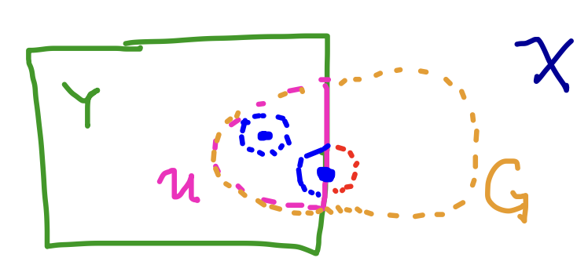

# Lecture 11. Compact Sets

## Compact sets
- "the next best thing to being finite"
  - both finite sets and compact sets
    - contain their $\sup$
    - are bounded (bdd)
    - are closed
    - processes on such sets "end"

**Definition (open cover).** An **open cover** of $E$ in metric space $X$ is a collection of open sets $\{G_\alpha\}$ whose union contains $E$.
- The term **cover** itself refers to an **open cover**.

**Definition (subcover).** A **subcover** of $\{G_\alpha\}$ is a subcollection $\{G_{\alpha_\gamma}\}$ that still covers $E$.

**S1.** In $\R$, $[\frac{1}{2}, 1)$ has
- a cover $\{V_n\}_{n=3}^{\infty}$ where $V_n = (\frac{1}{n}, 1-\frac{1}{n})$.
- a cover $\{W_x\}_{x \in [\frac{1}{2}, 1)}$ where $W_x = N(x, \frac{1}{10})$.

**S2.** $[0, 1]$ in $\R$.
- covered by $\{V_n\} \cup \{W_0, W_1\}$.
- has a **finite subcover**.

<Box>

**Definition (compact).** A set $K$ in metric space $X$ is compact (in $X$) if every open cover of $K$ has a finite subcover.

</Box>

To show a set is **not compact**, you need to find _an open cover_ that does not have a finite subcover.

- **S3.** $[\frac{1}{2}, 1)$ is not compact (see $V_n$).

- **S4.** $\Z$ (in $\R$) is not compact (cover each integer with a small open set).

 

**Theorem.** Finite sets are compact.

**Proof.** For every point $x_i$ in the finite set, pick one set $G_{\alpha_i}$ covering it.

 

**Definition (bounded).** A set $K$ is bounded in metric space $(X, d)$ if $K \subset N(x, r)$ for some $x \in X$, and finite $r$.
  - i.e. if there is some open ball that completely contains $K$.

**Theorem.** Compact sets are **bounded**.

**Proof.**
- Create open cover with concentric open balls of increasing radius $r_1, r_2, ..., r_\infty$.
- A finite subcover will exist, which means that some finite radius $r_n$ will be the cover, and thus $K$ is bounded.

 

**Theorem.** $K$ is compact in $X$ $\implies$ $K$ is closed.

**Proof.**

### Relative open sets

- If $Y$ is a subset of some metric space $(X, d)$, then $(Y, d)$ is also a metric space ($Y$ **inherits** metric from $X$).
- **Definition (open relative).** A set $E$ is **open relative** to $Y$ if every point in $E$ is an interior of $E$ when considering neighborhoods in $Y$.
  - $N(p, r) = \{q : d(p, q) < r, \boxed{q \in Y}\}$

- $U$ is open in $Y$ but not in $X$ because in $Y$, points on the "boundary" whose neighborhoods would otherwise make the set not open are _not part of $Y$_ and don't need to be considered.

 

<Box>

**Theorem.** Suppose $E \subset Y \subset X$. Then $E$ is open in $Y$ iff $E = Y \cap G$ for some open $G$ in $X$.

**Proof.**
- ($\Leftarrow$) Use the fact that if $N_X(x, r) \subset G$ in $X$, then $N_X(x, r) \cap Y = N_Y(x, r) \subset E$ in $Y$.
- ($\Rightarrow$) Let $G$ be the union of all the cutoff neighborhoods in $Y$.

</Box>

 

**Theorem.** Compactness is an intrinsic property of a set, **regardless** of the metric space.

 
