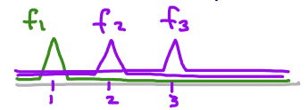

# Lecture 13. Compactness and the Heine-Borel Theorem

## Recall
- To show compact sets are bounded, use open balls of increasing radius as a cover, and then take the maximum radius of the finite subcover.
- To show compact sets are closed, use the pairs of open neighborhoods to show that its complement is open.

**Theorem 1.** Any closed interval $[a, b]$ is compact in $\R$.

**Proof.**
- We need to show that any open cover has a finite subcover.
- We can do this by contradiction: suppose $\exists$ an open cover $\{G_\alpha\}$ that does not have a finite subcover.
- Then $\{G_\alpha\}$ covers $[a, c_1]$ and $[c_1, b]$, but _at least_ one of them does not have a finite subcover; call it $I_1$.
  - If both had finite subcovers, we could union those subcovers to get a subcover for $[a, b]$, a contradiction
- WLOG, say $I_1 = [a, c_1]$ has no finite subcover.
- Subdivide, and repeat. We get $I_1 \supset I_2 \supset I_3 \supset...$, all closed, nested, size $\rightarrow$ 0 (**F1**), with no finite subcover of $\{G_\alpha\}$ (**F2**).
- $\exists x^* \in I_n$ for all $n$ (by **Theorem 12.4**).
- Because $\{G_\alpha\}$ covers all of $[a, b]$, $x^* \in G_{\alpha_0}$ for some $\alpha_0$.
  - Because $G_{\alpha_0}$ is open, $x^* \in N(x^*, r) \subset G_{\alpha_0}$ (definition of interior point; all points are interior in open sets).
- By **F1**, $I_n$ are decreasing in size, so at some point, $I_n \subset N(x^*, r) \subset G_{\alpha_0}$. But that means $\{G_{\alpha_0}\}$ is a finite subcover of $I_n$, a contradiction of **F2**.
- Therefore, every open cover of a closed interval has a finite subcover. $\blacksquare$

**Theorem (Heine-Borel Theorem).** In $\R$ or $\R^n$, $K$ **compact** $\iff$ $K$ is **closed** and **bounded**.

**Proof.**
- ($\Rightarrow$) True in all metric spaces (**Theorem 12.2**, **Theorem 11.2**).
- ($\Leftarrow$) Not true in arbitrary metric spaces.
  - $K$ bounded $\implies$ $K \subset [-r, r]$.
  - $[-r, r]$ is compact in $\R$ (this is why $K$ must be in $\R$).
  - $K$ is closed and a subset of compact set $[-r, r]$; by **Theorem 12.3**, $K$ must be compact. $\blacksquare$

- Examples where $\Leftarrow$ is not true.
  - Discrete metric with infinite set $K$.
    - Subsets are closed and bounded
      - all subsets in discrete metric spaces are closed because _none of them have limit points_
      - all subsets are bounded by $N(p, 2)$.
    - But infinite subsets are **not** compact, because the cover made from open balls of radius $\frac{1}{2}$ needs all the sets (no finite subcover).
  - In $\mathfrak{C_b}(\R)$ (spaces of bounded, continuous functions $f: \R \rightarrow \R$) with **sup** metric
    - $\exist$ closed, bounded sets that are not compact
    - Functions $f_n$ where $f_n(x) = 1$ when $x = n$, and $0$ otherwise.
    - $\{f_n\}_n$ has no limit points (for any function $f$, we can find a small distance $d$ such that all functions $d$ away from $f$ are not in $\{f_n\}_n$) $\implies$ closed
    - Bounded by distance $2$.
    - But this set is not compact because the open cover of sets that cover each $f_n$ one at a time has no finite subcover.

<Box>

**Theorem 2.** $K$ compact $\iff$ every infinite subset $E$ of $K$ has a limit point in $K$.

**Intuition.** Packing an infinite amount of points into a "finite" space $K$ means that points should accumulate in $K$.

**Proof.**
- ($\Rightarrow$)
  - Think: what would go wrong if an infinite subset $E$ had no limit point in $K$?
  - If infinite subset $E$ has no limit point in $K$, then every point $q \in K$ would have a neighborhood $N(q)$ that does not contain any point of $E$ (other than $q$ itself, if $q \in E$).
  - $\{N(q)\}$ covers $K$, but does not have a finite subcover, because infinitely many points $e \in E$ are only covered by $N(e)$, contradicting the fact that $K$ is compact.
- ($\Leftarrow$) Proof here only for $\R^k$, but it's true for general metric spaces (see Rudin 2.26).
  - We will show that $K$ is closed and bounded (and use **Heine-Borel**).
  - Suppose $K$ is not bounded.
    - Choose $x_n$ such that $|x_n| > n$ (distance from origin).
    - No limit point $p$ can exist for $\{x_n\}$ because there needs to be infinitely many points arount $p$ (to accomodate arbitrary radius neighborhoods), but cannot be the case based on how we chose $\{x_n\}$ (contradiction; $K$ is bounded).
      - i.e. points cannot accumulate anywhere for this $E \subset K$ we have chosen.
  - Suppose $K$ is not closed.
    - Then $\exists p \not\in K$ such that $p$ is a limit point of $K$.
    - Construct set $\{x_n\}$ such that $|x_n - p| < \frac{1}{n}$.
    - $\{x_n\}$ can only accumulate onto $p$ (meaning $p$ is the only limit point for this set) because if a second limit point $p'$ were to exist, at some point $N(p')$ would not contain $x_n$, as $x_n$ is too close to $p$, and some distance exists between $p$ and $p'$ (triangle inequality).

</Box>

**Theorem (Bolzano-Weierstrass Theorem).** Every bounded, infinite subset $E$ of $\R^k$ has a limit point in $\R^k$.

**Proof.**
- $E$ bounded $\implies$ $E$ is a subset of k-cell $K$ (compact), which implies that $E$ has a limit point in $K \subset R^k$ (by **Theorem 2**).

**Theorem (Finite Intersection Property).** $K$ compact $\iff$ any collection of **closed subsets** $\{K_\alpha\}$ with the finite intersection property (any finite subcollection is has a non-empty intersection) has a non-empty intersection.

This generalizes the **Nested Intervals Theorem**.

**Proof.**
- ($\Rightarrow$, by contradiction)
  - Let $U_\alpha = K_\alpha^c$. These $U_\alpha$ are open.
  - Suppose $\bigcap_\alpha K_\alpha = \emptyset$. Then $\{U_\alpha\}$ cover $K$ (every point $q \in K$ is not in every $K_\alpha$, which means that it is at least one $U_\alpha$).
  - By compactness, there exists a finite subcover $\{U_{\alpha_i}\}$ of $K$.
  - Then $\bigcap_i K_{\alpha_i} = \emptyset$. But this contradicts the assumption that the subsets $K_\alpha$ have the finite intersection property.
  - Thus, $\bigcap_\alpha K_\alpha \neq \emptyset$. $\blacksquare$

---

# Rudin

### 2.22
- A metric space is called **separable** if it contains a countable dense subset. Show that $\R^k$ is separable.
- Hint: Consider the set of points which have only rational coordinates. 

### 2.23
- A collection $\{V_\alpha\}$ of open subsets of $X$ is said to be a **base** for $X$ if the following is true:
  - For every $x \in X$ and every open set $G \subset X$ such that $x \in G$, we have $x \in V_\alpha \subset G$ for some $\alpha$.
  - In other words, every open set in $X$ is the union of a subcollection of $\{V_\alpha\}$.
- Prove that every separable metric space has a countable base.
- Hint: Take all neighborhoods with rational radius and center in some countable dense subset of $X$. 

### 2.25
- Let $X$ be a metric space in which every infinite subset has a limit point. 
- Prove that $X$ is separable.

### 2.26
- Let $X$ be a metric space in which every infinite subset has a limit point. 
- Prove that $X$ is compact.