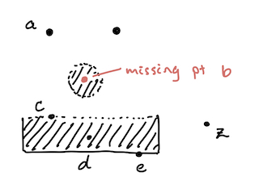

# Lecture 9. Limit Points

## Recall
- $(X, d)$, a set with a **metric**, is a metric space
    - The metric $d$ satisfies
        1. non-negativity
        2. symmetry
        3. triangle inequality
- Examples of metric spaces
    - $(\R^n, \text{discrete})$
        - $d(p, q) = \begin{cases} 0 &\text{if }p = q\\ 1 &\text{if } p \neq q \end{cases}$
- Metrics begin to create **geometry**

## Limit points
**Question.** When does a set $E$ "approach" a point $p$?

**Definition (limit point).** A point $p \in X$ is a **limit point** of $E$ if every open ball around $p$ contains a point $q$ in $E$, with $q \neq p$.
  - A point $p$ is _not_ a limit point of $E$ if $\exists$ an open ball around $p$ that does not contain any other point of $E$.

**Definition (isolated point).** A point $p$ is an **isolated point** of set $E$ if $p$ is in $E$ but $p$ is not a limit point.
  - Intuitively, $p$ has no points immediately next to it in $E$, because if it did, any open ball around $p$ would have said points and $p$ would be a limit point.

**Definition (interior point).** A point $p$ is an **interior point** of set $E$ if $\exists$ open ball $N$ around $p$ such that $N \subset E$.
  - $p$ is _not_ an interior point of $E$ if all open balls around $p$, $N \not\subset E$ ($\exists$ point in $N$ not in $E$)
  - Intuitively: a limit point but instead of just one point, its the whole ball.
    - Not every interior point is a limit point however, because the subset can include just $p$ itself.

**S1.** In $\R$, consider $\emptyset, \R, \Q$.
- What are the limit points?
- What are the interior points?
- What are the isolated points?

Answer:
- $\emptyset$.
  - no limit points (any neighborhood around arbitrary point $p$ cannot contain points from the empty set)
  - no interior points (no points in the set)
  - no isolated points (needs to be a point in the set)
- $\R$
- $\Q$

**S2.** In $(\R, \text{discrete})$, consider $\emptyset, \R, \Q$.
- What are the limit points?
- What are the interior points?
- What are the isolated points?

**Theorem.** If $p$ is a limit point of $E$, then every neighborhood of $p$ contains infinitely many points of $E$.

**Proof (by contradiction).**
- $\exists$ neighborhood $N$ of $p$ with only finitely many points of $E$ ($e_1, e_2, ..., e_N$).
- Let $r = \min_{i = 1}^N \{d(p, e_i\}$
- Then $N_r(p)$ has no points of $E$; contradiction. $\blacksquare$

## Open and Closed Sets

**Definition (open).** A set $E$ is **open** if every point of $E$ is an **interior point** of $E$.

**Definition (closed).** A set $E$ is **closed** if $E$ contains all its limit points.

- **S4.** In $\R$, a single point $\{p\}$ is closed.
    - Because there are no limit points, it contains all its limit points.

### Closing a set
**Definition (closure).** Let $E'$ be the set of all limit points of $E$. The **closure** of $E$, $\overbar{E}$, is $\overbar{E} = E \cup E'$.

## Aside: Logic practice
- negating "$\forall x, P(x)$ is true": $\exists x$ such that $P(x)$ is false.