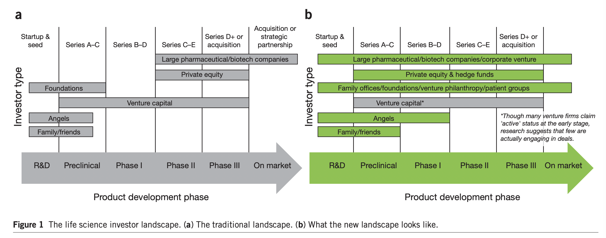

# business and funding models for accelerating biomedical innovation

- why is there a _valley of death_?
    - answer: _increasing risk and uncertainty_
    - increasing knowledge leads to increased risk (because the probability of a breakthrough will topple a company increases)
- **sharpe ratio ($R_{\text{sh}}$).** risk adjusted return
    - stock market has **sharpe ratio of 0.33**
    - people naturally seek higher sharpe ratios
    - sharpe ratio for biomedicine has gone down
- _average biotech investment_
    - early stage drug research
    - $200m investment, 10 year horizon
    - probability of success: 5%
    - anti-cancer drug makes $2B/yr for 10 years
    - $R_{\text{sh}} = 0.03$
    - very risky; generally only the ultra-rich can play this
- suppose you have $n$ investments
    - expected return of each is $\mu$, risk $\sigma$
    - risk free rate is 0
    - sharpe ratio of collection assuming **independence**: $R_{\text{sh}} = \frac{\mu \sqrt{n}}{\sigma}$
    - **can you find independent projects?**
        - [yes: rare diseases portfolio](https://pubmed.ncbi.nlm.nih.gov/25717096/)
        - **rare disease.** 200,000 patients or less
        - about 7000 rare diseases

## raising capital

- the funding ecosystem
    - NIH, NSF, SBIR, DoD/DARPA, MassBio
    - Philanthropy (e.g. [MIT Office of Resource Development](https://development.mit.edu/))
    - Patient advocacy groups (e.g. CFF)
    - VCs, Big Pharma
    - Biotech
    - CROs
- tap into resources with _(financial) narrative_
- build _narrative_ with financial engineering
    - assumptions
        - 150 projects
        - statistically independent
        - 5% success rate
    - risk decreases with $\sqrt{150} \implies R_{\text{sh}} = 0.33$
    - can we raise $30bn?
        - if the assumptions are correct, then yes through _debt-financing_

## healthcare finance (starting a fund: [BridgeBio](https://bridgebio.com/))
- IPO in 2019: $47.17 stock price
- in 6 years
    - 30 assets; 4 in phase 3 clinical trials
    - 2 approved drugs

## new business models
- [quantitative life sciences advisors](https://capd.mit.edu/jobs/qls-advisors-llc-data-scientist/)
    - e.g. measuring _independence between biomedical projects_