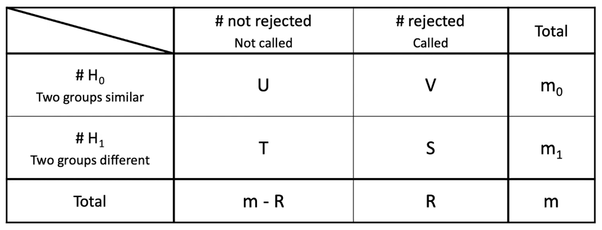
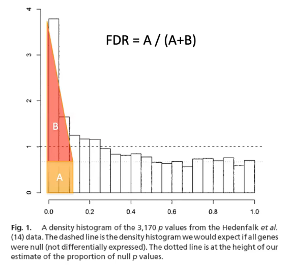
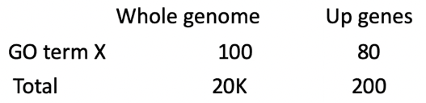

$\gdef\var#1{\mathbb{V}\left(#1\right)}$
$\gdef\P#1{\mathbb{P}\left(#1\right)}$

# L4. Differential expression, FDR, GO

## LIMMA: Linear model for differential expression on log(counts)

We build a separate model for each gene $j$.

$$
Y_{ijk} = \mu_j + \alpha_{ij} + \epsilon_{ijk}
$$

- condition/treatment $i$
    - $i = 0$ is control
- gene $j$
- specific sample (replicate) $k$
- $\mu_j$. the mean expression for gene $j$ over all the samples
- $\alpha_{ij}$. the deviation of the mean of the $i$th condition from the overall mean.
    - Note that $\sum_i \alpha_{ij} = 0$.

To compare samples between _treatment_ $i$ and _control_, we use the null hypothesis

$$
\alpha_{ij} - \alpha_{0j} = 0
$$

- Use **t family of tests** for tests of significance.

### LIMMA Design and Contrast matrices

- The LIMMA design matrix specifies which conditions correspond with which samples.

- The LIMMA constrast matrix defines the signficance tests to be performed (one test per column).

## DESeq2: Differential expression on raw counts

### Sequencing read distribution
- sequencing data is over-dispersed (variance > mean)

### Modeling variance from limited replicates
- Even with a single replicate, looking at the differential gene expression of other genes can help estimate the variance, which can help determine whether or not a gene of interest is differentially expressed.

### DESeq2: Modeling over-dispersion

$$
K_{ij} \sim \mathrm{NB}(s_{ij}q_{ij}, \alpha_i)
$$

$$
\var{K_{ij}} = \mu_{ij} + \alpha_i \mu^2_{ij}
$$

- $K_{ij}$. raw count for gene $i$, sample $j$
- $s_{ij}$. normalization factor (depth, gene length, etc.)
- $q_{ij}$. expression level of interest
- $\alpha_i$. dispersion for gene $i$
- $\mu_{ij}$. Poisson from sampling fragments
- $\alpha_i \mu^2_{ij}$. extra variation due to biological variance

Effectively, we are adjusting variance of gene expression (for each gene) towards the _theoretical variance_ that a gene would have given its _expression level_.

### Visualize differential expression
- $\text{FC}$ is the [fold change](https://en.wikipedia.org/wiki/Fold_change)
    - quantity 1: $A$
    - quantity 2: $B$
    - fold change = $B/A$
- **Volcano plot**
    - $-\log{\left(\text{p-value}\right)}$ vs. $\log{\mathrm{FC}}$
    - Each gene is 1 dot.
    - Blue dots are down regulated.
    - Red dots are up regulated.
    - The most significant genes are in the upper-left and upper-right corners.

- **MA plot**
    - $\log{\mathrm{FC}}$ ("M") vs. average expression ("A")
    - Each gene is 1 dot.
    - Red dots are called (statistically significant).

## Multiple Hypotheses Testing and False Discovery Rate
- a.k.a. _How many differential genes do we report?_
- We need to control for:
    - **family-wise error rate**, or
    - **false discovery rate**

### Family-wise error rate (FWER)

$$
\text{FWER} = \P{\text{falsely reject at least one hypothesis}}
$$

$$
\text{FWER} < \alpha \implies \P{\text{no false rejections}} > 1 - \alpha
$$

#### Bonferroni correction (BC)
- For $m$ hypotheses to test, set false rejection rate at $\alpha/m$.
- BC is too conservative for noisy data.

### False discovery rate (FDR)
- FDR is also known as **Q-value**, **adjusted P-value**
- $U$. true negative
- $V$. false positive (type I)
- $T$. false negative (type II)
- $S$. true positive

- the **false discovery rate (FDR)** is $\boxed{V / R}$, or false positives divided by all calls (i.e. out of our discoveries, how many were wrong?)
- BC attempts to make FDR equal to 0; we can be more lenient.
- The **Benjamini-Hochberg** method is an algorithm for using FDR.

- Generally, people are comfortable if around a few hundred genes are differentially expressed.

## Gene ontology
- Categories
    - Molecular function
    - Biological process
    - Cellular component
- Relations:
    - **I**. `is_a`
    - **P**. `part_of`

### Evaluating differentially expressed genes

- Use a **goodness-of-fit test**.
    - $\chi^2$ or **Fisher's exact test**.
- Needs multiple hypothesis testing as well.

### GO Tools for Microarray Analysis
- AmiGO, Gorilla, GREAT
- DAVID
    - A good query size: between 50 and 3000.