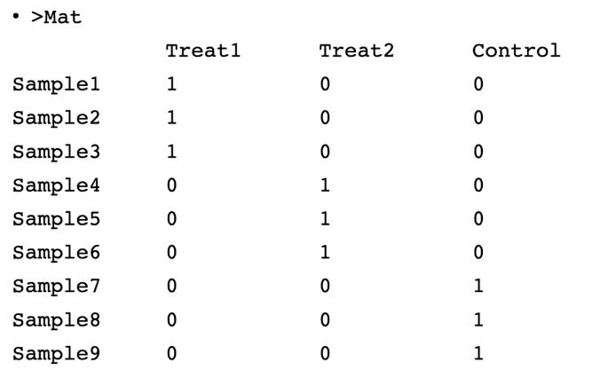
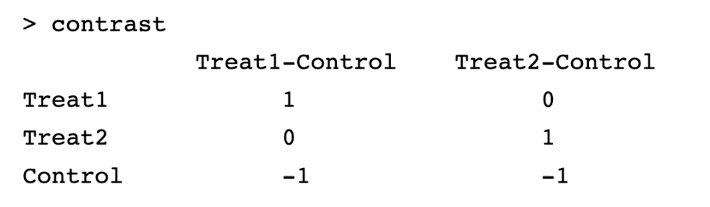
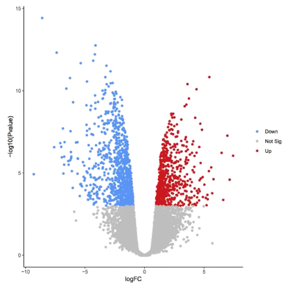
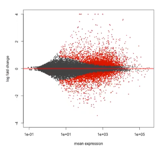

$\gdef\var#1{\mathbb{V}\left(#1\right)}$

# L4. Differential expression, FDR, GO

## Linear model for differential expression (LIMMA)

We build a separate model for each gene $j$.

$$
Y_{ijk} = \mu_j + \alpha_{ij} + \epsilon_{ijk}
$$

- condition/treatment $i$
    - $i = 0$ is control
- gene $j$
- specific sample (replicate) $k$
- $\mu_j$. the mean expression for gene $j$ over all the samples
- $\alpha_{ij}$. the deviation of the mean of the $i$th condition from the overall mean.
    - Note that $\sum_i \alpha_{ij} = 0$.

To compare samples between _treatment_ $i$ and _control_, we use the null hypothesis

$$
\alpha_{ij} - \alpha_{0j} = 0
$$

- Use T* tests for tests of significance.

### LIMMA Design and Contrast matrices

- The LIMMA design matrix specifies which conditions correspond with which samples.

- The LIMMA constrast matrix defines the signficance tests to be performed (one test per column).

### Sequencing read distribution
- sequencing data is over-dispersed (variance > mean)

### Modeling variance from limited replicates
- Even with a single replicate, looking at the differential gene expression of other genes can help estimate the variance, which can help determine whether or not a gene of interest is differentially expressed.

### DESeq2: Modeling over-dispersion

$$
K_{ij} \sim \mathrm{NB}(s_{ij}q_{ij}, \alpha_i)
$$

$$
\var{K_{ij}} = \mu_{ij} + \alpha_i \mu^2_{ij}
$$

- $K_{ij}$. raw count for gene $i$, sample $j$
- $s_{ij}$. normalization factor (depth, gene length, etc.)
- $q_{ij}$. expression level of interest
- $\alpha_i$. dispersion for gene $i$
- $\mu_{ij}$. Poisson from sampling fragments
- $\alpha_i \mu^2_{ij}$. extra variation due to biological variance

Effectively, we are adjusting variance of gene expression (for each gene) towards the _theoretical variance_ that a gene would have given its _expression level_.

### Visualize differential expression
- $\text{FC}$ is the [fold change](https://en.wikipedia.org/wiki/Fold_change)
    - quantity 1: $A$
    - quantity 2: $B$
    - fold change = $B/A$
- **Volcano plot**
    - $-\log{\left(\text{p-value}\right)}$ vs. $\log{\mathrm{FC}}$
    - Each gene is 1 dot.
    - Blue dots are down regulated.
    - Red dots are up regulated.
    - The most significant genes are in the upper-left and upper-right corners.

- **MA plot**
    - $\log{\mathrm{FC}}$ ("M") vs. average expression ("A")
    - Each gene is 1 dot.
    - Red dots are called (statistically significant).

## Multiple Hypotheses Testing and False Discovery Rate
- a.k.a. _How many differential genes do we report?_